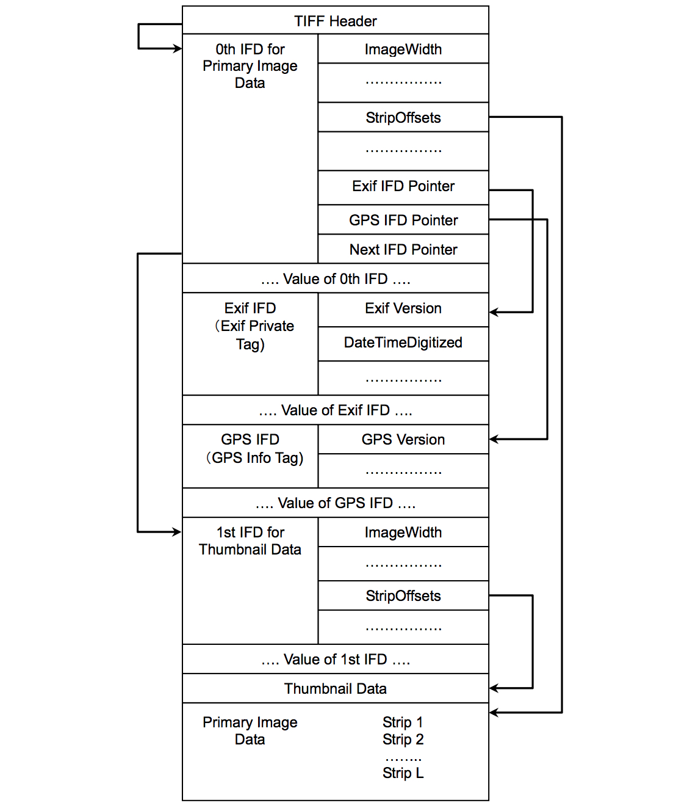

可交换图像文件格式（英语：`Exchangeable image file format`，官方简称`Exif`），是专门为数码相机的照片设定的，可以记录数码照片的属性信息和拍摄数据，比如拍摄的设备、拍摄的参数以及地理位置等。

一张`Exit`图片结构主要分为：
- `0th IFD`：主要的图片数据
- `Exif IFD`：Exif私有的一些标签数据
- `GPS IFD`：GPS信息
- `Thumbnail Data`：缩略图数据

一张`Android`手机拍摄的图片的元数据信息有：
```
Image ImageWidth : 2976
Image ImageLength : 3968
Image BitsPerSample : [8, 8, 8]
Image Make : HUAWEI
Image Model : HRY-AL00T
Image Orientation : 0
Image XResolution : 72
Image YResolution : 72
Image ResolutionUnit : Pixels/Inch
Image Software : HRY-AL00T 9.1.0.226(C00E226R3P1)
Image DateTime : 2019:09:02 13:42:55
Image YCbCrPositioning : Centered
Image ExifOffset : 288
GPS GPSVersionID : [2, 2, 0, 0]
GPS GPSLatitudeRef : N
GPS GPSLatitude : [31, 12, 5179367/125000]
GPS GPSLongitudeRef : E
GPS GPSLongitude : [121, 35, 21029663/500000]
GPS GPSAltitudeRef : 1
GPS GPSAltitude : 0
GPS GPSTimeStamp : [5, 42, 53]
GPS GPSProcessingMethod : GPS
GPS GPSDate : 2019:09:02
Image GPSInfo : 8944
Image DeviceSettingDescription : [105, 112, 112, 0]
Thumbnail ImageWidth : 384
Thumbnail ImageLength : 512
Thumbnail Compression : JPEG (old-style)
Thumbnail Orientation : 0
Thumbnail XResolution : 72
Thumbnail YResolution : 72
Thumbnail ResolutionUnit : Pixels/Inch
Thumbnail JPEGInterchangeFormat : 9292
Thumbnail JPEGInterchangeFormatLength : 14540
EXIF DocumentName : []
EXIF ExposureTime : 1/50
EXIF FNumber : 9/5
EXIF ExposureProgram : Program Normal
EXIF ISOSpeedRatings : 125
EXIF ExifVersion : 0210
EXIF DateTimeOriginal : 2019:09:02 13:42:55
EXIF DateTimeDigitized : 2019:09:02 13:42:55
EXIF ComponentsConfiguration : YCbCr
EXIF CompressedBitsPerPixel : 19/20
EXIF ShutterSpeedValue : 298973/10000
EXIF ApertureValue : 169/100
EXIF BrightnessValue : 0
EXIF ExposureBiasValue : 0
EXIF MaxApertureValue : 169/100
EXIF MeteringMode : Pattern
EXIF LightSource : Daylight
EXIF Flash : Flash did not fire
EXIF FocalLength : 181/50
EXIF MakerNote : [35, 42, 35, 42, 50, 48, 49, 56, 49, 49, 48, 56, 49, 54, 48, 48, 58, 58, 50, 57, ... ]
EXIF SubSecTime : 038601
EXIF SubSecTimeOriginal : 038601
EXIF SubSecTimeDigitized : 038601
EXIF FlashPixVersion : 0100
EXIF ColorSpace : sRGB
EXIF ExifImageWidth : 2976
EXIF ExifImageLength : 3968
Interoperability InteroperabilityIndex : R98
Interoperability InteroperabilityVersion : [48, 49, 48, 48]
EXIF InteroperabilityOffset : 8914
EXIF SensingMethod : One-chip color area
EXIF FileSource : Digital Camera
EXIF SceneType : Directly Photographed
EXIF CustomRendered : Custom
EXIF ExposureMode : Auto Exposure
EXIF WhiteBalance : Auto
EXIF DigitalZoomRatio : 1
EXIF FocalLengthIn35mmFilm : 26
EXIF SceneCaptureType : Standard
EXIF GainControl : None
EXIF Contrast : Normal
EXIF Saturation : Normal
EXIF Sharpness : Normal
EXIF SubjectDistanceRange : 0
JPEGThumbnail : b'\xff\xd8\xff\xe0\x00\x10JFIF\x00\x01\x01\x00\x00\x01\x00\x01\x00\x00\xff\xdb\x00C\x00\n\x07\x07\x08\x07\x06\n\x08\x08\x08\x0b\n\n\x0b\x0e\x18\x10\x0e\r\r\x0e\x1d\x15\x16\x11\x18#\x1f%$"\x1f"!&+7/&)4)!"0A149;>>>%.DIC<H7=>;\xff\xdb\x00C\x01\n\x0b\x0b\x0e\r\x0e\x1c\x10\x10\x1c;("(;;;;;;;;;;;;;;;;;;;;;;;;;;;;;;;;;;;;;;;;;;;;;;;;;;\xff\xc0\x00\x11\x08\x02\x00\x01\x80\x03\x01"\x00\x02\x11\x01\x03\x11\x01\xff\xc4\x00\x1f\x00\x00\x01\x05\x01\x01\x01\x01\x01\x01\x00\x00\x00\x00\x00\x00\x00\x00\x01\x02\x03\x04\x05\x06\x07\x08\t\n\x0b\xff\xc4\x00\xb5\x10\x00\x02\x01\x03\x03\x02\x04\x03\x05\x05\x04\x04\x00\x00\x01}\x01\x02\x03\x00\x04\x11\x05\x12!1A\x06\x13Qa\x07"q\x142\x81\x91\xa1\x08#B\xb1\xc1\x15R\xd1\xf0$3br\x82\t\n\x16\x17\x18\x19\x1a%&\'()*456789:CDEFGHIJSTUVWXYZcdefghijstuvwxyz\x83\x84\x85\x86\x87\x88\x89\x8a\x92\x93\x94\x95\x96\x97\x98\x99\x9a\xa2\xa3\xa4\xa5\xa6\xa7\xa8\xa9\xaa\xb2\xb3\xb4\xb5\xb6\xb7\xb8\xb9\xba\xc2\xc3\xc4\xc5\xc6\xc7\xc8\xc9\xca\xd2\xd3\xd4\xd5\xd6\xd7\xd8\xd9\xda\xe1\xe2\xe3\xe4\xe5\xe6\xe7\xe8\xe9\xea\xf1\xf2\xf3\xf4\xf5\xf6\xf7\xf8\xf9\xfa\xff\xc4\x00\x1f\x01\x00\x03\x01\x01\x01\x01\x01\x01\x01\x01\x01\x00\x00\x00\x00\x00\x00\x01\x02\x03\x04\x05\x06\x07\x08\t\n\x0b\xff\xc4\x00\xb5\x11\x00\x02\x01\x02\x04\x04\x03\x04\x07\x05\x04\x04\x00\x01\x02w\x00\x01\x02\x03\x11\x04\x05!1\x06\x12AQ\x07aq\x13"2\x81\x08\x14B\x91\xa1\xb1\xc1\t#3R\xf0\x15br\xd1\n\x16$4\xe1%\xf1\x17\x18\x19\x1a&\'()*56789:CDEFGHIJSTUVWXYZcdefghijstuvwxyz\x82\x83\x84\x85\x86\x87\x88\x89\x8a\x92\x93\x94\x95\x96\x97\x98\x99\x9a\xa2\xa3\xa4\xa5\xa6\xa7\xa8\xa9\xaa\xb2\xb3\xb4\xb5\xb6\xb7\xb8\xb9\xba\xc2\xc3\xc4\xc5\xc6\xc7\xc8\xc9\xca\xd2\xd3\xd4\xd5\xd6\xd7\xd8\xd9\xda\xe2\xe3\xe4\xe5\xe6\xe7\xe8\xe9\xea\xf2\xf3\xf4\xf5\xf6\xf7\xf8\xf9\xfa\xff\xda\x00\x0c\x03\x01\x00\x02\x11\x03\x11\x00?\x00\xf2\xcf-\x07;@\xa3h\'j\xf2}\x05z\xfd\xbf\x874H\x02\x18\xf4\xbb|\xaeHf]\xe7\x9fs\x9c\xfe5\xa1\x14P\xc17\x9d\x0c\x11C!\x18\xdf\x14j\x87\xf3\x02\x81\x1e/k\xa6^\xdfn\x16\x96w\x17\x1bz\xf9Q3\xe3\xf2\x15z\x0f\t\xebs\xa9d\xd2\xe7\\\x7f\xcf@#?\x93b\xbdx\xb1l\xe4\x93\x9fSHh\x03\xcb!\xf06\xb92\x16\xfb4qz\teU\'\xf9\xd5\x88>\x1f\xea\x92!2\xdcZ\xc2\xdf\xddff\xfd@5\xe9\x0f\xd2\xa2\xa5p8v\xd0\x9e\xc2\xd9\xeco\x1e9\x9b\xca\x12\xa3&@\xeaA\x03<\xf6\x07\xf1\x15>\x91\xe1\x1d?VF\x9e\xe6[\x84\x98`\xb2FWg#\xe9\x9c\xe4\x1f\xd2\xb7|Gb\xd3\xdaC{\x08&{\'\xde\x07]\xc8F\x1cc\xdcc\xf2\xaa:-\xfcq\xdeF\xcd\xfb\xac\x9f.Eln\x03\xa7?C\xb7?J\xcffR4\x0f\x83\xb4\x16\xb5\x8e\xdc\xd9\x02#$\x87\xdcC\x9c\x9e\xe4u\xfci[\xc2\xda\n\x85\xdb\xa6C\x91\xdc\x969\xfdkg\xb7\xa55\xfaU\x88\xca:^\x9e\x00\x03O\xb4\xf9O\x1f\xb8L\x8f\xc7\x15~\x0e8\x03\x00v\x14\xc6\xeai\xf1u\xa0\t\x85\x14\xbd\xa8\xa6\x03i;S\xa9(\x01\x058RR\x8a\x00(\xc5-\x14\x00\x98\xa2\x96\x8cP!(\xa5\xc5\x14\x0cLQ\x8aZ(\x011F)h\xa0\x04\xc5&;S\xa8"\x80!\x90T=\xea\xc3\x8e*\xb9\xebH\t\xa2\xe9S\x8a\xaf\x1bb\xa7S\xc5\x00A\xa8.t\xcb\xbf\xfa\xe0\xff\x00\xfa\t\xaf>\xba\x90\xbc{\xf2G\x03\x02\xbb\x8f\x10j\xb6\xdaf\x8fq%\xc3p\xeb\xe5\x80:\x92\xdc\x7f\xf5\xeb\xcdou(\x1a\x10\xb1\xb1\xde\xa7\r\x9f\xd2\x94\xb5\x04z\x9c\x8e\x8eIGV\x1e\xaar*\x11\xd6\xbc\xcf@\xf1\x03\xc5t\xa1G\x97&yP~Y\x07\xa6=k\xd2-\xe5Y\xa3Y\x14\xfc\xae\x01\x14\xc0\xb7\x18\xe2\xa4\xa6GRP\x02\nCKIL\x04\xa4\xa5\xa0f\x80\n)p)(\x00\xefG\x18\xa3\x14P\x04\x94\n:R\xd0 \xa3\xb5\x14P26\xa8\xeaF\xa8\xbb\xd2\x02e\x01\x90\xab\x00A\x18#\xd6\xb9\xcb\xc8\x12\xdas\x11@\npN>\xf8\xec\x7f,\x0f\xc2\xba8\xcf\x15C[\xb4\x13Z\x1b\x95!d\x81I\xe7\x03r\xf7\x07\xf9\x8f\xfe\xbd&\x86\x99.\x8fw\xf6\xcb<1-$8G\'\xa9\xf4?\x8f\xf8\xd5\xc7\x1cW\x19c\xa8\xbe\x9f\x7f\x1c\xd1\xb0eq\xd3\xb3\x8c\x8e=\xb3]]\x9e\xabg\xaaE#[H\x0bD\xdbd\x8c\xf0\xc8}\xff\x00\xc6\x84\xc45\xf84\xe8\xa9\xb2\x1eib\xfb\xd4\xc0\xb2(\xa0t\xa2\x98\tE\x14\x94\x00\xb4\n\x05\x02\x80\x14QE\x14\x00R\x8a(\xa0AE\x1d\xf3E\x03\n(\xa2\x80\x12\x94b\x8e\x94P\x01Hih\xa0\x08\xd8Uv\x1d\xea\xd1\x15\x13\'\xb5  \x0f\x8a\x0c\xc7\x1cS\x8ct,\x05\x8d\x00q\xff\x00\x10Y\x8e\x8fnI;~\xd27c\xbf\xca\xd5\xe7\x86F#\x93^\xe5w\xa5\xda\xea\x16\x13Y])h\xa6]\xad\x83\x829\xc8#\xdc\x10\ry\xe5\xd7\xc3M^)H\xb5\xb8\xb6\xb8\x8f\x9c1o,\xf5\xe3 \xf7\xfcM\x00r6\xccR\xea\x17U\xdc\xcb"\x90\xbe\xbc\xf4\xafi\xb1\x84\xc7k\x12c\x1bT\x0czW=\xa0x\x06=.\xe5//\xa7[\x99\x93\x94\x8d\x17\x08\x8d\xeb\x93\xd7\xf4\xfck\xafH\xf1\xda\x80\x15\x07\x14\xfaU\\R\xe2\x98\r\xedIN\xc7\x14\x94\x00\x98\xa3\x14\xb4P\x02QE\x19\xa0\x02\x92\x8aJ@H)i(\xa6\x02\xd1IE\x00#T\x0cy\xa9\xcdB\xe2\x86\x03\x91\xf1X\xbe3\xbah|;1F#\xb9\xc0\xcep\x0e?\\~U\xa6I\x1d+;Z\xd3d\xd5\xf4\xd9mQ\xf6H\xc0\xed\'\xa7B9\xfc\xe9\x01\xe5\x11j\x97Q\xc0a2oC\xc8\r\xd8\xfa\xe6\xba\x1f\x02j\x92\xc7\xe2#\x0bd\xa5\xcc,\xac7\x102>`q\xdc\xf0G\xfc\x08\xd77}\xa7\xddi\x97Mk{\x0bC*\xff\x00\x0b\x0e\xa3\xd4z\x8fq]\xc7\x83<7{\xa7\x195\x1b\xd8\xcc-4{#\x89\xbe\xf0\x19\x04\x921\xc7A\x8f\xc6\x8b\x01\xd8\x997\x1a\x9a#U\xa3C\x9a\xb7\x1a\x9a\x00\x98\x1a3H8\xa3\xf0\xa6\x02\xd2QK@\x05(\xa4\xc5-\x00\x14\xb4Q@\x05\x15\x13\xdc"I\xe5\xb09\xc0<\x0fS\x8f\xf0\xa5\x12\x86\x8b\xcc\\m+\xb8\x168\x07\x8a@IE\x14S\x00\xa2\xa1K\xa8\xd8\x90r\xa7qQ\x9e\xfc\x81\xfdG\xe7N\x17\x11\x13\x8d\xdc\xe7\x1d>\x9f\xe2?:W\x0b\x12QE\x14\xc0(\xa2\x8a\x00)6\xd2\xd2\xd0\x036\np\x00R\xd2P\x01F(\xa2\x90\t\x8c\xd0\x00\x14\xb4S\x00\xa4\xa2\x8a\x00))i(\x01(\xa5\xa4\xa0\x04\xa2\x96\x93\xda\x80\x12\x92\x96\x92\x90\x12g4QF)\x80R\xd2R\xd0\x01\x8aa\\\xd4\x94\x98\xa0\x08|\xac\xd3\xd20\xbc\xe3\x9a\x93\x14P\x02\x87`\x08\x0c@\xfa\xd3\x1dCg4\xea(\x02\x11\x10\x07\x8a\x90.)\xd4P\x01\x8a1E\x07\xde\x80\x13\x14P\x0eF@#\xebK@\t@\xa5\xa2\x80\n\x05\x14P\x04\rl\x1av\x9b8b\xaa\x07\x19\xe4\x12\x7f\xc3\xf2\xa9U\x02\xa8U$\x05\x18\x14\xea\xa1\xa6<\xad6\xa2\x92H\xcf\xe5\xdd\x90\x9b\x8ev\xaf\x96\x87\x03\xdb\x93H\x0b\xc3\xa63\x9fzZ(\xa6\x05x\xed|\xb7V\x0c\x08^H\xdb\xd4\xff\x00Ny\xfc\x05"Zyf \xad\x90\xb8\x0f\x9f\xe2\xc0\xe0\xfe`U=b{\xfbrZ\xd6A\x83\x16!\x8a5\r$\x93g\xa1\x04}\xccc$\x11\x8ekQ7\xec_0(|\r\xc1zg\xbe)Xw\x1dP\xddH\xd1[\xb3(%\x8f\x03\x1d\xbd\xeaZFEp7\x00@\xe7\x9ab#\x8e}\xe5\x86\xdcm\xe79\xe0\xf2G\xf4\xcd=\x1d]C.p\xc0\x11\xc7cL0!\x89\x918W9n\xf9\xf6\xfaq\x8atH\xc8\xa49\x04\xe4\x9c\xfdM$\x03\xe9i)\x19\x82)f (\x19$\xf6\xa6\x03\xa8\xa34\x94\x00\xb4\x94Q@\x05\x14Q\xd2\x80\nJ(\xa0\x04\xa2\x96\x92\x80\n1E\x14\x00\x94\x94\xb4\x94\x00SH\xa7RP\x03\xe9i(\xa0\x02\x96\x92\x96\x81\n(\xa4\xa2\x80\x16\x8aL\xd2\xd00\xa2\x8c\xd1\xc5\x00\x14\xb4Q@\rl\xed8<\xf6\xaa\xd0K,\x92+8 :\xe7i\x1ft\x8c\x7f\xf6_\xa5[\xaa\x17\xba\x84zyTXZB\xce\x9b\x95H\x1bC\xbe\xdd\xdc\xf5\xf9\x8fA\xcf4\x80\xbc\x0794W7\xaa_\xdf%\xe5\xf0\x83\xe5\x9e\xc5R\xea\xd8n\xf9n!\xc0\x12)\x1e\xc4\x1f|\x91\x8a\xe9\x08\xdaH\xa6\x01Gj(\xa0\x03\x8a(\xa0P\x01Q\xc7o\x14RI$hU\xa5m\xcew\x1eN\x00\xce3\x8e\x80T\xa2\xa8\xd9\xb1&\xd3,IkbX\xe4\x9e~N\xb4\x80\xbd\xd6\x8a)>\x94\xc0\xce\xbb\xd1-\xef.d\xb8k\x9b\xd8\xa4\x90\x00\xdeM\xcb  v\xc0\xed\xedZ]i\xa5\x88*6\x13\x93\xc9\x04qN\xa0\x02\xa9j/\x13\xc5\xf69A\xc5\xca\xb6Y\x91\x8cj\xaa2K\x10F\x07\xe2*\xed5\x91%B\x8e\xaa\xeaz\xab\x0c\x8f\xca\x802|-#\\h\x8bz\xcd)k\xb9^r\x8f\xd22X\xe5W\xfd\x9c\x82G\xd75\xb1@\x00\x00\x07\x00p\x00\x1d(\xa0\x02\xab\xde,\x8d\x1e\x10\x95Q\xcb\x90z\x8fO\xe7\xcf\xf8\xd5\x8a\xady\xa8Z\xd8E\xe6\\\xcc\x10d.\x00,I$\x00\x00\x19\'\xa8\xfc\xe9\x00[\xbb\xec\xdf+\x8d\xacp\x83\x18\xcfS\xc6y\xf6\xfc3\xde\xa7\x8d\xb7\xa0$`\xe3\x95\xcep}(h\xc1b\xdbF\xf00\t\x19\xc5\x08\xa5P\x02r@\x198\xea}h\x01\xd4\x94\xb4v\xa6\x02QGJ(\x00\xa4\xa5\xa4\xa0\x02\x8a(\xa0\x04\xa2\x8a(\x01))\xd4\x94\x00\x94\x84R\xd2P\x03\xfdh\xa2\x8c\xd0\x01J))h\x00\xa2\x8a(\x00\xa2\x8a(\x00\xa4gT\x00\xb9\xc0<~\x99\xfe\x94\xead\x89\xe6!^\x87\xb1\xf4=\x8d\x00G:\xbb:\x14a\xcf\xdd\xef\x822A\xfa\x1eA\xfa\x8a\x9c\x12@$`\xe3\xa7\xa5T\xb9\xba\xb4\xd2\xad\x9a{\x99\xfc\xa8\x81\xea\xc4\x90\xbe\x80\x01\xda\xb3\xaf\xae\xb5\x14\xbf_(M\x10\x82\xf2%e)\x98\xe7\x85\xf6\xa9\xc1\xc7\xde\x0cOz\x00\xdd\xaa\xd7\x90\x1b\x98\xe3\x8b\xc9\x82h\xcb\xfe\xf1&\xce6\xe0\xf4\xe0\xf3\x9cU\x9a(\x02\xa5\x8d\x84vv\x16\xb6\xcc\xdes[F\x14H\xfc\x92q\xc9\xf6\xfaU\xaa\x0eH\xe3\xf5\xa4U\xc6y$\x93\x9eM\x00-\x14Q@\x0bE\x14P\x01H\x00\x00\x000\x00\xc0\xc5-\x14\x00QE\x14\x00QE\x14\x80)\x8e#l+\x8e\xa7\xbf\xadIH)\x80QKI@\x05c\xc9\xa5\xdcK\xae\xc73\x84\xfb\x1d\xb9\x12\xc4\x8c\xc5\xb7J\xc4\xeec\xee\xa3\xee\xe78\xdd\xc1\xec5\x8b|\xddq\xcf~\x86\x95rT\x120q\xc8\xceq@\x0bE\x14P\x01U\xd6\xe9\x1eb\xa0\x8d\x83+\xb8\x91\xcbu\xe3\xf0\xcdX\xeb\xc5V{x\x94\x99\x18\x80\x8a\xb9\xdb\x8fO_n:R`X\xa2\xa1\x86I\x1c\xefu!_\xee\x01\xce\x06:\x9a\x9a\x80\n(\xa2\x98\tE\x14P\x02QE\x14\x00\x94R\xd2R\x01)\r-%0\x1e(\xa3\xe9E\x00\x14\x0c\xf3\x9a)h\x10QE\x14\x00\xb4t\xefE1\xca\x90\xca\xe0l#\x04\x9e\x9d\xf3@\xc7\x8c\x1e\xf9\xa2\xa2,\xb6\x96\xee\xf2\xbb\x18\xe3\xc9\xce\xd2H_\xc3\x93\xde\x9f\x14\x89<)4N\x1e9\x1420\xe8\xc0\x8c\x83@\x14\xb5\x8bo\xb4i\xf7\x04\x19\xc9\x16\xf2\xa7\x97\x11?>\xe5\xc6\x08\x1dO\xa5Od\xb7MnM\xf2\xc4\xae\xcf\xb9cA\x91\x18\xe3\x00\x9e\xe4c9\xff\x00\n\xb1L\x99\x1d\xa2>Y\xc3\x8e@\xec\xc7\xd0\xfb\x1e\x94\x00\xf5ea\x95`G\xa8\xa5\xa8-\xf2X\xc8\x80\x88e\x01\xc0<\x15n\xfc{\xff\x000}jl\xd2\x00\xa5\xa4\xa5\xa6\x01E\x14P\x01E\x14P\x01E\x14P\x01\x8a(\xa2\x90\x05\x14Q@\x05\x02\x96\x92\x80\x16\x90\xf20E-%0\x1aT\xe4\x00F\xde\xe0\x8au\x14P\x01E5\xdcF\x85\x98\xe0\n\xac\x97,&>`8#$v@?\xcf\'\xe8\x05+\x81\x9d\xa9j6\xf2\x15\xb2\xbcW\x8d\xa7\xba\xfb2@$\xc4\x92) \tF9P:\xff\x00\xfa\xc5kZC%\xbd\xacp\xcbs%\xcb\xa0\xc1\x96@77\xa6q\xde\x9e\x04r\x14\x98*\xb1\xc6U\xf1\xce\x0f\xa1\xa7\xd3\x01\xa8\x8b\x18!F\x019\xc5/\x14\xb4P\x02\x01\x8a)\x82Tg(\xa7$\x0epzS\xe8\x011E\x14P\x01\xda\x92\x96\x92\x80\nJZJ\x00JJZJ@I\x83IE\x14\x00\xb4\nJQLAKE\x14\x0c(\xda\r\x14\n\x00\xc9\xb8\x94j7\xff\x00`\x91n-DC\xed\x10]C0\x19(B\xb8 t\xfb\xe3\x83\xd4\x1av\x87cqi\x0b\xc9t\x86\x19\xa5DY"\x13\x19\x102\xe4\x16_M\xc3o\x03\xa6\x05K{\xa3\xc1{4%\x88HQ\x99\xa5\x85\x10\x016\xe2\x0f\xcd\xed\x95\x04\xfa\xd5\xc9\x9c\xc7\x19p@\x0b\xcb|\xb9\xe3\xbd\x00>\x96\xa3\x8fxlaLx\xc8`\xd9&\xa4\xa0\x04\xa2\x8a(\x01h\xa2\x8a\x00)(\x19\xa5\xa4\x01E\x14P\x01@\xa2\x8a`\x14v\xa2\x8a@\x14QE0\n(\xa2\x90\x0bIE\x14\x00QE\x14\xc0\x08\xc8\xc1\x19\x15\x03\xdby\x97\x1b\x9c\x8f/h\x05\x7f\xbd\xcf\x00\xfb\x0f\xebS\xd1J\xc0\x14P(\xa0\x02\x91\x80e*I\xc1\x18\xe0\xd4\x17\xf3\xcdmc,\xb6\xf1\teU\xc2)\xe0n\'\x00\x9f@3\x93\xec\reh\xb77w\x17\x971M\xabGz\xf0\x04/\xe4\xc6\xa2!\xbb?( gp\xdb\xeb\x8c\x11L\r\x05\x8b\xec\xef\xb8\xc9\xe4\xc6\xa4\xfd\xe2>l\x9fA\xfdj\xd2:H\xbb\x90\xe4q\xfe4J\x1d\xa1q\x19\x01\xf6\x9d\xa7\xd0\xd2\xaa\x04P\xaa0\xa3\xa0\xa4\x80(\xa5\xa4\xa6\x01IKE\x00%%-\x14\x80i\xa4\xa7Sh\x02J(\x14P\x02b\x96\x8a\x07J\x00Z\x8e`\xec\x85cp\xad\xef\xdc\x7fO\xadIP\xc9\x01k\x85\x94`\xe3\x8c\xf4e\xfc{\x8fc@\r3}\x96\xd6[\x9b\xa9\x0e\xc4]\xe7\x0b\xc8\x00z\x0c\xe4\xfd*\xc2\xb0e\x0c\xac\x19H\xc8#\x90EP\xbe\xb8\xb5\x92\xee\xdbO\x9e9\xbf{*\xb2\xb8\x8f1\xefO\x9c)n\x99!zU\x8bd\x94O4\xa6\xe8Mm(V\x85\x02\xfd\xce\xbb\xbel\xfc\xc0\xe4c\xd3\xa50,QH\xac\x19A\x1c\x83\xde\x96\x80\x1a\x8a\x11\x15GE\x00\nZZJ\x00)i(\xa0\x05\xa2\x8a)\x00Q@\xa2\x98\x05\x14QH\x02\x81@\xa5\xa6\x02QKE\x00&(\xa5\xa0R\x01(\xa0\xd1@\x05-%-\x00\x14QE\x00%-\x14\x94\xc0Z\xab5\xc3\x80v\xc5\x80\x0e\x19\xa4;T\x1f\xe6j\xcdF`F\x9cJ@$\x0c`\x8c\xfe4\x80r\xe4\x82\xae2G\x07\x8e\x0f\xd3\xda\x9b\r\xbc6\xc9\xb2\x08R$\xcev\xa2\x85\x19\xfc*J(\x00\xa4\xa3$\xd1\xda\x80\n*)g\x11\xb2\xa0Vvc\x80\x14~4\xf4b\xf1\xab\x11\xb4\x91\x923\xd2\x80\x16\x8a(\xa0\x04\xa2\x8a(\x01))i(\x01\xe2\x8cR\xf4\xa2\x80\n(\xa2\x80\nZcJ\x88H;\x89\x038\nM:\x80)\xdf\xe9\xff\x00i\xb7\xb86\xf2\x98.eU\xdb(\xe4\x02\xa7*q\xd3\xd8\xfbT\xf6\xf6\xb1Y\xdaGkn\xbb#\x89\x02(\xef\x81\xdf\xebSRS\x02\xba,\xdep\x0c\xee\x02\x81\x9e\x06\xd7\x1d\x88\xf4>\xa3\xde\xac\xf6\xa4\xc5- \nJZ\x050\x10QKT\x96\xe6\x19\xa5\x969&1\x98\xd8\xa8\x1b\xf6\xf08\xce~\xb5-\xd8i\\\xba(\xa8\xe1\x12\x06\x93{\xef\x05\xb2\x87\xdb\x1d*Zi\x85\x84\x14QHd\x8dF\xe2\xea\x06q\x92\xc3\xad\x02\x17\x9a;R\x16TR\xcc\xc1W\xd5\x8dCgv\xb7h\xcd\x80\xa4\x1cm\xdd\x93\x8c\x0e\x7fZW[\x0e\xc5\x8a)\xaf"F@f\xc1n\x83\xb9\xa4IQ\xe3\xde\x8c\x19}G4\xee!\xf4TIu\x03\xb1U\x90\x12\xbdGq\xf8P\xb7P4e\xd6@\xca:\xe3\x93\xf9Qt;2Z\x86+\xa8e\x95\xa2\x8eM\xcc\xa3$`\xd3\xe0\x9e;\x84\xdf\x13\xee\x19\xc7\xd2\xb3l\xd8.\xads\x9c\x9c\xef\xc0\x1d\xfej\x89J\xd6\xb0\xd4osV\x8a\x8e\x1b\x88\xe6fU$:\x1c2\xb0\xc1\x14=\xc4i2\xc3\xcbH\xdd\x15q\x9a\xbb\xa1Y\x92RS"\xb8\x8egt\\\xab\xa1\xc3+\x0ej&\xbe\x8dn\xbe\xceQ\x83\xfa\xf1\xe9\x91\xf9\xd2\xe6AfX\xa5\xaa\xf6\xb7iw\xe6mV]\x87\x1c\x9e\xb5b\x9aw\x10\x94\xb4Q@\x05%-\x14\x00\x94PN\x01\xe38\xf4\xa8E\xc0<\xf9r\xf5\x0b\x82\x84s@\x13Uqy\x07\xdb\xbe\xc3\xb9\x84\xfeY\x90)F\x00\xa8 \x12\x1b\x18\xeaG\x19\xa5\xbc\x82[\x9bs\x1c7rZ\xb1 \xf9\x91\x80N;\x8eEBt\xc8\x9e\xf2\xda\xeeY\xa6\x92[]\xdeYf\x1cn]\xa78\x1c\xe7\xfa\n\x00\x9a\xe6\x11 \x04\xb6\xd0\xbd~]\xd4\x96\xee\x98\xf2\xa3\xde\xc1G\xdee\xc0\xff\x00=zzT\xd2!x\x9dU\xca\x12\x08\x0c:\x83\xebM\x8a$\x88\x1d\xaa\xa1\x8f\xde u\xfc\xf9\xa0\x07\xf5\xa4\xa5\xa4\xa0\x02\x92\x96\x92\x80\x12\x92\x94\xd2P\x03\xe9E\x14P \xa5\xe9E\x14\x0c\xaf\x13\xac\x92\t6`\x9e\x15\xd0\xe40\xf7#\xebT5\xbb\x9b\x9bT\x024\xbc0\xce6<\xd6\x91\x87h\x08\xce\x0e\xdc\x1c\xe7 g\xb6=\xebTF\x81\xcb\x84\x01\x8fR\x07Z\xc6\xba\xb0\xbc\x86Ig\xb42\tnnQX\xac\xcc\xc1Sr\x9f0\x83\xc0\xc6\x18`pA\x19\xcf4\xd0\x1a\xb6\xc6D\xb3\x8c\xdd\xc8\xa6@\xa03\xed\xd9\xb8\xf4\xce;\x13\xe9\xdb55CtXE\xf2\x06\xeb\xce\x17?\x860\x7f\x91\xa6\xd9\xa2,[\x90\xfd\xee\xbf\\\x9e\xdf\x8e?\n@X\xa4\xa5\xa2\x98\x05\x14Q@\x00\xaa\x17:twL\xd2\xc5 F$\xee\x18\xc8&\xb4*\x08\xed\x9a\'\x91\x92R7\xb9b\n\xe4TJ7Vc\x8b\xb1[NI\xad\xa7\x92\xd6S\x95\x0b\xbdH\xe9\xd7\xb7\xf9\xedL\xb4w\xb9\xba\xb82\xc4\xb2`\x80\x03\xff\x00\x08\xc9\xe3\xfc\xfaV\x82G\xb4\xb3\x16,\xcd\xd4\x9a`\xb6T\x99\xa5\x88\x94g\xfb\xe0r\x0f\xbe;Tr\xb4\x92+\x99jC\x142\xa6\x9d$3\xb2\xb9\x01\xb1\x8ep1\xc5V\xb0A\xfd\x93r\xc4\r\xd8q\xff\x00\x8e\x8a\xd4\x08\x15\x08\xc9\xe7\xa9=Mg\xe9\x91,\xb6\x12\xa6\xe2\xbb\x98\x86\xdaFq\x81\xeb\xf5\xa1\xe9$\x86\xb6d\xbaC;Za\x89!\\\xaa\xe7\xb0\xc0\xa6h\xe4\x0b2\t\x00\x99H\x1e\xff\x00(5z(\xd2\x14\t\x1a\x85Q\xd0TPY\xc1ns\x1a\x11\xdce\x89\xc5\n\r[\xc8NKR\x94\x06g\xd6\'\xcbm`\x08\x1b\x94\x9e21\x81\x91\xdb\x15n\xda\xdf\xc8\x96f2\x872\xb6\xf2\xa0`.s\xdb\'\xfc\x8a\x95\xed\xe2y\x04\xac\xbf:\xf4`H?\xa59PF0\x01\xfa\x93\x92\x7f\x1a\xa8\xc6\xcfQ9\\\xcc\xb0_\xf8\x9c\\\x123\xf7\xf0}>j\x93JO\xdf\xdc\x12\xbc\x82\x00\xfc\xcd[KKt$\xacJ\t\xceO~z\xd3\x85\xbc*\x0e"A\x9e\xb8\x18\xcdJ\x83O\xe6S\x92(h\xd9\xd90>\xab\xfdi\xb6_\xf2\x18\xb8\xcf}\xe0{\xfc\xc2\xb4\xa3\x82(\x8f\xee\xe3T\xfa\n\x16\x08P\x92\xb1(\'\x82@\xa1A\xf2\xa5\xd89\x95\xdb3\xac\xd1\xce\xadp\xea~P[q\xc7\xbfO\xf3\xe9M\xf2\xdf\xfbo\x12\x16\x1b\xc9!\x94\xe3\x8d\xa7\x1f\xe1Z\xa9\x1aF\xb8E\n=\x85\x0c\x8a\xff\x00yCc\xa6Fh\xe4\xd3\xe7qs\x10\xc7\x04Q\xdc\xb3\xa6\xe2\xec\xb8f-\x9f\xf3\xd3\xf4\xaa%\x95u\xdd\xec\xc0(\xeaI\xc0\xfb\x95\xaa\xaa\xaa0\xaa\x00\xcfaI\xe5\xa7?"\xf3\xd7\x81M\xc2\xea\xc2R\xb0\x05\x0b\x9c(\x1998\x1dh\xa5\xa4\xad,Hb\x8a)(\x01i)h\xa0\x04\xa8\x96)\x0b;I\';\x86\xd0\xbd\x14\x0f\xeay\xcdMI@\x05\x14Q@\x05%-!\xe0d\xf0=h\x00\xa4\xa5\x07##\x90h\xa0\x04\xa4\xedKE\x004\xd2S\xa9\r\x00>\x8a(\x14\x00QKQ\xcb!\x8c\xaf\xca\xe5s\xc9U\xcf\xff\x00_\xf4\xa0\t(\xa8\x1a\xe9b\x16\xe2P\xca\xd3\xb6\xc1\xf2\xf4;Ks\xe9\xc2\x9a\x8bN\xd4\xed\xb5H\xa4\x92\xd8\xbe#}\x8c\x1d\n\x9fc\x83\xd8\x8eA\xa0\x0b\x94Q\xf5\xa2\x80\x01E\x14S\x00\xa0QK@\x00\xa2\x81\xd2\x94\n@\x14QU\xb5\x1dF\xdbJ\xb1\x92\xf2\xed\xf6E\x18\xec2I\xec\x00\xeeh\x02\xc3*\xb0!\x80 \xf5\x04SJC\x02\x97+\x1cc\x18\xdd\x80\xb5\xe6Z\xc7\x8e5=H\xbcv\xc7\xecV\xe4\x90\x04g\xf7\x8c\xa4c\xe6o\xf0\xc7\xe3\x8c\xd5\x1f\rYA\xacx\x9a\x08/\x83L\x93\xefi\ts\xb9\x88FnO^\xa2\x8b\x01\xeb\xca\x01P\xc3\x90y\x04t4W37\x81t\xf4&m2\xe6\xebN\xb8\x00*\xbcr\x16\x1dA9\xcf\'\xf3\xf4\xa8-\xbcA\xaahz\x8cZo\x89\x126\x82S\xb2\x0b\xf4\xc2\xabc\x8c\xb7lt\xcfB;\xe7\xad\x02:\xda(\xe0\x8c\x83\x90}(\xa0aKI\x90\x01$\x80\x07R{W#7\x885o\x10_\xb5\x8f\x86\x94E\x04M\x89o\xa4\x1c~\x19\xe8;\xfa\x9fa\xd4\x03\xa9\xb8\xbb\xb5\xb4\x03\xed70\xc1\xb8\x12<\xd9\x02\xe7\x1dq\x93\xcf\xe1Yc\xc5\xfe\x1e\xe9\xfd\xab\x0f\xe4\xdf\xe1U,\xbc\t\xa5BD\xb7\xcf6\xa1pNZI\x9c\x80x\xc7@}1\xd4\x9e\x95\xcd\xf8\xf7H\xd3\xf4\xa94\xff\x00\xb0Z\xa5\xbf\x9c%\xde\x13?66c\xf9\x9f\xce\x80=\x12\x0b\x98.\x91\x9e\xdax\xa7U8-\x13\x86\x00\xfaqR\xd7\x86C4\xb6\xd3,\xd0H\xd1H\xbc\x87BA\x1f\x88\xae\xeb\xc3^;\x12\x14\xb2\xd6\xa4D8\n\x97g\x80\x7f\xdf\xec>\xbd=}h\x03\xb9\xa2\x81K@\r\xa2\x96\x92\x84\x02QE\x14\x00QE\x14\x00RR\xd0:\xd0\x02T7\x97p\xd9Z\xbd\xcc\xe4\x88\xd3\x19\xda\xa5\x89$\xe0\x00\x07RI\x02\xaa\xba\x83\x95\tw+\x00\xc0\x12X\x0c\xe7\xd7\x81W.\xa1k\x8by"I\x9e\x16a\xf2\xc8\x87\x95 \xe4\x1f\xfe\xb5\x08\n6\xfa\xdc\x17W)\x14V\xd7^[(\xcc\xcf\x16\xd4\x8d\x898F\xcf!\x8f\x07\xa7\xf1/\xa8\xabs\xc6\x1d\xd4\xfd\x99e>\xa7\x03\x18\xe9\xd6\xa8\xd9\xe81[\xcb\x15\xc5\xc5\xcd\xc5\xd5\xca\x12\xcf#HUdn\xc4\xa08\xc8\x18\x03\xe8*\xe5\xe4l\xe8\xa5P\xbe\xd3\xd0\x0f\xf3\xc5\x0c\x11$*\x151\x80\x0ey\x01\x89\x00\xd3\xea\x1bX\xe4\x8d\x08\x93<\x80~\x95=$\x02QE\x14\xc0JCKHh\x01\xf4\xa2\x8a\x05\x00\x15\x04\xd2H\x8f\xf2\xe3\x1b{\xa1#?QSR\xd0\x05\rVU\x89`?a\x96\xf1\x96M\xfbb8h\xc0\x18f\x1e\xa7\r\x8c\x0e\xb9\xa9l\xde\xdeYn\xa4\x81\xdd\xcf\x98\x15\x99\x9b#\xee\x82\x02\xff\x00\xb3\x86\xfc\xc9\xa9\xde(\xe4\xdb\xbd\x15\xb60e\xc8\xce\x0f\xad6\x0bh\xad\xbc\xcf)q\xe6Hdns\xc9\xc6\x7f\x95\x008)\x03\xef\xb79\xeb\xeei\xf4Q@\x05\x14QL\x02\x96\x92\x96\x80\x16\x8a(\x14\x80^\xb5\xe4\xfe.\xd7\x9bZ\xd5\x9dc|\xda[1H@<7\xab\xfb\xe7\xb7\xb6=\xeb\xd1<Kz\xfaw\x87/\xaec.\x1cG\xb1\x19\x0e\n\x96;C\x03\xecN\x7f\n\xf1\xda\x00+\xa0\xf00\xff\x00\x8a\xbe\xcb\xfd\xd9\x7f\xf4S\xd7?]\x0f\x81\x7f\xe4o\xb3\x1f\xec\xcb\xff\x00\xa2\x9e\x81\x1e\xabU\xef\xacm\xf5+9-.\xe3\x0f\x14\x83\x07\x81\x91\xee2\x0e\x08\xecj\xc5\x1d\xa8\x03\x9a\xf0\xb5\xcd\xcd\x95\xd5\xcf\x86\xef\xe4/-\x90\rm!\x1f~\x1e\xdf\x96G\x19\xeeG\xf0\xd7I\\\xbf\x8bH\xd35M\x1f^\xdc\x88\xb0O\xe4N\xc4e\x8cm\x93\xc0\xf6_3\xf1j\xea:dP\x07-\xe2\xbb\x99\xf5\x0b\xebO\x0c\xd9\xb1G\xbc\xc3\xdc>\x06\x04c\'\x1c\xff\x00\xbaI\xe9\xd0\x0e\xf5\xd1XX\xdbi\xb6Q\xd9\xdaF#\x861\x80;\x93\xdc\x9fR{\x9a\xe7<=\xb6\xfb\xc6z\xf6\xa22\x86\x12\xb6\xdb}pv\x93\xff\x00\x90\xbfZ\xeb(\x00\xae\x0b\xe2o\xfa\xcd/\xfd\xd9\xbf\x9cu\xde\xd7\x07\xf14|\xdaY\xf6\x9b\xff\x00i\xd0\x07\x07FiH\xa4\xa0g\xa5x\x07]k\xfb\x17\xd3n\x18\xb4\xf6\x8a\x0clI%\xa3\xcf\xfe\xcap>\x84zW]^A\xe1\x1b\xd7\xb1\xf1=\x93\xae\xf2\xb2\xc8!uS\x8d\xc1\xfe^}@$\x1f\xc2\xbd~\x80\x12\x92\x96\x92\x80\nJZJ`\x14QE \n(\xc5\x14\x00RR\xd1@\tE\x14P\x02QKI@\x05%-%\x00%%-!\xa0\t(\xa2\x81@\x82\x8a*9\x0bg\x03p^>e\x00\xf7\xa0\t)j\xa5\xf4W\xf2\x08\xfe\xc1s\x0c\x18\'\xcc\xf3a2d{`\x8au\x8a\xdc\xa5\xa8\xfb\\\xcb4\xa4\xfd\xe5B\x9d\x80\xc6\t>\x86\x81\x96(\xa6\x8c\x90\x0ey\xcfn\xf4\xea\x00ZJ(\xa0\x02\x96\x92\x96\x98\n)i\x05- 9\x7f\x88W\x0f\x0f\x86\xd65 \t\xee\x11\x1f\xdc\x00\xcd\xfc\xd4W\x98\xf4\xafS\xf1\xe5\xb2\xcf\xe1i\xa4c\x83o"H\xbe\xe4\xb0O\xe4\xe6\xbc\xb0\xd0\x01]\x07\x81\xff\x00\xe4o\xb3\xfaK\xff\x00\xa2\xda\xb9\xe1[~\x0f\x7f/\xc5V\x07=]\x97\xf3R(\x03\xd7h\xa2\x8c\xd0#\x9e\xf1\xcd\xbcsxV\xe5\xddr\xd0\xb2<g\xd1\xb7\x85\xfeL\x7f:\xd9\xb2\xba\xfbu\x8d\xbd\xe0\x1b~\xd1\x12\xcb\x8c\xf4\xdc\x01\xfe\xb5\x8b\xe3\xab\x98\xa0\xf0\xad\xc4np\xd3\xbaG\x18\xc7R\x187\xf2S[\x1a}\xabX\xe9\xd6\xb6lAkxR"GBT\x01\xfd(\x03\x9e\xd1\x994\xdf\x1dk\x1av\xdd\x89x\xabr\x8d!\xc1f\xeaB\xfa\xf2\xef\xd3\xfb\xa7\xd2\xba\xba\xe7\xfcK\xa2\xdd^\x185=*A\x0e\xa7g\xccm\xc7\xef\x17\x9f\x97\xf9\xe3<rGze\x87\x8d\xb4\xd9\x99\xa0\xd4Ci\xb7Q\x0f\xde\xc78\xc2\x83\xec\x7f.\xb8\xeb\xde\x98\x1d\x1dp\xbf\x13@\xc6\x98{\xfe\xf7\xff\x00d\xad\xeb\x9f\x1ax~\xda\xdc\xcd\xfd\xa0\x93\x80@\xd9\x07\xcc\xc7\xf9\x0f\xcc\xd7-\xe3\xab\xd7\xbf\xb0\xd1n\x9e\xdaKf\x95&c\x14\xbfyyO\xff\x00_\xd0\xd2\x03\x8d\xa2\x8aJ\x06^\xd1\tMwOu\xea.\xa2#\xfe\xfb\x15\xedU\xe3>\x1c\x8aI\xbcI\xa7$i\xbc\xfd\xa66#\xd80$\xfe\x00\x13^\xcd@\tIN\xa4\xa1\x00\x94\x94QL\x02\x8a(\xa4\x01E\x14P\x03K`\xa8\xc7\xde8\xfd\t\xfe\x94\xeak\x02Y\x08#\x01\xb2s\xe9\x83\xfdqN\x14\x01\x9bw\xad\xc3j!\xd9kyteO3\x16\xd6\xe5\xca)\xe8Xv\xcf8\xfa\x1fJ\xbe\x1cI\x10\x92\x16W\x0c\x01S\x9e\x08=\xeb*\xe3\xc3\xb1Mz\xd70\xdf\xdf\xdao9x\xed\xee\n\xab\x1c\x93\x9cv\xe4\x93\xf8\xd6\xb4q\xa4Q\xacQ\xa0D@\x15Tt\x00p\x05\x00G\x19\x94\xb3\t\x160?\xd8by\xfc\xaaJ\x01\xc8\xc89\xfcih\x01;RR\xd1@\r\xa44\xe3M4\x01\'z\x05\x14P \xa8f\xf3w/\x96\\z\x85\x00\xff\x00:\x9a\x8a\x06S\xd4mf\xba\xb6\x8d#\x92u+"\xb3\x08f\xf2\x99\x87O\xbd\xed\x9c\xe3\xbe1E\x847p\xcbw\xf6\x99|\xd5yU\xa2l\xf6\xf2\xd4\x1e;r\t\xc7\xb9\xab\xb4\x94\x00b\x8cQK@\x05\x14\x94\xb4\x00\x94\xa2\x8a)\x80\xa0\xd2\xd2R\xd2\x02\xa6\xabb5=&\xea\xc8\x84&x\x99T\xb8\xca\xabc\xe5?\x81\xc1\xfc+\xc5Y\x1e7)"2:\x9c2\xb0\xc1R:\x82+\xddk\xcf<w\xe1\xb6\x82\xe1\xf5\x9b8\xc9\x86S\xfe\x90\x8a3\xb1\xbf\xbf\xc0\xe0\x1e\xf9\xee}\xf8\x00\xe2\xebK\xc3\xcec\xf1\x16\x9c\xc0\x91\x9b\xa8\xc7\xe6\xc0\x7fZ\xcd\xab\xda\x19\xc6\xbf\xa7\x7f\xd7\xe4?\xfa\x1a\xd3\x03\xdaz\xd1H*\x96\xb1\xab\xdbhzs\xde\xdd\x12Tp\x88\x08\r#z\x0c\xfe\xbe\x82\x90\x8c\x0f\x15\x9f\xed]wI\xf0\xfa\x8d\xd1\xc9\'\x9fp\xbd2\x83#\x86\xf5\xda$\xe3\xe9]es^\x12\xd3\xae\xd9\xae5\xfdS\x8b\xdd@\r\xab\xc8\xf2\xe3\xe0\x81\xd7\xbe\x06\x01\xe8\x14s\xc9\xae\x96\x80\x16\xa9\xdfi\x1av\xa6?\xd3l\xa1\x9d\xb0\x00vO\x9c\x00r\x00a\xc8\x1f\x8dY\x91\xfc\xa8\x9eM\x8e\xfb\x14\xb6\xd4\\\xb3c\xb0\x1d\xcde\xf8w\xc4v\xde!\xb6\x9aH\xa30\xc9\x0b\xe1\xa3c\x93\x83\xf7[>\xf8?\x97\xd2\x81\x13ZxwF\xb1\x90\xcbm\xa6[\xab\xf1\x86e\xdeT\x8e\x84n\xce\x0f\xd2\xb9O\x89\xa7\xf7\x9a_\xfb\xb3\xff\x008\xeb\xbd\xae\x07\xe2o\xdf\xd2\x8f\xfb3\xff\x00\xed:\x06\x8e\x16\x8a*\xee\x91\xa4\xdd\xeb7\xe9gh\x99f\xe5\x9c\xfd\xd8\xd7\xbb\x13\xe9@\xce\x93\xe1\xd6\x94g\xd4\xe5\xd5\x1d\x0f\x97l\xa5#<\x8c\xc8\xc3\x07\x1d\x8e\x179\xff\x00xW\xa3\xd5=+M\x83H\xd3a\xb1\xb7\xce\xc8\x87,z\xb3\x1e\xa4\xfdM\\\xa0\x04\xa4=ii\r\x00%\x14Q@\x05\x14Q@\x05\x14RP\x01\xd6\x8aZ(\x01(\xa5\xa6\x96P@$\x02zP\x02\xe3\x03\x8a(\xa2\x80\x12\x8a(\xa0\x04\xfci\xa7\xa7Zu4\xd0\x04\xa7\xad%)\x18c\xf5\xa2\x80\x12\x96\x8aB21\xcf\xe1@\x80r2:v5F-^\xda\xe2\xf1m\xad\xd6Y\xf9!\xe5\x8d2\x91\x9c\x91\x86>\xe4\x11\xc05=\xb4K\x01(6n?{bc\xf1=\xff\x00Z\xce\xbb\xb9\x8a\t.c\xfe\xcf\xb8\x9c[~\xf8M!\x021 \x1b\x95s\x9c\x80\t\x1c\xe3\x034!\x9b\x04\x902\x06qE2\t\x92\xe2\xde9\xe3\xfb\x92\xa0u\xfa\x11\x91O\x1c\x00)\x80\nZ(\xa4\x02R\x8a(\x14\xc0Q@\xa4\xa5\x14\x80Z?\xfdT\x94f\x808\xadw\xe1\xf4S\xb1\xb8\xd1\x99 l\x12\xd6\xf2\x13\xb4\x9f\xf6Oo\xa1\xe3\xdcW9\x0f\x87\xb5\xbd\x1e\xfe\x1b\xd9\xf4\x9b\x89#\xb3\x9e9\x1c\xc7\x86\r\xb5\x83`\x11\x9e\xbe\xb5\xeb\x1f\xa5-\x00r\x8f\xaf\xf8\x96\xf7i\xd3<8\xd0\xc7 \xf9d\xban\x84s\xcf\xdd\x18#\x8f\xc6\xaci\x9e\x19\x9d\xae\x93Q\xf1\x05\xe7\xf6\x8d\xecd\xf9k\xd6(\x86x\xc0\xc0\xc9\xeaz\x01\xcf\xe3]\x1d\x14\x08\t\xcf$\xe4\xd1E%\x02\x14W)\xa8\xf8V\xf2\xc7S:\xbf\x86g[{\x86$\xcbl\xe7\xe4\x90\x1eH\x19\xecO\xf0\x9e;\x821]X\xa2\x81\x9c\xcc>.\xbb\x82O\'U\xf0\xf5\xfc2m\xdd\x9bh\xfc\xc5\xeaq\xd7\x1d\x87\xads\xfe,\xba\xb8\xf1=\xc5\x84v\x1aN\xa2\xa6! \xfd\xf5\xbe\xdd\xc5\xb6\xf4\xc1#\xf8}k\xd1\xa9h\x04y\x96\x93\xf0\xfbR\xbce\x92\xfd\x96\xca\x13\x83\x8e\x1aC\xf8t\x1cg\xa9\xfc+\xd04\xad&\xcbG\xb5\xfb5\x94"5\xea\xccyg>\xa4\xf7\xab\x94P1i(\xa2\x80\nJ(\xa0\x04\xa2\x8a(\x00\xa2\x8a\x05\x00\x1d\xa9\xac\xc1J\xa9l\x168_s\x8c\xff\x00 i\xd4t\xa0\x06\xe7\xe7\xdb\x91\xd3\'\x9e\x7f\xcfZ\xab\xa8Z\xdd]$F\xce\xe4[\xcb\x0c\x9eb\xb9M\xe0\x9c\x11\xb4\xafpC\x1e\xe0\xf0*\xde\x06I\xc0\xc9\xeaqX~$\xb4[\xb5\x8dn4\x89\xf5\x0b`3\xfe\x8fpU\xd1\x81\xfe\xe7\x00\xe4w\xc9>\xd4\x01v\xc0k)p\xd1\xea\rg,!IY`\xdc\xae\xc7#\x00\xa9\xe0\x0c\x13\xd0\x9e\x82\x9fr\xa5\xeex\xf2C\x11\x85\xcbbA\xee?Zn\x8c\x93\xc7c\xb6cw\xf7\xc9Av\xca\xd2*\xf1\xc1#9\xe78\xcf4}\x99\xcd\xd6\xf9\x14\xb7#\xe6\x07\x19\x19\xe0\x9c\x1f\xd3\x1e\xb4\x9e\xc3E\xb8P\xc7\n#\x12X\x0eI9\xc9\xfa\xd3\xe8\xa2\x9a\x10\x94R\xd2b\x80\x12\x9azS\x8d5\xbe\xe9\xa0\t\x9b\xef\xb7\xd6\x92\x95\xfe\xfb}i;P\x02R\xd1E\x00W\x16\x8a\xb7>r\x90=@A\x93\xf8\xf5\xa9>\xcf\x0f\xdaE\xc9\x8dL\xc1\n\x07\xc7!I\xc9\x1f\xa0\xfc\xaaJ(\x01\x11\x164\x08\x8a\x15T`(\x18\x00R\xd3%\x9e8\x02\x99\\ w\x08\xa4\xf7bp\x07\xe7D\x92$@\x17\'\x93\x80\x00$\x93@\x0f\xa2\x99\x1b\x97\\\xb2\x14>\x84\x8c\xfe\x94\xfa\x00J)i(\x01h\xa0QL\x05\xa6\xc9"\xc5\x13\xc8\xd9\xda\x8aX\xe3\xae\x074\xb4\xd9#\x12\xc4\xf11;]J\x9cu\xe4R\x02\x85\xb3\xbe\xa3\x1b\xbf\xdb\xca?h\xe1\xc0\xf2\xfe\xb9\xe5\xbf\xfduMu\x0b\xcd>\xf9\xa0\xb9\x97\xcd\x8d[\xe7-\xc9\xc1\xc7 \xfd;}j\xed\x8e\x9b\x1e\x98\xd2N\xf3\x06\xf9q\xb8\x8c\x05\x1d\xff\x00\x90\xac\xa6G\xd5\xf571\x8d\xa8\xcd\xf36>\xea\xe3\x19\xfa\xf1XI\xc9%\xdc\xda)_\xc8\xe9\xbd\xab \xea3__\x8b[Y<\xb8NA\x91FI\x03\xb8\xf4\xf4\x1fZ\xd2\xbbvKI\xe4V\xda\xcb\x1b0>\x87\x06\xb0\xfc>\xdf\xe9\xf2\x00z\xc2\x7f\xf4%\xaa\x9c\xac\xd2"\x11\xbal\xb7qy6\x97v\x91\xc9#On\xe39q\x97\x1c\x9c\xf3\xdf\xd6\xb5\x94\xab\xa8e`\xca\xc3 \x83\xc1\x15\x89\xe2B@\xb6\xff\x00\x81\xff\x00\xec\xb5{Gr\xfaL\x05\x98\x92\x01\x1c\xfa\x02@\xfd1D_\xbe\xe2\x12^\xe2b\xde\xde\\Z\xab:Zo\x8dq\x97\xde?\x97Z\xaf\xa5j\x13\xde\\J\xb2\xb2\xe0.B\xaa\xe3\x1c\xd5\xbdO\xfeA\xb3\xff\x00\xbb\xfdk+\xc3\xc773\xff\x00\xb8?\x9d\x12mM!\xc5\'\x16\xcd\xfa\xcc\xd4\xb5o\xb29\x86\x15\r(\x1f1n\x8b\xfe5\xa7\xda\xb9+\xc6\xdb\xa9\xccX\x10\x04\xc7\xf2\xcd:\x92qZ\n\x9cSf\xdd\xcc\xb7\x9a|+3\xce\xb7\x19`\xac\xa60\xa0}\x08\xfaw\xab\x96\xb71\xdd\xdb\xac\xd1\xf4<\x10z\xa9\xf4\xaa\xfa\xd1\xc6\x990\xce2W\x1f\xf7\xd0\xaa>\x1d\x97\xfd|98\xe1\x80\xfd\x0f\xf4\xa5\xcdi\xd8v\xbcnnQIEjf\x14\x94\xb4\x94\xc0(\xa2\x8a@\x1d\xa8\xa2\x8a\x00(\xa6\xb3`\xfb\x01\x93\xc5(=\xb1\xce9\xf4\xa0\x05\xa4\xa6\xf9\xb1\x99\xfc\x80\xeb\xe6\xec\xdf\xb3p\xdd\xb78\xce:\xe3=\xe9\xf8\xa0\x06H\xa5\xa2u_\xbcA\xc7\xccW\x9e\xdc\x8a\x86\x18\xe5\x12\xees \x01z1\x07\xf0\xce9\xc7=\xf3Vh\xc5 \x13\x14QE0\x12\x8aZJ\x00J\x8a\xe0\xed\xb7\x94\xfa#\x1f\xd2\xa5\xa8/\x7f\xe3\xc6\xe3<~\xe9\xbf\x91\xa1\x01q\xfe\xfb}i\xb4\xe7\xfb\xed\xf54\xda\x00(\xa2\x8a\x00*\x14\x9f|\xef\x19\xc0\xdb\xdb\xb9\xff\x00?\x8fZ\x9a\xab\xcf\xb67W\n\xb9\'\xabd\xf3\xc7E\x1dO\x1f\xca\x803\xaf,m\x94\xdd\x0b\xdb\xb1\x0cwM\xf2K%\xce\x18\xbf\xf0\x85V\xf9F\xdcdu9\xc7\xbdh\xdb\xce\xb7\x96\xec\xf1\xb3\xa1Wdb\xc0n\x04\x1c\x1fnz\xfd\r6\xe6\xd1obF`\x12E\xe5Y\xe2W+\xeb\xc1\xcdK\r\xb4\x16\xdb\xfc\x98V?0\xeem\xa3\x198\xc7\xf2\x02\x80\x16(\x12\x1c\xed\xdc\xccF\x0b1$\x9f\xf3\x9a\x92\x8a(\x00\xa2\x92\x8a`-\x14\x94\xb4\x00Q\xd7\xa5\x15\x1c\xe8\xf2[\xc8\x91\xb0Ve*\t\xed\x9e\xf4\x80\xa4\xe0\xea\xb2\x94\x12\xed\xb4\x8c\xf3\xb4\xf3+\x0f\xe8=jK\x99\xad\xf4\xbb&T+\x19\xdaLh:\xb1\xf5\xc7~\xdc\xd6a\xf0\xfd\xc8\xfb\xaf\t\xfa\xe4\x7fJ`\xf0\xfd\xe6O0\xfb|\xe7\xfc+\x0eioc[.\xe6\xeb\xc7,\x96-\x11 \xca\xf0\x95\xc9\xe3,F+\x13\xc3\xff\x00\xf2\x10\x93\xfe\xb9\x1f\xe6\xb5\xd1\x1e\xb5\x9a\xdakC\xa8\xad\xe5\xa9\x00d\xf9\x91\xb1\xc6s\xd7\x07\xfaz\xd5N-\xd9\x8a2\xb2h\xad\xe2O\xbbm\x8e\xbf?\xf4\xab\xfaB\x18\xf4\xb8\x03.\xd2A8\xf6$\x91\xfa\x11U\xee4\xe9\xb5\x0b\xa4\x96\xe3\x11D\xaa\x06\xc0\xd9o\x7fj\xd3\n\x14\x00\x06\x00\xe0\x01\xda\x9a\x8f\xbe\xe4&\xfd\xdb\x15uC\x8d2\x7f\xf7\x7f\xadfxw\xfe>\'\xff\x00p\x7f:\xbd|on \x96\x08\xac\xbeV;w\xb4\xa9\xc8\xcf\\f\xa8\xe9\xd6\xf7\xfa|\xce\xedd\xd2+\x8c\x10\xae2*e\xf1\xa1\xc7\xe1h\xde\xac\xcdGM\x82\xf2l\xac\xa9\x1d\xc9_\xbaO\xde\x1d\xb8\xfe\xb5\xa1\x13\x99#\x0eQ\x90\x9f\xe1q\x82+"m>e\xd5\xc5\xcb\xefx\xfc\xc0\xe1\x917\x1e\x0fB\x07"\xae{\x13\r\xc7jp\\\xff\x00g\xbc\x973\xabyAv\xaa\x0c\x069\x03\'=\xf0MG\xe1\xd8\x893\xcd\x83\x8c\x05\x07\xd7\xb9\xfe\x95gPK\xadAE\xb4\x10\xbcq\xee\xcb\xc9 \xda\x0f\xb6:\x9a\xb9gk\x1d\x9d\xba\xc3\x1f8\xe4\xb1\x1c\xb1\xf5\xa8\xe5\xbc\xd3/\x9b\xdd\xb1=\x1d(\xa2\xb72\x12\x8a(\xa4\x01E\x14P\x01E\x14P\x02\x14S\x9c\x8e\xac\x1b\xafq\x8f\xf0\x14\x8a\x04j\xc5\xdcu,X\xf1\xc7\xbf\xd0`~\x14\xea(\x03\x1d\xb4\xfd#\xc4\x96\xb1j\x00oy\x104s\xc3)\x12G\xec\x18\x1e0A\xe3\xd7>\xa6\xaf\xd9[Mgn\xc9=\xdc\xd7\xae\x19\x88y\x02\x86\xc6I\x0b\xc6\x07\x1e\xbf\xfe\xaa\xa97\x874\xd9.\x96\xea8\xde\xd6]\xcad6\xed\xb1fQ\x9f\x95\xd4pA\xcf\xa6}\xebH\xb7\xcc@\xe4\xff\x00Z\x00ls\xc7+\x15S\x86^\xaa\xc3\x04~\x15%&\x01\xe7\x19\xc18\xcd\x14\x00QE\x14\x00RR\xf6\xa4\xa0\x04\xaa\xba\x9c\x89\x06\x95y4\x99\xdb\x1d\xbc\x8c\xd8\xf4\nI\xabu\x9b\xe2\x06\xc7\x875#\xff\x00N\x92\x8f\xfct\xd0\x06\xab\xfd\xf6\xfa\xd2S\x9f\xef\x9f\xad6\x81\x05\x14Q@\x05\x14Q@\xc2\x81E4\x96do,\x80\xd8\xf9K\x0c\x8f\xca\x80\x17#$g\x903\x8fj\x85\xf8\x986\xd7s\x1fEQ\x8e\xbf^;\x1f\xce\xb2#HtX\x9e{\x8b\x88\xaf5\xa9\xe3\x0c\xc2Y\xd66\x90\xf4\n\xa0\xf4@I\xe0\x0e~\xb5\xb1ks\x15\xed\xacw\x10\x92cq\x91\x91\x82\x0epA\x1d\x889\x06\x80%\x04\x95\x04\x82=\x8fjZ(\xa0\x02\x8a(\x14\xc0(\xa2\x8a\x00(\xa2\x8a\x00ZJ(\xa4\x00)i(\xa0B\x8a)(\xa0b\xd1\x8a)(\x01h\xa2\x92\x98\x0bIFh\xa4\x01E\x14P\x01E\x14S\x029&\x8e.\x1d\xc2\x92\x0b\x00}\x07$\xfe\x15^\xdaiVC\x1b\x9f9X\x9d\xac>\xf2\x8c\xf7\xf5\x1f\xa8\xe8j\xcc\xd0Gq\x19\x8eU\xdc\xbdq\xe8}A\xedL\x86\x1f ;\xcb"\xbbs\x99\x18\x05\xc2\x8f_\x7fS\xc6p=*u\xb8\xc9\xa8\xacw\x92\xebP\xfb6\xb1\xa3_Gq\x08V\x02\xdd\xd4\xaaL\xb9\x19\xe7\xa8l\xaf\x04\x8e=:\xe7F\xce\xe4\xdd\xc1\xe6\x9bi\xed\xf9#d\xea\x03\x0cu\xe8zg\x8c\xf7\xc7\xa51\x13\xd1\xc6s\xdct4Q\x8a\x00@\x02\x80\x07@0)h\xa2\x80\nJ(\xa0\x02\x8a1F(\x01+\x17\xc5\xd3\x18|+~\xc3\xbca?\xef\xa6\x0b\xfdkj\xb0|m\xcf\x84o~\xb1\xff\x00\xe8\xc5\xa0\x0e\x89\xfe\xfb}i\xb4\xe7\xe1\xcf\xd4\xd3h\x10R\xd2Q@\x05\x14QLa\x8c\x8c\x1ej)e1p\x00\xf5,x\x00\x7f\x9e\xd5-!U$\x12\x01*r2:\x1a@W{D\x92\xe1.\x94\x98e!U\xd8(\xdc\xc8\x0e\xe0\xa4\xf6\x19\xeb\xf55a\x11#]\xb1\xa2\xa0\xcep\xa3\x03\'\xad-\x14\xc0Z\x86iL{v\xaer\xdc\x9e\x8a\xa3\xb9\'\xb5g\x8dq\r\xe4\xb1\xf9 [G:[,\xed&<\xd9\x99\x80*\xab\x8ev\xe7\x93\x9e\xc7\xd35\xa5$\x11\xc9\xf7\x97\x8d\xdb\x88\xecO\xbf\xad \x167I\x142\x1c\x83\xd0\xd3\xa8\xa2\x80\n(\xa2\x98\x07\xd6\x8a(\xa0\x02\x8a(\xa0\x03\x8a(\xa2\x90\x05\x14Q@\x07j;QE\x00\x19\xa2\x8a(\x00\xa2\x8a(\x00\xa2\x8a(\x01\x0b\xa8uB@f\xce\x06i\xd5J\xe2\tK\x10\xb3p\xc31\x86l7\x98\x01\xe8{\x02:\xfe>\xb5q\x14\x81\xb7\x8f`\xa3\x80=(L\x05\xaa\xf7\xb6Qj\x16\xadk>\xe3\x13\x95\xde\x15\xb1\xb8\x02\x0e\x0f\xb1\xc6\x0f\xb1\xa9\xd5\x95\xc6\xe5 \x83\xd0\x8e\xf4\xb4\x01\x89\xa7Z\xeaV\xfa\x91\x86ko.\xd2\x19g\x92)\xa2\xb9\x1e\\\x8b#\xee\x01\xa3\x03;\x978\x19\xe0`\xf5\xc8\xadwu-\xe5\x16eb2\n\xe4\x13\xf4\xf5>\xd4\xff\x00Z\xa8m\xe6i\xb6\xc8\xe5\x93\xae\xec\x0c\x11\x8f\xd0\xe4g?\x96(\x02x\x8b\x95\xcc\x80\xf2\x01\x07\xa6\x7f\x0e\xc6\xa4\xa2\x8a\x00))h\xa0\x02\x92\x96\x92\x80\x16\x93\xb5-!\xa0\x04\xac/\x1a\x7f\xc8\xa7{\xff\x00l\xff\x00\xf4b\xd6\xed`x\xd9\xb6\xf8^q\xdd\x9e1\xff\x00\x8f\x03\xfd(\x03\xa3\x7f\xbe\xdfZm+u?ZJ\x04\x14QGZ\x00(\xa2\x8a\x06\x14QE0\nL\xe5\xb8#\x8e\xb4\xb4\x84\x1c\x1cu\xc7\x14\x01\x99\xa8\xd8\x88\x11\xf5\x0b;E\xb8\xbd\x81X\xdb\xc7#\x91\x1a3\x1f\x99\xb0;\xf2O\xa9\xfci\x9a,\x13\x06\x96\xec^\x07\x8ag\x7f2\x11\x1b\x04\xf3\x03\x90Y71 \x12\x0f\xb1\xe0\xe0V\x85\xb8\x93s\x97\xcf^I\xfe#\xdf\x03\xb0\x18\x00z\xf5\xf73\xf5\xeb@\x056GX\xa3gl\xe1Fp:\x9fa\xefJ\xcc\xa8\x8c\xee\xc1UFK\x13\x80\x07\xadV\xb2\xbf\xb5\xd5!\xf3\xad\x8bI\x16\xec+\x98\xd8\x06 \xf5\x04\x8ey\xef\xedH\x05\x86\xe7\xe4U\x9c\xaa\xca[\x05G<\xe7\x1cz\x80N3\xff\x00\xd7\xab5\x04v\x91\xc5.\xf0I\xeapy\xe7\xa6\x7f/\xe6\xde\xb5=\x08\x02\x8aBp\xa4\xe0\x9c\x0c\xe0w\xa3#\'\xdb\x8a`-\x14Q\x9a\x00\x05\x14Q@\x05\x14QH\x02\x8a(\xa0\x02\x8a2\x00$\x9c\x0e\xb9\xa2\x80\n\x06\x0f\x19\x1cpy\xe9EB\xd6\xc8dvT\xdae\x18\x90\x83\x8c\x8e\x9c\xfb\xe3\xbf^(\x02H\x9f\xcc\x89$\x03\x1b\xd4\x1czdS\xc52\x14)\n)\n\x08P\x08^\x83\xd8{S\xfau\xe2\x84\x01Y\x16\x9a\x94Z\xc4\x97\x10\xb2[5\x98g\x8c\xe6l\xb9ela\x93\x1c\x02\x01n\xbd\x08\xc8\xe6\xb5\xeb:\xebE\xb6\xba\xbfK\x96T\x08RT\xb8\x88F?\xd2\x03\x85\xfb\xc7\xa8\xc1E<z}i\x81\x0e\x95g}\xa5\\6\x9e\xa9\xe7i\x80f\xdaB\xff\x00<\x03\x9c\xc6\xd9\xe5\x86q\xb7\xdb\xa9\xe0V\xa9t\x05\x81`\n\xae\xe3\x93\xd0z\xfe\x95\x15\xcd\xca\xc0\xad\x93\xf3\x01\x9eG\x1f\xe7<~5\x10\x0fv\x12@U\x19\x14\xf5\x191\xbe\x07\xe6\x08?\xc8\xf7\xa4\xd8\xec\\\xa4\xa4E\x08\x8a\x8a\xa1UF\x00\x03\x00\nZ\x04\x1d(\xa2\x8a\x00(\xa2\x8a\x00(\xa2\x92\x80\x16\x92\x8a(\x00\xaeg\xc7\x8d\xb7@E\xcf\xde\xb8Q\xfa1\xfe\x95\xd2\xd7/\xf1\x03\xfe@Ps\xff\x00/K\xff\x00\xa0=\x00ug\xef\x1e\xfe\xf4\x9d)[\xef\x1f\xad%\x02\n(\xa2\x81\x85\x14QL\x02\x8a(\xa0\x02\x8a(\xa0\x02\x8a(\xa0\x08o-\xa3\xbd\xb2\x9e\xd2]\xc29\xe3h\xdbo\\0 \xff\x00:\xcf\x929tkK\xfb\xd8\xff\x00\xd2X\xaa\xad\xbd\xacQmH\xc2\x8d\xa8\x80\x02O$\xf2\x7f\x90\x15\xab\x8e\xa4w\xa8a\x9d\xa5r6\x8d\xa7,\x0f\xa2\xf4\x1f\\\xe0\x9f\xa5 \x1b\xa6\xda\xc9c\xa7Am4\xedq* \xdf#\x1c\xeen\xa7\x1e\xd9<{b\xac\xd1@\xa6\x03dR\xe8Tc\x9e\x0eI\xe9\xdf\xa7\xb5*\xe7\xbf\xf3\xcds\xfaE\xf5\xdd\xcd\xec+\x1c\xaec\x98Iu2\xdc\xe48\x85\xd9\x84;\x17\xb66\xf3\xff\x00\xd7\xad]>\xff\x00\xed\xff\x00i"\x07\x8d`\xb8x\x037\x1b\xca\xe0\x16\x1e\xd9\xc8\xfc(\x02\xe5#\x12\x14\xed\x00\xb68\x04\xe0\x1aZk\xae\xe4*\x18\xa9#\x1b\x97\xa8\xa0\x07s\xe9E \x04\x1c\xee8\xf4\xa5\xa4\x01E\x14\xd5\x8d\x161\x18Q\xb4t\x07\x9f\xe7@\x0e\xa2\x80\x00\x18\x03\x00QL\x08&\xc2\xddDYKG h\xd9I$\x13\x82G\x1fM\xff\x00\xa5:\xd5$\x8e\xd64\x94a\xd1v\x1es\x9cq\x9f\xc7\x19\xfcif\xb9\x86\xdf`\x96@\xa6F\xda\x8b\xc9,}\x80\xe4\xf0\t>\x80\x13T\xee\xb5x\xa0K\tSkA\x7f"G\x1c\xa4\x902\xe3+\xc63\xc8\xe3\xd8\x91\x9aI\x01\xa1A;T\x93\xd8g\x93E\x1f\xad03\xb4\xedR\x1dn\xc42+\xc6\xb3,\xa8\xfbd\xc3\xc4A\xdb\x8e9V\xc1\x07\xdb\x8fPL\x1e\x1f\xba\x91c\x97G\xba%\xae\xb4\xdcD\\)\xc4\x91\xe3\xf7o\xdc\x0c\xae8\xc99\x06\xad[\xe96\xf6\xda\xbd\xc6\xa3\x19`\xf3\xa0\x060N\xd0\xdcn`:e\x82\xa6\x7f\xdd\xf7\xab\x92\xcaR"\xfc\xb2\xa9\xe7\x9e\x838\'\xf0\xe4\xfe\x14\x00\xfa\x8em\xc6&\x08\xa5\x8f\x1c\x03\x83\x8c\xf3\x83\xd8\xe2\x9f\xf44R\x02\x18\x19\xa4B\xae|\xc4\xc6<\xce\x82O\xf1\xc8\xc1\xf4\xe6\xa5E\x08\xa1rN\x00\x19\'$\xfdih\xa2\xc0\x14R\xd2S\x00\xa2\x8aZ@%\x14Q@\tKIJ(\x00\xa4\xa5\xa4\xc5\x00\x15\xcb|@\xff\x00\x90\x1c\x1f\xf5\xf4\xbf\xfa\x03\xd7Q\\\x9f\xc4\'\xc6\x91j\x9e\xb7\x19\xfc\x94\xff\x00\x8d\x00u\xed\xf7\x8f\xd6\x92\x95\xbe\xf1\xfa\xd2P \xa2\x8a(\x00\xa2\x8a(\x18QE\x14\xc0(\x14Q@\x05\x14Q@\x05\x00\x00I\xf5\xa2\x8a\x00)\xb2J\x90\xc6\xce\xed\x80\xaaX\xfd\x07Zu#\xa0u\xdazdg\xdf\x9e\x94\x80j\xc7\x14s3,j\xb20\xe4\x81\xc9\x00\xfa\xfe?\xadA\xa6\xd8G\xa5\xd8Gg\x13\xc8\xe9\x19b\x1aF\xcb\x1c\xb1c\x93\xdf\x92j\xcf9\xed\x8fJZ\x00++W\xbd\xb4\x8a\xe6\xce\t\xf5T\xb1t\x94N\xc0\xcb\xb0\xc8\x8b\x9f\x97\xaf \x9e\xbd\xb0\x0f\xb5j\xd4op\xb1J\xa8\xff\x00(e$1>\xe0c\xff\x00\x1e\x1f\x9d\x00g\xeaW\xd2A\xaciZ|r4f\xf2IK\x95\nr\xa9\x198\xe4\x1e\xe5\x7f*\xd4\xa8\xa5\x82\tf\x86ibF\x96&>S\x91\xf3!#\x9c\x1e\xd9\x03\x9fZ\x96\x98\x08\xc5\x95\x18\xaao`\t\x0b\xbb\x1b\x8f\xa6{V.\x9f\xad\\_j\x91\xd8\xba,E\xb4\xc5\xb8\x90\xe0\x87\x8em\xfb\\`\x8e\xc4\x8f\xcb\xde\xb6\xea8\xe3\x84H\xd3&\x19\xe5\xf9K\xe7$\x80I\x03>\x83\'\x02\x90\x19\xfa\r\xf3_G|\x1eyekk\xd9\xad\xc9\x90(\xc0V\xe3\x1b@\xfe\x12\xbf\x8ekR\xab\xda\xd9Z\xdaKp\xf6\xf1\x08\xda\xe1\xfc\xc9p\xc7\xe6c\xfcX\xce9\xfe\x95f\x98\x19\xda\xad\x9cry7\xeb\x0c\xf2^Y\x96\xfb1\xb7eV\xcb\x8d\xa4|\xc0\xae:d\x91\xc63M{\t\xf5\x1d\x01m.f\x96\xd6\xe1\xc2\xb6\xf4e/\x13\x06\x0c\xbc\xa8\x03#\x00p\x07\xf5\xad&\x05\x94\x8d\xc5I\xee:\x8a\x82&\x91d\x966b\xe5@d\x0f\xd7\x04`\x02~\xaa\xdf\x98\xa5p&\x8c0@\x1d\xc3\xb0\xea\xc0c\'\xe9KQ\xc0\x8c\x9eb\x90p$b\t\xfe \xdf6\x7f2G\xe1RP\x022\xe5\x95\x830\xdaz\x03\xc1\xfa\x8adq\xed\x1f8RC3\x0e\xf8\xc9>\xbe\xc6\xa4\xa5\xa0\x06\xc6\x8b\x14k\x1a\x0c*\x8c\x01\x92p?\x1aZZ;S\x01)h\xa2\x80\x12\x8aZ(\x01(\xa5\xa2\x80\x12\x8a\\RP\x01E\x14R\x00\xa2\x8a(\x01+\x8a\xf8\x8f![{\x04\xec\xce\xed\x8f\xa0\x1f\xe3]\xadp\xff\x00\x11\xc6\x7f\xb3G\xfdu\xff\x00\xd9(\x03\xbao\xbc~\xb4\xdaV\xfb\xc7\xebI@\x0bE%\x14\x08Z(\xa2\x81\x85\x14\n)\x80QE\x14\x00QE\x14\x00QE\x14\x00QE\x14\x00QE\x14\x00S\x1e%vV=T\xfa\x7f\x9e\xe0\x1f\xc0S\xe8\xa4\x04f73\xab\x87;B\xb0#=\xc9\\c\xf2?\x9dIE\x14\x00Tk\x11\x17\x0c\xf9]\x84d.?\x8b\xbb~X\xfdjZ(\x02$\x84\xa4\xcc\xfb\xc9\x05\x15FO<\x16\xff\x00\x1a\x96\x8a(\x00\xa2\x8a)\x80QE\x14\x00QE\x14\x00QE\x14\x00QE\x14\x00QE\x14\x00QE\x14\x00Rb\x96\x8cP\x02P(\xa2\x90\x05\x14t\xa2\x80\x12\xb8\xaf\x88\xab\xff\x00 \xdf\xfbm\xff\x00\xb2Wm\\g\xc4!\x9f\xec\xe1\xff\x00]\x7f\xf6J\x00\xec\xb7g\x9fZJL\xd1@\x85\xa5\xa4\xa3\xa5\x03\x16\x8aL\xd2\xd0\x02\xd1IE\x00-\x14\x94\xb4\xc0(\xa4\xa5\xa0\x02\x8a(\xa0\x02\x8a(\xa0\x02\x8a(\xa0\x02\x8a(\xa0\x02\x8a(\xf6\xa0\x02\x8aZJ\x00)E\x14P\x01E\x14P\x01E\x14P\x01G\xd2\x8a(\x00\xa2\x8a(\x00\xa2\x8a(\x00\xa2\x8a(\x00\xa2\x8a(\x00\xa2\x8a(\x00\xa2\x8a\x05\x00\x14QF)\x00\x95\xc6\xf8\xf3\xe6\x9a\xc5}\x15\xcf\xea?\xc2\xbb*\xe3\xbck\xf3_\xdb/\xa4D\xfe\xbf\xfdj\x04u\xb9\xe2\x8aJ)\x80\xb9\xa5\xa6\xd2\xe6\x90\x0bKM\x14\xb4\x0cPii\xb4\xb9\xa0\x05\xa2\x934\xb4\x00R\xd2P)\x80R\xd1@\xa0\x02\x8a)h\x01(\xa5\xa2\x80\x12\x8aZ(\x00\x03\x9a\xe6\x1ei\xfc\xe2\xef#\x89\x01\xe4\xe7\x90k\xa7\x15\x0c\x96\xd6\xd2K\xbeH\x90\xbf\xa9\xeak\x1a\xb1\x94\x96\x8c\xb84\xb7\x1dn\xcd%\xb4N\xdfy\x90\x13\xf5\xc5IE\x15\xaa\xd8\x80\xa2\x8a)\x80P(\xa2\x80\n(\xa2\x80\n(\xa2\x80\n(\xa2\x80\n(\xa2\x80\n(\xa2\x80\n(\xa2\x80\n(\xa2\x80\n(\xa0P\x01E\x14R\x01+\x88\xf1\xac\xe15\x9bx\xcf\xfc\xfb\x83\xf9\xb3\x7f\x85w\x15\xc1\xf8\xee0\xda\xbc\x0cz\xfd\x9c\x7f\xe8M@\x8e\xbe\xca\xed/\xec\xa2\xbb\x8c0I\x94:\x86\xeb\x83\xd2\xa7\xac\x7f\x0b9o\x0ci\xe5\xb0O\x92\x07\x1fSZ\xc2\x98\xc7QIFi\x08u\x14\x82\x8a\x00p\xa2\x90R\xd3\x18\xb4\xb4\xd1K@\x05-%-\x00\x14\xb4Q@\x0bIKE\x00\x14QE\x00\x14QE\x00\x15\x95q\xa7\xdd>\xa1\xe7F\xdf)`w\xe7\x95\xfc+V\xa0k\xc4[\xc5\xb5*\xdb\x98d\x1e\xdf\xe7\x8a\x89\xc55\xa8\xe2\xecOE\x14U\x88(\xa2\x8a\x00(\xa2\x8a\x00(\xa2\x8a\x00(\xa2\x8a\x00;QE%\x00-\x19\xa4\xa2\x80\x16\x8a)(\x01h\xa4\xa34\x00\xa2\x92\x8a3@\x05(\xa4\xa0P\x02\xd1\x9aJ)\x00W\x9d\xfcC\xbd[mr\x04 \x9c\xda\xa9\xc0\xff\x00}\xeb\xd0\xeb\xcc\xbe&*\x9f\x10\xdb\x16l\x7f\xa1\xa8\xff\x00\xc7\xde\x98\x8e\xbf\xc2\x83\x1e\x18\xb1\x1f\xf4\xcc\xff\x00\xe8F\xb5\xeb\x1b\xc2\x7f\xf2+i\xff\x00\xf5\xcb\xfa\x9a\xd8\x14\x86:\x96\x9a)E0\x16\x8c\xd2R\xd0\x02\xe6\x96\x9bJ(\x01\xc2\x94SiE\x00--%\x02\x80\x1d@\xa0R\x8a\x00(\xa2\x8a\x00(\xa2\x8a\x00(\xa2\x8a\x00(\xc0\xc8$\x0c\x8e\xf8\xe6\x8a(\x00\xa2\x8a(\x00\xa2\x8a(\x00\xa3\xebE\x14\x00QE%\x00\x14QE\x00\x14QI@\x0bE%\x14\x00\xb9\xa4\xcd\x14\x99\xa4\x02\xe6\x8aJ3L\x05\xa4\xa34\x99\xa4\x03\xb3E6\x80h\x01\xd9\xa4\xcd\x14\x99\xa0\x05\xcdp\x1e;\xd1\xee5-z\tceX\xd6\xd5T\x93\xd7;\xdf\xb7\xe3]\xf7Z\xc2\xd6\xd45\xf2{F?\x99\xa0A\xe1e)\xe1\x8d<\x11\x83\xe4\x83\xf9\x9c\xd6\xb5P\xd0\x97n\x81\xa7\x8f\xfau\x8c\xfej\r_\x14\x0cQKIJ\x05\x00(\xa5\xa4\xa2\x98\n)E%(\xa0\x05\x14\xb4\x82\x97\xb5\x00\x0c\xc1Q\x98\x92\x00\x19$T0\x07\x8b\x02W\xc9\x7f\x98\xe7\xb1$\x0c~\xb8\xa9\xf84\x85\x15\x983($\x1c\x8a@C\xbd\xcc\xd2\xa6\xf20\xdc`\xf3\x8d\xa3\xda\x9f$\xbb#W,A\xda\x0e6\xf5\'\xa0\xa9\x1a0\xcaW$g\xb884\xbb\x06\xe5l\x9f\x93\xa0\xed\xf5\xfe\x7f\x9d-@D\x91J\x92dF\xdb\xd4\xafjT}\xcd <l`\xbf^\x01\xfe\xb4\x9e_\xc8\xc8\x1b\xe5#\x81\x8e\x94\xd1\x13\x82\xf9`K\xb8c\xc6:c\xfc(\xd4\x053a\xd9v\x93\x82\x06A\x1d\xff\x00\xfa\xfcS\x84\x89\xb5\x18\xb0\x01\xfe\xe9=\xf8\xcf\xf2\xa8E\xbboY\x0b\x02cf(=w1<\xfe\x1cRyO\xf6X\xd4)\xf3\x162\x9c\x9f\xf6q\xfc\xc0\xa2\xece\x80\xcas\x86\x07\xf1\xff\x00>\x94\xa3\x91\x91\xd2\xa1G\xc3I$\x8b\xb7\x8e\xb8=\x07_\xd7\'\xe8i\x8c\x81P;F\x8a\xef"\xe0\x002\x01`1\xf9Qq\x16h\xa2\x8a\xa0\n(\xaa\xdfjo)\x9ba\xca\xb9\xdd\xbb\x03\n\x18\xe7\xeb\xc0?\x95&\xec\x16,\xd1P\x99\xcaF\x8c\xea\x06F[\xe6\x00\x0e\x9f\xe3E\xbd\xca\xce\xab\x85 \x95\x0cA#\x8f\xd6\x8b\x85\x89\xa9*\x11w\x16\xdd\xc5\xb00NON:\xff\x00:\x91\xe4D\\\xb3\x85\x07\xb9<Qp\x1dE5\x1d\\e\x180\xce2)r(\x01i=h\xa2\x80\n)(\xa0\x05\xa4\xa4\xa2\x98\x0b\x9aL\xd1I@\x0b\x9aL\xd2Q@\x0bE&i3@\x0e\xcd\x19\xa6\xe6\x81@\x0e\xa4\xa4\xcd\x19\xa0\x07V&\xaeG\xdb\x87\xfds\x1f\xcc\xd6\xcds\xfa\xdc\x17\x13jJb\x93j\xf9j\x08\x0b\x92y4\x84\xcb\xfa7\xfc\x80\xf4\xf1\xff\x00N\x90\xff\x00\xe8\x02\xaeU=\x15v\xe8Zx\xc8\xe2\xd6!\xc1\xcf\xf0\n\xbb\x8a\x06\x02\x94P)q@\x83\xebFh\xa2\x98\n)E \xe9N\x14\x0c\x058R\nQ@\n)E4\np\xa0\x05\x14\xb4\x94\xb4\x00R\xd1E \n(\xa4\xa6\x01APz\x80q\xcf4\xb5\x1c\x9b\xb7\xc5\xb78\xdf\xf3}6\x9f\xeb\x8a@<\x90\x06I\x00t\xa0s\xd2\xaa\xde\x89\t\x8fgL\x8eOL\xefLg\xf24\xb6\x8cY\x19Ab\xa9\xc7l\xb1\xeaOO\xd7\xbd+\xeb`\xb1f\xab5\x8a\xb6p\xed\x93\xc1\'\x9c\xe79\xff\x00\xd0\x9a\xa2\x12\xb9\xd8\xea\xd2\xe5\x99\x8e\x01\xdc0\x01\x1f\xcf\x1f\x9d^c\xb4\x0e\t\xf9\x80\xe3\xdc\xe2\x96\x8c{\x10\xf9\x0eQ\x14\x95\\FQ\xb6\xe7\xd5z{pj(!\x996o\xe5\x84m\x96c\x91\xb8\xed?\xcc\x1a\xb7E>^\xa1r\x83\xc5\xb2 \xbb[\x85e\xceH\xceI\xcf\x03\xd7\x8a\xb3(q\xb0\xa8bT\x93\xc69\xe0\x8ey\x1e\xb5-\x14\x94l\x17*\xc4\xe4\xb4\xe3p\x04\x80\xc4\xafc\x8d\xbf\xfb-WV,c\\18P\x88\x8d\xeb\xbb\xbe{m#\xd7\x8fz\xd0\xc0\x04\xb6\x06OS\xfe~\xa6\x98\xf0\xc6\xed\xb9\x97\x9fPH\xf5\xff\x00\x13\xf9\xd1`\xb9Zi\x19#\x8c,\x8eK\xa2\x83\xeb\x8c\xf2y\xeeA\xfd)\xd6s\xb4\xa7\xe6\x938\xcf\xcaq\x93\xcf\x07\xfc\xfa\xd4\xed\x120\xc1^\x00\xc7\xe1\xe9H\xb1\xed$\x96\xdcO^1\x9a,\xee\x17V#\x12\xc9\xe6\xb4gvW\x1f0\x88\xe3\x92G\xf4\xebS\xd5\x7f\xb3\x05\x9d\xa5B\x17r\x81\x8eG#=\xc1\xf7\xa9\x94\x15@\t\xc9\x03\x04\xd3@;\xb5\x14\x94\x95B\x16\x934\x1aJ\x00(\xa4\xa2\x80\x16\x92\x8aJ\x00\\\xd1\x9aJ(\x01sI\x9a):\xd0\x03\xb3X\x9a\xa4\xca\x97\xe5I\xfe\x11\xd2\xb6\xab\x0fT@\xf7\xccH\x04\x80)\t\x92\xe8\xf7\xeb,\xd7Zsm\x13Y\x95\xe0q\xb9\x19C\x03\xf9\x928\xf6\xf5\xadQ^o\xae\xeaSh\xde>\xb9\xbd\x84\xb6T\xc7\xbd\x01\xc6\xf5\xf2\xd3*~\xb8\xfeG\xb5z\x15\x9d\xdc\x17\xf6q]\xdb>\xf8f\\\xa9\xfd\x08\xfa\x83\xc5\x00\x89\xc5-%\x14\x00\xb4\xb4\x94\x03@\xc5\x14\xeam(\xa0\x05\x14\xe1M\xa5\x14\xc0p\xa5\xa4\x14\xb4\x08ZZJQ@\xc5\xa2\x92\x96\x80\n(\xa2\x81\x05\x14Q@\x08T0\xc1\x19\x1e\x86\x93b\x9e\xaa:c\xa7oJu\x14\x86E\xf6t#\x00\xb6@\xf9I9*s\x9c\xf3\xef\x8f\xca\x9e\xea\x1c`\x9cr\x0f\x1e\xc7?\xd2\x96\x96\x8b\x00\x94QE\x00!\xa4\xa5\xa4\xa6\x01IE\x14\x00R\x1a3IH\x034Rf\x8a`\x14RQ@\x05!4R\x1a\x00(&\x92\x8c\xd0\x01E&i(\x01\xd9\xa34\xdc\xd1\x9a\x00Z)(\xa4\x02\xd6M\xfe~\xda\xd9\xf4\x1f\xca\xb5sYw\x837n~\x9f\xca\x82N\x03\xc6\xa3\xfe*\xdb\xef\xac\x7f\xfa-j\xb6\x87\xe2\x1b\xdd\x06\xe3t\x07\xcc\x81\x9b2@\xc7\xe5oq\xe8}\xff\x00<\xd7y\xacx"\xdfV\xd4\xa5\xbek\xd9byH\xdc\xbb\x03\x0e\x00\x1c~\x02\xb2\xae>\x1b\x90\xa4\xdb\xea\x00\x9e\xc2H\xf1\xfc\x8d0F\xad\x9f\x8e\xb4K\x98\xf34\xafj\xe0d\xac\xa8O~\xc5s\x9fZ\xd1\x8b\xc4:,\xd1\t\x17V\xb3\nN>y\x95\x0f\xe4\xc4\x1a\xe0\xae|\x0b\xac@2\x8b\x0c\xc3\xfd\x89@?\xf8\xf6+&}\x0fR\xb6\xdf\xe6\xd9\xca\xa1>\xf1\xdb\x90?\x11\xc5\x16\x0b\x9e\xc4\x92\xc7 S\x1c\x88\xe1\xfe\xe9V\x07w\xd3\xd6\x9ex\xeb\xc5xz\xac\x90\xc8$\x8c\x94t9\x0c\xa7\x05O\xd6\xad\xdb\xeb:\xb5\xa1f\x83Q\xbaB\xff\x00x\x89I\xcf\xe7@\xee{.F)q^I\x0f\x8c\xbcC\x04b5\xd4K(\xff\x00\x9e\x91#\x13\xf5$g\xf5\xadX>$\xeak)i\xec\xad$B8T\xdc\x98?RM = \x1a\x01\xe2\xb8X>&E\xe5\x8f\xb4i\x8f\xe6g\x9f.Q\x8c~"\xb5 \xf8\x81\xa0K&\xd7\x92\xe2\x01\x8c\xef\x92\x1e>\x9f)\'\xf4\xa63\xa8\x14\xec\xd6%\xbf\x8b|?<e\xd3V\xb7P\x1bo\xef\t\x8c\xfeL\x01\xfck^\x19\xe2\xb8\x89e\x86E\x91\x18eYNA\x14\x01 \xa5\x14\x80\xd0)\x00\xe1E&h\xcd1\x0e\xa2\x92\x8a\x06-\x14\x94P!i(\xcd\x14\x80(\xa2\x8a\x00(\xa4\xa2\x80\x12\x92\x82i(\x00\xa34\x94f\x98\xc34Rf\x93<P\x01E\x19\xa4\xa0\x034f\x92\x8a\x00Ri\xb4\xa7\x8anh\x00\xcd&i\r%\x00.h\xa4\xcd\'z\x00\\\x8aZnh\xcd\x00:\x8aL\xd2f\x90\x87f\xb2\xee\xff\x00\xe3\xf1\xc7\xd3\xf9\n\xd3\xcdf]\x9f\xf4\xb7?O\xe5@\x8f\xff\xd9'
```
## Python读取Exit图片的元数据信息
```python
import exifread

def  imageread():
        GPS = {}
        date = ''
        f = open("0.jpg",'rb')
        imagetext = exifread.process_file(f)
        print(imagetext)
        for key in imagetext:                           #打印键值对
                print(key,":",imagetext[key])
        print('********************************************************')
        for q in imagetext:                             #打印该图片的经纬度 以及拍摄的时间
                if q == "GPS GPSLongitude":
                        print("GPS经度 =", imagetext[q],imagetext['GPS GPSLatitudeRef'])
                elif q =="GPS GPSLatitude":
                        print("GPS纬度 =",imagetext[q],imagetext['GPS GPSLongitudeRef'])
                elif q =='Image DateTime':
                        print("拍摄时间 =",imagetext[q])


if __name__ == '__main__':
    imageread()
```
`imagetext = exifread.process_file(f)`读取该图片的元数据信息，返回一个字典类型`imagetext`。
结果
```
{'Image ImageWidth': (0x0100) Short=2976 @ 18, 'Image ImageLength': (0x0101) Short=3968 @ 30, 'Image BitsPerSample': (0x0102) Short=[8, 8, 8] @ 262, 'Image Make': (0x010F) ASCII=HUAWEI @ 194, 'Image Model': (0x0110) ASCII=HRY-AL00T @ 202, 'Image Orientation': (0x0112) Short=0 @ 78, 'Image XResolution': (0x011A) Ratio=72 @ 212, 'Image YResolution': (0x011B) Ratio=72 @ 220, 'Image ResolutionUnit': (0x0128) Short=Pixels/Inch @ 114, 'Image Software': (0x0131) ASCII=HRY-AL00T 9.1.0.226(C00E226R3P1) @ 228, 'Image DateTime': (0x0132) ASCII=2019:09:02 13:42:55 @ 268, 'Image YCbCrPositioning': (0x0213) Short=Centered @ 150, 'Image ExifOffset': (0x8769) Long=288 @ 162, 'GPS GPSVersionID': (0x0000) Byte=[2, 2, 0, 0] @ 8954, 'GPS GPSLatitudeRef': (0x0001) ASCII=N @ 8966, 'GPS GPSLatitude': (0x0002) Ratio=[31, 12, 5179367/125000] @ 9094, 'GPS GPSLongitudeRef': (0x0003) ASCII=E @ 8990, 'GPS GPSLongitude': (0x0004) Ratio=[121, 35, 21029663/500000] @ 9070, 'GPS GPSAltitudeRef': (0x0005) Byte=1 @ 9014, 'GPS GPSAltitude': (0x0006) Ratio=0 @ 9118, 'GPS GPSTimeStamp': (0x0007) Ratio=[5, 42, 53] @ 9126, 'GPS GPSProcessingMethod': (0x001B) ASCII=GPS @ 9050, 'GPS GPSDate': (0x001D) ASCII=2019:09:02 @ 9150, 'Image GPSInfo': (0x8825) Long=8944 @ 174, 'Image DeviceSettingDescription': (0xA40B) Undefined=[105, 112, 112, 0] @ 186, 'Thumbnail ImageWidth': (0x0100) Short=384 @ 9172, 'Thumbnail ImageLength': (0x0101) Short=512 @ 9184, 'Thumbnail Compression': (0x0103) Short=JPEG (old-style) @ 9196, 'Thumbnail Orientation': (0x0112) Short=0 @ 9208, 'Thumbnail XResolution': (0x011A) Ratio=72 @ 9276, 'Thumbnail YResolution': (0x011B) Ratio=72 @ 9284, 'Thumbnail ResolutionUnit': (0x0128) Short=Pixels/Inch @ 9244, 'Thumbnail JPEGInterchangeFormat': (0x0201) Long=9292 @ 9256, 'Thumbnail JPEGInterchangeFormatLength': (0x0202) Long=14540 @ 9268, 'EXIF DocumentName': (0x010D) Undefined=[] @ 298, 'EXIF ExposureTime': (0x829A) Ratio=1/50 @ 866, 'EXIF FNumber': (0x829D) Ratio=9/5 @ 8834, 'EXIF ExposureProgram': (0x8822) Short=Program Normal @ 334, 'EXIF ISOSpeedRatings': (0x8827) Short=125 @ 346, 'EXIF ExifVersion': (0x9000) Undefined=0210 @ 358, 'EXIF DateTimeOriginal': (0x9003) ASCII=2019:09:02 13:42:55 @ 8850, 'EXIF DateTimeDigitized': (0x9004) ASCII=2019:09:02 13:42:55 @ 8870, 'EXIF ComponentsConfiguration': (0x9101) Undefined=YCbCr @ 394, 'EXIF CompressedBitsPerPixel': (0x9102) Ratio=19/20 @ 8826, 'EXIF ShutterSpeedValue': (0x9201) Signed Ratio=298973/10000 @ 874, 'EXIF ApertureValue': (0x9202) Ratio=169/100 @ 8842, 'EXIF BrightnessValue': (0x9203) Signed Ratio=0 @ 850, 'EXIF ExposureBiasValue': (0x9204) Signed Ratio=0 @ 858, 'EXIF MaxApertureValue': (0x9205) Ratio=169/100 @ 8818, 'EXIF MeteringMode': (0x9207) Short=Pattern @ 478, 'EXIF LightSource': (0x9208) Short=Daylight @ 490, 'EXIF Flash': (0x9209) Short=Flash did not fire @ 502, 'EXIF FocalLength': (0x920A) Ratio=181/50 @ 834, 'EXIF MakerNote': (0x927C) Undefined=[35, 42, 35, 42, 50, 48, 49, 56, 49, 49, 48, 56, 49, 54, 48, 48, 58, 58, 50, 57, ... ] @ 882, 'EXIF SubSecTime': (0x9290) ASCII=038601 @ 8890, 'EXIF SubSecTimeOriginal': (0x9291) ASCII=038601 @ 8898, 'EXIF SubSecTimeDigitized': (0x9292) ASCII=038601 @ 8906, 'EXIF FlashPixVersion': (0xA000) Undefined=0100 @ 610, 'EXIF ColorSpace': (0xA001) Short=sRGB @ 622, 'EXIF ExifImageWidth': (0xA002) Long=2976 @ 634, 'EXIF ExifImageLength': (0xA003) Long=3968 @ 646, 'Interoperability InteroperabilityIndex': (0x0001) ASCII=R98 @ 8924, 'Interoperability InteroperabilityVersion': (0x0002) Undefined=[48, 49, 48, 48] @ 8936, 'EXIF InteroperabilityOffset': (0xA005) Long=8914 @ 658, 'EXIF SensingMethod': (0xA217) Short=One-chip color area @ 670, 'EXIF FileSource': (0xA300) Undefined=Digital Camera @ 682, 'EXIF SceneType': (0xA301) Undefined=Directly Photographed @ 694, 'EXIF CustomRendered': (0xA401) Short=Custom @ 706, 'EXIF ExposureMode': (0xA402) Short=Auto Exposure @ 718, 'EXIF WhiteBalance': (0xA403) Short=Auto @ 730, 'EXIF DigitalZoomRatio': (0xA404) Ratio=1 @ 842, 'EXIF FocalLengthIn35mmFilm': (0xA405) Short=26 @ 754, 'EXIF SceneCaptureType': (0xA406) Short=Standard @ 766, 'EXIF GainControl': (0xA407) Short=None @ 778, 'EXIF Contrast': (0xA408) Short=Normal @ 790, 'EXIF Saturation': (0xA409) Short=Normal @ 802, 'EXIF Sharpness': (0xA40A) Short=Normal @ 814, 'EXIF SubjectDistanceRange': (0xA40C) Short=0 @ 826, 'JPEGThumbnail': b'\xff\xd8\xff\xe0\x00\x10JFIF\x00\x01\x01\x00\x00\x01\x00\x01\x00\x00\xff\xdb\x00C\x00\n\x07\x07\x08\x07\x06\n\x08\x08\x08\x0b\n\n\x0b\x0e\x18\x10\x0e\r\r\x0e\x1d\x15\x16\x11\x18#\x1f%$"\x1f"!&+7/&)4)!"0A149;>>>%.DIC<H7=>;\xff\xdb\x00C\x01\n\x0b\x0b\x0e\r\x0e\x1c\x10\x10\x1c;("(;;;;;;;;;;;;;;;;;;;;;;;;;;;;;;;;;;;;;;;;;;;;;;;;;;\xff\xc0\x00\x11\x08\x02\x00\x01\x80\x03\x01"\x00\x02\x11\x01\x03\x11\x01\xff\xc4\x00\x1f\x00\x00\x01\x05\x01\x01\x01\x01\x01\x01\x00\x00\x00\x00\x00\x00\x00\x00\x01\x02\x03\x04\x05\x06\x07\x08\t\n\x0b\xff\xc4\x00\xb5\x10\x00\x02\x01\x03\x03\x02\x04\x03\x05\x05\x04\x04\x00\x00\x01}\x01\x02\x03\x00\x04\x11\x05\x12!1A\x06\x13Qa\x07"q\x142\x81\x91\xa1\x08#B\xb1\xc1\x15R\xd1\xf0$3br\x82\t\n\x16\x17\x18\x19\x1a%&\'()*456789:CDEFGHIJSTUVWXYZcdefghijstuvwxyz\x83\x84\x85\x86\x87\x88\x89\x8a\x92\x93\x94\x95\x96\x97\x98\x99\x9a\xa2\xa3\xa4\xa5\xa6\xa7\xa8\xa9\xaa\xb2\xb3\xb4\xb5\xb6\xb7\xb8\xb9\xba\xc2\xc3\xc4\xc5\xc6\xc7\xc8\xc9\xca\xd2\xd3\xd4\xd5\xd6\xd7\xd8\xd9\xda\xe1\xe2\xe3\xe4\xe5\xe6\xe7\xe8\xe9\xea\xf1\xf2\xf3\xf4\xf5\xf6\xf7\xf8\xf9\xfa\xff\xc4\x00\x1f\x01\x00\x03\x01\x01\x01\x01\x01\x01\x01\x01\x01\x00\x00\x00\x00\x00\x00\x01\x02\x03\x04\x05\x06\x07\x08\t\n\x0b\xff\xc4\x00\xb5\x11\x00\x02\x01\x02\x04\x04\x03\x04\x07\x05\x04\x04\x00\x01\x02w\x00\x01\x02\x03\x11\x04\x05!1\x06\x12AQ\x07aq\x13"2\x81\x08\x14B\x91\xa1\xb1\xc1\t#3R\xf0\x15br\xd1\n\x16$4\xe1%\xf1\x17\x18\x19\x1a&\'()*56789:CDEFGHIJSTUVWXYZcdefghijstuvwxyz\x82\x83\x84\x85\x86\x87\x88\x89\x8a\x92\x93\x94\x95\x96\x97\x98\x99\x9a\xa2\xa3\xa4\xa5\xa6\xa7\xa8\xa9\xaa\xb2\xb3\xb4\xb5\xb6\xb7\xb8\xb9\xba\xc2\xc3\xc4\xc5\xc6\xc7\xc8\xc9\xca\xd2\xd3\xd4\xd5\xd6\xd7\xd8\xd9\xda\xe2\xe3\xe4\xe5\xe6\xe7\xe8\xe9\xea\xf2\xf3\xf4\xf5\xf6\xf7\xf8\xf9\xfa\xff\xda\x00\x0c\x03\x01\x00\x02\x11\x03\x11\x00?\x00\xf2\xcf-\x07;@\xa3h\'j\xf2}\x05z\xfd\xbf\x874H\x02\x18\xf4\xbb|\xaeHf]\xe7\x9fs\x9c\xfe5\xa1\x14P\xc17\x9d\x0c\x11C!\x18\xdf\x14j\x87\xf3\x02\x81\x1e/k\xa6^\xdfn\x16\x96w\x17\x1bz\xf9Q3\xe3\xf2\x15z\x0f\t\xebs\xa9d\xd2\xe7\\\x7f\xcf@#?\x93b\xbdx\xb1l\xe4\x93\x9fSHh\x03\xcb!\xf06\xb92\x16\xfb4qz\teU\'\xf9\xd5\x88>\x1f\xea\x92!2\xdcZ\xc2\xdf\xddff\xfd@5\xe9\x0f\xd2\xa2\xa5p8v\xd0\x9e\xc2\xd9\xeco\x1e9\x9b\xca\x12\xa3&@\xeaA\x03<\xf6\x07\xf1\x15>\x91\xe1\x1d?VF\x9e\xe6[\x84\x98`\xb2FWg#\xe9\x9c\xe4\x1f\xd2\xb7|Gb\xd3\xdaC{\x08&{\'\xde\x07]\xc8F\x1cc\xdcc\xf2\xaa:-\xfcq\xdeF\xcd\xfb\xac\x9f.Eln\x03\xa7?C\xb7?J\xcffR4\x0f\x83\xb4\x16\xb5\x8e\xdc\xd9\x02#$\x87\xdcC\x9c\x9e\xe4u\xfci[\xc2\xda\n\x85\xdb\xa6C\x91\xdc\x969\xfdkg\xb7\xa55\xfaU\x88\xca:^\x9e\x00\x03O\xb4\xf9O\x1f\xb8L\x8f\xc7\x15~\x0e8\x03\x00v\x14\xc6\xeai\xf1u\xa0\t\x85\x14\xbd\xa8\xa6\x03i;S\xa9(\x01\x058RR\x8a\x00(\xc5-\x14\x00\x98\xa2\x96\x8cP!(\xa5\xc5\x14\x0cLQ\x8aZ(\x011F)h\xa0\x04\xc5&;S\xa8"\x80!\x90T=\xea\xc3\x8e*\xb9\xebH\t\xa2\xe9S\x8a\xaf\x1bb\xa7S\xc5\x00A\xa8.t\xcb\xbf\xfa\xe0\xff\x00\xfa\t\xaf>\xba\x90\xbc{\xf2G\x03\x02\xbb\x8f\x10j\xb6\xdaf\x8fq%\xc3p\xeb\xe5\x80:\x92\xdc\x7f\xf5\xeb\xcdou(\x1a\x10\xb1\xb1\xde\xa7\r\x9f\xd2\x94\xb5\x04z\x9c\x8e\x8eIGV\x1e\xaar*\x11\xd6\xbc\xcf@\xf1\x03\xc5t\xa1G\x97&yP~Y\x07\xa6=k\xd2-\xe5Y\xa3Y\x14\xfc\xae\x01\x14\xc0\xb7\x18\xe2\xa4\xa6GRP\x02\nCKIL\x04\xa4\xa5\xa0f\x80\n)p)(\x00\xefG\x18\xa3\x14P\x04\x94\n:R\xd0 \xa3\xb5\x14P26\xa8\xeaF\xa8\xbb\xd2\x02e\x01\x90\xab\x00A\x18#\xd6\xb9\xcb\xc8\x12\xdas\x11@\npN>\xf8\xec\x7f,\x0f\xc2\xba8\xcf\x15C[\xb4\x13Z\x1b\x95!d\x81I\xe7\x03r\xf7\x07\xf9\x8f\xfe\xbd&\x86\x99.\x8fw\xf6\xcb<1-$8G\'\xa9\xf4?\x8f\xf8\xd5\xc7\x1cW\x19c\xa8\xbe\x9f\x7f\x1c\xd1\xb0eq\xd3\xb3\x8c\x8e=\xb3]]\x9e\xabg\xaaE#[H\x0bD\xdbd\x8c\xf0\xc8}\xff\x00\xc6\x84\xc45\xf84\xe8\xa9\xb2\x1eib\xfb\xd4\xc0\xb2(\xa0t\xa2\x98\tE\x14\x94\x00\xb4\n\x05\x02\x80\x14QE\x14\x00R\x8a(\xa0AE\x1d\xf3E\x03\n(\xa2\x80\x12\x94b\x8e\x94P\x01Hih\xa0\x08\xd8Uv\x1d\xea\xd1\x15\x13\'\xb5  \x0f\x8a\x0c\xc7\x1cS\x8ct,\x05\x8d\x00q\xff\x00\x10Y\x8e\x8fnI;~\xd27c\xbf\xca\xd5\xe7\x86F#\x93^\xe5w\xa5\xda\xea\x16\x13Y])h\xa6]\xad\x83\x829\xc8#\xdc\x10\ry\xe5\xd7\xc3M^)H\xb5\xb8\xb6\xb8\x8f\x9c1o,\xf5\xe3 \xf7\xfcM\x00r6\xccR\xea\x17U\xdc\xcb"\x90\xbe\xbc\xf4\xafi\xb1\x84\xc7k\x12c\x1bT\x0czW=\xa0x\x06=.\xe5//\xa7[\x99\x93\x94\x8d\x17\x08\x8d\xeb\x93\xd7\xf4\xfck\xafH\xf1\xda\x80\x15\x07\x14\xfaU\\R\xe2\x98\r\xedIN\xc7\x14\x94\x00\x98\xa3\x14\xb4P\x02QE\x19\xa0\x02\x92\x8aJ@H)i(\xa6\x02\xd1IE\x00#T\x0cy\xa9\xcdB\xe2\x86\x03\x91\xf1X\xbe3\xbah|;1F#\xb9\xc0\xcep\x0e?\\~U\xa6I\x1d+;Z\xd3d\xd5\xf4\xd9mQ\xf6H\xc0\xed\'\xa7B9\xfc\xe9\x01\xe5\x11j\x97Q\xc0a2oC\xc8\r\xd8\xfa\xe6\xba\x1f\x02j\x92\xc7\xe2#\x0bd\xa5\xcc,\xac7\x102>`q\xdc\xf0G\xfc\x08\xd77}\xa7\xddi\x97Mk{\x0bC*\xff\x00\x0b\x0e\xa3\xd4z\x8fq]\xc7\x83<7{\xa7\x195\x1b\xd8\xcc-4{#\x89\xbe\xf0\x19\x04\x921\xc7A\x8f\xc6\x8b\x01\xd8\x997\x1a\x9a#U\xa3C\x9a\xb7\x1a\x9a\x00\x98\x1a3H8\xa3\xf0\xa6\x02\xd2QK@\x05(\xa4\xc5-\x00\x14\xb4Q@\x05\x15\x13\xdc"I\xe5\xb09\xc0<\x0fS\x8f\xf0\xa5\x12\x86\x8b\xcc\\m+\xb8\x168\x07\x8a@IE\x14S\x00\xa2\xa1K\xa8\xd8\x90r\xa7qQ\x9e\xfc\x81\xfdG\xe7N\x17\x11\x13\x8d\xdc\xe7\x1d>\x9f\xe2?:W\x0b\x12QE\x14\xc0(\xa2\x8a\x00)6\xd2\xd2\xd0\x036\np\x00R\xd2P\x01F(\xa2\x90\t\x8c\xd0\x00\x14\xb4S\x00\xa4\xa2\x8a\x00))i(\x01(\xa5\xa4\xa0\x04\xa2\x96\x93\xda\x80\x12\x92\x96\x92\x90\x12g4QF)\x80R\xd2R\xd0\x01\x8aa\\\xd4\x94\x98\xa0\x08|\xac\xd3\xd20\xbc\xe3\x9a\x93\x14P\x02\x87`\x08\x0c@\xfa\xd3\x1dCg4\xea(\x02\x11\x10\x07\x8a\x90.)\xd4P\x01\x8a1E\x07\xde\x80\x13\x14P\x0eF@#\xebK@\t@\xa5\xa2\x80\n\x05\x14P\x04\rl\x1av\x9b8b\xaa\x07\x19\xe4\x12\x7f\xc3\xf2\xa9U\x02\xa8U$\x05\x18\x14\xea\xa1\xa6<\xad6\xa2\x92H\xcf\xe5\xdd\x90\x9b\x8ev\xaf\x96\x87\x03\xdb\x93H\x0b\xc3\xa63\x9fzZ(\xa6\x05x\xed|\xb7V\x0c\x08^H\xdb\xd4\xff\x00Ny\xfc\x05"Zyf \xad\x90\xb8\x0f\x9f\xe2\xc0\xe0\xfe`U=b{\xfbrZ\xd6A\x83\x16!\x8a5\r$\x93g\xa1\x04}\xccc$\x11\x8ekQ7\xec_0(|\r\xc1zg\xbe)Xw\x1dP\xddH\xd1[\xb3(%\x8f\x03\x1d\xbd\xeaZFEp7\x00@\xe7\x9ab#\x8e}\xe5\x86\xdcm\xe79\xe0\xf2G\xf4\xcd=\x1d]C.p\xc0\x11\xc7cL0!\x89\x918W9n\xf9\xf6\xfaq\x8atH\xc8\xa49\x04\xe4\x9c\xfdM$\x03\xe9i)\x19\x82)f (\x19$\xf6\xa6\x03\xa8\xa34\x94\x00\xb4\x94Q@\x05\x14Q\xd2\x80\nJ(\xa0\x04\xa2\x96\x92\x80\n1E\x14\x00\x94\x94\xb4\x94\x00SH\xa7RP\x03\xe9i(\xa0\x02\x96\x92\x96\x81\n(\xa4\xa2\x80\x16\x8aL\xd2\xd00\xa2\x8c\xd1\xc5\x00\x14\xb4Q@\rl\xed8<\xf6\xaa\xd0K,\x92+8 :\xe7i\x1ft\x8c\x7f\xf6_\xa5[\xaa\x17\xba\x84zyTXZB\xce\x9b\x95H\x1bC\xbe\xdd\xdc\xf5\xf9\x8fA\xcf4\x80\xbc\x0794W7\xaa_\xdf%\xe5\xf0\x83\xe5\x9e\xc5R\xea\xd8n\xf9n!\xc0\x12)\x1e\xc4\x1f|\x91\x8a\xe9\x08\xdaH\xa6\x01Gj(\xa0\x03\x8a(\xa0P\x01Q\xc7o\x14RI$hU\xa5m\xcew\x1eN\x00\xce3\x8e\x80T\xa2\xa8\xd9\xb1&\xd3,IkbX\xe4\x9e~N\xb4\x80\xbd\xd6\x8a)>\x94\xc0\xce\xbb\xd1-\xef.d\xb8k\x9b\xd8\xa4\x90\x00\xdeM\xcb  v\xc0\xed\xedZ]i\xa5\x88*6\x13\x93\xc9\x04qN\xa0\x02\xa9j/\x13\xc5\xf69A\xc5\xca\xb6Y\x91\x8cj\xaa2K\x10F\x07\xe2*\xed5\x91%B\x8e\xaa\xeaz\xab\x0c\x8f\xca\x802|-#\\h\x8bz\xcd)k\xb9^r\x8f\xd22X\xe5W\xfd\x9c\x82G\xd75\xb1@\x00\x00\x07\x00p\x00\x1d(\xa0\x02\xab\xde,\x8d\x1e\x10\x95Q\xcb\x90z\x8fO\xe7\xcf\xf8\xd5\x8a\xady\xa8Z\xd8E\xe6\\\xcc\x10d.\x00,I$\x00\x00\x19\'\xa8\xfc\xe9\x00[\xbb\xec\xdf+\x8d\xacp\x83\x18\xcfS\xc6y\xf6\xfc3\xde\xa7\x8d\xb7\xa0$`\xe3\x95\xcep}(h\xc1b\xdbF\xf00\t\x19\xc5\x08\xa5P\x02r@\x198\xea}h\x01\xd4\x94\xb4v\xa6\x02QGJ(\x00\xa4\xa5\xa4\xa0\x02\x8a(\xa0\x04\xa2\x8a(\x01))\xd4\x94\x00\x94\x84R\xd2P\x03\xfdh\xa2\x8c\xd0\x01J))h\x00\xa2\x8a(\x00\xa2\x8a(\x00\xa4gT\x00\xb9\xc0<~\x99\xfe\x94\xead\x89\xe6!^\x87\xb1\xf4=\x8d\x00G:\xbb:\x14a\xcf\xdd\xef\x822A\xfa\x1eA\xfa\x8a\x9c\x12@$`\xe3\xa7\xa5T\xb9\xba\xb4\xd2\xad\x9a{\x99\xfc\xa8\x81\xea\xc4\x90\xbe\x80\x01\xda\xb3\xaf\xae\xb5\x14\xbf_(M\x10\x82\xf2%e)\x98\xe7\x85\xf6\xa9\xc1\xc7\xde\x0cOz\x00\xdd\xaa\xd7\x90\x1b\x98\xe3\x8b\xc9\x82h\xcb\xfe\xf1&\xce6\xe0\xf4\xe0\xf3\x9cU\x9a(\x02\xa5\x8d\x84vv\x16\xb6\xcc\xdes[F\x14H\xfc\x92q\xc9\xf6\xfaU\xaa\x0eH\xe3\xf5\xa4U\xc6y$\x93\x9eM\x00-\x14Q@\x0bE\x14P\x01H\x00\x00\x000\x00\xc0\xc5-\x14\x00QE\x14\x00QE\x14\x80)\x8e#l+\x8e\xa7\xbf\xadIH)\x80QKI@\x05c\xc9\xa5\xdcK\xae\xc73\x84\xfb\x1d\xb9\x12\xc4\x8c\xc5\xb7J\xc4\xeec\xee\xa3\xee\xe78\xdd\xc1\xec5\x8b|\xddq\xcf~\x86\x95rT\x120q\xc8\xceq@\x0bE\x14P\x01U\xd6\xe9\x1eb\xa0\x8d\x83+\xb8\x91\xcbu\xe3\xf0\xcdX\xeb\xc5V{x\x94\x99\x18\x80\x8a\xb9\xdb\x8fO_n:R`X\xa2\xa1\x86I\x1c\xefu!_\xee\x01\xce\x06:\x9a\x9a\x80\n(\xa2\x98\tE\x14P\x02QE\x14\x00\x94R\xd2R\x01)\r-%0\x1e(\xa3\xe9E\x00\x14\x0c\xf3\x9a)h\x10QE\x14\x00\xb4t\xefE1\xca\x90\xca\xe0l#\x04\x9e\x9d\xf3@\xc7\x8c\x1e\xf9\xa2\xa2,\xb6\x96\xee\xf2\xbb\x18\xe3\xc9\xce\xd2H_\xc3\x93\xde\x9f\x14\x89<)4N\x1e9\x1420\xe8\xc0\x8c\x83@\x14\xb5\x8bo\xb4i\xf7\x04\x19\xc9\x16\xf2\xa7\x97\x11?>\xe5\xc6\x08\x1dO\xa5Od\xb7MnM\xf2\xc4\xae\xcf\xb9cA\x91\x18\xe3\x00\x9e\xe4c9\xff\x00\n\xb1L\x99\x1d\xa2>Y\xc3\x8e@\xec\xc7\xd0\xfb\x1e\x94\x00\xf5ea\x95`G\xa8\xa5\xa8-\xf2X\xc8\x80\x88e\x01\xc0<\x15n\xfc{\xff\x000}jl\xd2\x00\xa5\xa4\xa5\xa6\x01E\x14P\x01E\x14P\x01E\x14P\x01\x8a(\xa2\x90\x05\x14Q@\x05\x02\x96\x92\x80\x16\x90\xf20E-%0\x1aT\xe4\x00F\xde\xe0\x8au\x14P\x01E5\xdcF\x85\x98\xe0\n\xac\x97,&>`8#$v@?\xcf\'\xe8\x05+\x81\x9d\xa9j6\xf2\x15\xb2\xbcW\x8d\xa7\xba\xfb2@$\xc4\x92) \tF9P:\xff\x00\xfa\xc5kZC%\xbd\xacp\xcbs%\xcb\xa0\xc1\x96@77\xa6q\xde\x9e\x04r\x14\x98*\xb1\xc6U\xf1\xce\x0f\xa1\xa7\xd3\x01\xa8\x8b\x18!F\x019\xc5/\x14\xb4P\x02\x01\x8a)\x82Tg(\xa7$\x0epzS\xe8\x011E\x14P\x01\xda\x92\x96\x92\x80\nJZJ\x00JJZJ@I\x83IE\x14\x00\xb4\nJQLAKE\x14\x0c(\xda\r\x14\n\x00\xc9\xb8\x94j7\xff\x00`\x91n-DC\xed\x10]C0\x19(B\xb8 t\xfb\xe3\x83\xd4\x1av\x87cqi\x0b\xc9t\x86\x19\xa5DY"\x13\x19\x102\xe4\x16_M\xc3o\x03\xa6\x05K{\xa3\xc1{4%\x88HQ\x99\xa5\x85\x10\x016\xe2\x0f\xcd\xed\x95\x04\xfa\xd5\xc9\x9c\xc7\x19p@\x0b\xcb|\xb9\xe3\xbd\x00>\x96\xa3\x8fxlaLx\xc8`\xd9&\xa4\xa0\x04\xa2\x8a(\x01h\xa2\x8a\x00)(\x19\xa5\xa4\x01E\x14P\x01@\xa2\x8a`\x14v\xa2\x8a@\x14QE0\n(\xa2\x90\x0bIE\x14\x00QE\x14\xc0\x08\xc8\xc1\x19\x15\x03\xdby\x97\x1b\x9c\x8f/h\x05\x7f\xbd\xcf\x00\xfb\x0f\xebS\xd1J\xc0\x14P(\xa0\x02\x91\x80e*I\xc1\x18\xe0\xd4\x17\xf3\xcdmc,\xb6\xf1\teU\xc2)\xe0n\'\x00\x9f@3\x93\xec\reh\xb77w\x17\x971M\xabGz\xf0\x04/\xe4\xc6\xa2!\xbb?( gp\xdb\xeb\x8c\x11L\r\x05\x8b\xec\xef\xb8\xc9\xe4\xc6\xa4\xfd\xe2>l\x9fA\xfdj\xd2:H\xbb\x90\xe4q\xfe4J\x1d\xa1q\x19\x01\xf6\x9d\xa7\xd0\xd2\xaa\x04P\xaa0\xa3\xa0\xa4\x80(\xa5\xa4\xa6\x01IKE\x00%%-\x14\x80i\xa4\xa7Sh\x02J(\x14P\x02b\x96\x8a\x07J\x00Z\x8e`\xec\x85cp\xad\xef\xdc\x7fO\xadIP\xc9\x01k\x85\x94`\xe3\x8c\xf4e\xfc{\x8fc@\r3}\x96\xd6[\x9b\xa9\x0e\xc4]\xe7\x0b\xc8\x00z\x0c\xe4\xfd*\xc2\xb0e\x0c\xac\x19H\xc8#\x90EP\xbe\xb8\xb5\x92\xee\xdbO\x9e9\xbf{*\xb2\xb8\x8f1\xefO\x9c)n\x99!zU\x8bd\x94O4\xa6\xe8Mm(V\x85\x02\xfd\xce\xbb\xbel\xfc\xc0\xe4c\xd3\xa50,QH\xac\x19A\x1c\x83\xde\x96\x80\x1a\x8a\x11\x15GE\x00\nZZJ\x00)i(\xa0\x05\xa2\x8a)\x00Q@\xa2\x98\x05\x14QH\x02\x81@\xa5\xa6\x02QKE\x00&(\xa5\xa0R\x01(\xa0\xd1@\x05-%-\x00\x14QE\x00%-\x14\x94\xc0Z\xab5\xc3\x80v\xc5\x80\x0e\x19\xa4;T\x1f\xe6j\xcdF`F\x9cJ@$\x0c`\x8c\xfe4\x80r\xe4\x82\xae2G\x07\x8e\x0f\xd3\xda\x9b\r\xbc6\xc9\xb2\x08R$\xcev\xa2\x85\x19\xfc*J(\x00\xa4\xa3$\xd1\xda\x80\n*)g\x11\xb2\xa0Vvc\x80\x14~4\xf4b\xf1\xab\x11\xb4\x91\x923\xd2\x80\x16\x8a(\xa0\x04\xa2\x8a(\x01))i(\x01\xe2\x8cR\xf4\xa2\x80\n(\xa2\x80\nZcJ\x88H;\x89\x038\nM:\x80)\xdf\xe9\xff\x00i\xb7\xb86\xf2\x98.eU\xdb(\xe4\x02\xa7*q\xd3\xd8\xfbT\xf6\xf6\xb1Y\xdaGkn\xbb#\x89\x02(\xef\x81\xdf\xebSRS\x02\xba,\xdep\x0c\xee\x02\x81\x9e\x06\xd7\x1d\x88\xf4>\xa3\xde\xac\xf6\xa4\xc5- \nJZ\x050\x10QKT\x96\xe6\x19\xa5\x969&1\x98\xd8\xa8\x1b\xf6\xf08\xce~\xb5-\xd8i\\\xba(\xa8\xe1\x12\x06\x93{\xef\x05\xb2\x87\xdb\x1d*Zi\x85\x84\x14QHd\x8dF\xe2\xea\x06q\x92\xc3\xad\x02\x17\x9a;R\x16TR\xcc\xc1W\xd5\x8dCgv\xb7h\xcd\x80\xa4\x1cm\xdd\x93\x8c\x0e\x7fZW[\x0e\xc5\x8a)\xaf"F@f\xc1n\x83\xb9\xa4IQ\xe3\xde\x8c\x19}G4\xee!\xf4TIu\x03\xb1U\x90\x12\xbdGq\xf8P\xb7P4e\xd6@\xca:\xe3\x93\xf9Qt;2Z\x86+\xa8e\x95\xa2\x8eM\xcc\xa3$`\xd3\xe0\x9e;\x84\xdf\x13\xee\x19\xc7\xd2\xb3l\xd8.\xads\x9c\x9c\xef\xc0\x1d\xfej\x89J\xd6\xb0\xd4osV\x8a\x8e\x1b\x88\xe6fU$:\x1c2\xb0\xc1\x14=\xc4i2\xc3\xcbH\xdd\x15q\x9a\xbb\xa1Y\x92RS"\xb8\x8egt\\\xab\xa1\xc3+\x0ej&\xbe\x8dn\xbe\xceQ\x83\xfa\xf1\xe9\x91\xf9\xd2\xe6AfX\xa5\xaa\xf6\xb7iw\xe6mV]\x87\x1c\x9e\xb5b\x9aw\x10\x94\xb4Q@\x05%-\x14\x00\x94PN\x01\xe38\xf4\xa8E\xc0<\xf9r\xf5\x0b\x82\x84s@\x13Uqy\x07\xdb\xbe\xc3\xb9\x84\xfeY\x90)F\x00\xa8 \x12\x1b\x18\xeaG\x19\xa5\xbc\x82[\x9bs\x1c7rZ\xb1 \xf9\x91\x80N;\x8eEBt\xc8\x9e\xf2\xda\xeeY\xa6\x92[]\xdeYf\x1cn]\xa78\x1c\xe7\xfa\n\x00\x9a\xe6\x11 \x04\xb6\xd0\xbd~]\xd4\x96\xee\x98\xf2\xa3\xde\xc1G\xdee\xc0\xff\x00=zzT\xd2!x\x9dU\xca\x12\x08\x0c:\x83\xebM\x8a$\x88\x1d\xaa\xa1\x8f\xde u\xfc\xf9\xa0\x07\xf5\xa4\xa5\xa4\xa0\x02\x92\x96\x92\x80\x12\x92\x94\xd2P\x03\xe9E\x14P \xa5\xe9E\x14\x0c\xaf\x13\xac\x92\t6`\x9e\x15\xd0\xe40\xf7#\xebT5\xbb\x9b\x9bT\x024\xbc0\xce6<\xd6\x91\x87h\x08\xce\x0e\xdc\x1c\xe7 g\xb6=\xebTF\x81\xcb\x84\x01\x8fR\x07Z\xc6\xba\xb0\xbc\x86Ig\xb42\tnnQX\xac\xcc\xc1Sr\x9f0\x83\xc0\xc6\x18`pA\x19\xcf4\xd0\x1a\xb6\xc6D\xb3\x8c\xdd\xc8\xa6@\xa03\xed\xd9\xb8\xf4\xce;\x13\xe9\xdb55CtXE\xf2\x06\xeb\xce\x17?\x860\x7f\x91\xa6\xd9\xa2,[\x90\xfd\xee\xbf\\\x9e\xdf\x8e?\n@X\xa4\xa5\xa2\x98\x05\x14Q@\x00\xaa\x17:twL\xd2\xc5 F$\xee\x18\xc8&\xb4*\x08\xed\x9a\'\x91\x92R7\xb9b\n\xe4TJ7Vc\x8b\xb1[NI\xad\xa7\x92\xd6S\x95\x0b\xbdH\xe9\xd7\xb7\xf9\xedL\xb4w\xb9\xba\xb82\xc4\xb2`\x80\x03\xff\x00\x08\xc9\xe3\xfc\xfaV\x82G\xb4\xb3\x16,\xcd\xd4\x9a`\xb6T\x99\xa5\x88\x94g\xfb\xe0r\x0f\xbe;Tr\xb4\x92+\x99jC\x142\xa6\x9d$3\xb2\xb9\x01\xb1\x8ep1\xc5V\xb0A\xfd\x93r\xc4\r\xd8q\xff\x00\x8e\x8a\xd4\x08\x15\x08\xc9\xe7\xa9=Mg\xe9\x91,\xb6\x12\xa6\xe2\xbb\x98\x86\xdaFq\x81\xeb\xf5\xa1\xe9$\x86\xb6d\xbaC;Za\x89!\\\xaa\xe7\xb0\xc0\xa6h\xe4\x0b2\t\x00\x99H\x1e\xff\x00(5z(\xd2\x14\t\x1a\x85Q\xd0TPY\xc1ns\x1a\x11\xdce\x89\xc5\n\r[\xc8NKR\x94\x06g\xd6\'\xcbm`\x08\x1b\x94\x9e21\x81\x91\xdb\x15n\xda\xdf\xc8\x96f2\x872\xb6\xf2\xa0`.s\xdb\'\xfc\x8a\x95\xed\xe2y\x04\xac\xbf:\xf4`H?\xa59PF0\x01\xfa\x93\x92\x7f\x1a\xa8\xc6\xcfQ9\\\xcc\xb0_\xf8\x9c\\\x123\xf7\xf0}>j\x93JO\xdf\xdc\x12\xbc\x82\x00\xfc\xcd[KKt$\xacJ\t\xceO~z\xd3\x85\xbc*\x0e"A\x9e\xb8\x18\xcdJ\x83O\xe6S\x92(h\xd9\xd90>\xab\xfdi\xb6_\xf2\x18\xb8\xcf}\xe0{\xfc\xc2\xb4\xa3\x82(\x8f\xee\xe3T\xfa\n\x16\x08P\x92\xb1(\'\x82@\xa1A\xf2\xa5\xd89\x95\xdb3\xac\xd1\xce\xadp\xea~P[q\xc7\xbfO\xf3\xe9M\xf2\xdf\xfbo\x12\x16\x1b\xc9!\x94\xe3\x8d\xa7\x1f\xe1Z\xa9\x1aF\xb8E\n=\x85\x0c\x8a\xff\x00yCc\xa6Fh\xe4\xd3\xe7qs\x10\xc7\x04Q\xdc\xb3\xa6\xe2\xec\xb8f-\x9f\xf3\xd3\xf4\xaa%\x95u\xdd\xec\xc0(\xeaI\xc0\xfb\x95\xaa\xaa\xaa0\xaa\x00\xcfaI\xe5\xa7?"\xf3\xd7\x81M\xc2\xea\xc2R\xb0\x05\x0b\x9c(\x1998\x1dh\xa5\xa4\xad,Hb\x8a)(\x01i)h\xa0\x04\xa8\x96)\x0b;I\';\x86\xd0\xbd\x14\x0f\xeay\xcdMI@\x05\x14Q@\x05%-!\xe0d\xf0=h\x00\xa4\xa5\x07##\x90h\xa0\x04\xa4\xedKE\x004\xd2S\xa9\r\x00>\x8a(\x14\x00QKQ\xcb!\x8c\xaf\xca\xe5s\xc9U\xcf\xff\x00_\xf4\xa0\t(\xa8\x1a\xe9b\x16\xe2P\xca\xd3\xb6\xc1\xf2\xf4;Ks\xe9\xc2\x9a\x8bN\xd4\xed\xb5H\xa4\x92\xd8\xbe#}\x8c\x1d\n\x9fc\x83\xd8\x8eA\xa0\x0b\x94Q\xf5\xa2\x80\x01E\x14S\x00\xa0QK@\x00\xa2\x81\xd2\x94\n@\x14QU\xb5\x1dF\xdbJ\xb1\x92\xf2\xed\xf6E\x18\xec2I\xec\x00\xeeh\x02\xc3*\xb0!\x80 \xf5\x04SJC\x02\x97+\x1cc\x18\xdd\x80\xb5\xe6Z\xc7\x8e5=H\xbcv\xc7\xecV\xe4\x90\x04g\xf7\x8c\xa4c\xe6o\xf0\xc7\xe3\x8c\xd5\x1f\rYA\xacx\x9a\x08/\x83L\x93\xefi\ts\xb9\x88FnO^\xa2\x8b\x01\xeb\xca\x01P\xc3\x90y\x04t4W37\x81t\xf4&m2\xe6\xebN\xb8\x00*\xbcr\x16\x1dA9\xcf\'\xf3\xf4\xa8-\xbcA\xaahz\x8cZo\x89\x126\x82S\xb2\x0b\xf4\xc2\xabc\x8c\xb7lt\xcfB;\xe7\xad\x02:\xda(\xe0\x8c\x83\x90}(\xa0aKI\x90\x01$\x80\x07R{W#7\x885o\x10_\xb5\x8f\x86\x94E\x04M\x89o\xa4\x1c~\x19\xe8;\xfa\x9fa\xd4\x03\xa9\xb8\xbb\xb5\xb4\x03\xed70\xc1\xb8\x12<\xd9\x02\xe7\x1dq\x93\xcf\xe1Yc\xc5\xfe\x1e\xe9\xfd\xab\x0f\xe4\xdf\xe1U,\xbc\t\xa5BD\xb7\xcf6\xa1pNZI\x9c\x80x\xc7@}1\xd4\x9e\x95\xcd\xf8\xf7H\xd3\xf4\xa94\xff\x00\xb0Z\xa5\xbf\x9c%\xde\x13?66c\xf9\x9f\xce\x80=\x12\x0b\x98.\x91\x9e\xdax\xa7U8-\x13\x86\x00\xfaqR\xd7\x86C4\xb6\xd3,\xd0H\xd1H\xbc\x87BA\x1f\x88\xae\xeb\xc3^;\x12\x14\xb2\xd6\xa4D8\n\x97g\x80\x7f\xdf\xec>\xbd=}h\x03\xb9\xa2\x81K@\r\xa2\x96\x92\x84\x02QE\x14\x00QE\x14\x00RR\xd0:\xd0\x02T7\x97p\xd9Z\xbd\xcc\xe4\x88\xd3\x19\xda\xa5\x89$\xe0\x00\x07RI\x02\xaa\xba\x83\x95\tw+\x00\xc0\x12X\x0c\xe7\xd7\x81W.\xa1k\x8by"I\x9e\x16a\xf2\xc8\x87\x95 \xe4\x1f\xfe\xb5\x08\n6\xfa\xdc\x17W)\x14V\xd7^[(\xcc\xcf\x16\xd4\x8d\x898F\xcf!\x8f\x07\xa7\xf1/\xa8\xabs\xc6\x1d\xd4\xfd\x99e>\xa7\x03\x18\xe9\xd6\xa8\xd9\xe81[\xcb\x15\xc5\xc5\xcd\xc5\xd5\xca\x12\xcf#HUdn\xc4\xa08\xc8\x18\x03\xe8*\xe5\xe4l\xe8\xa5P\xbe\xd3\xd0\x0f\xf3\xc5\x0c\x11$*\x151\x80\x0ey\x01\x89\x00\xd3\xea\x1bX\xe4\x8d\x08\x93<\x80~\x95=$\x02QE\x14\xc0JCKHh\x01\xf4\xa2\x8a\x05\x00\x15\x04\xd2H\x8f\xf2\xe3\x1b{\xa1#?QSR\xd0\x05\rVU\x89`?a\x96\xf1\x96M\xfbb8h\xc0\x18f\x1e\xa7\r\x8c\x0e\xb9\xa9l\xde\xdeYn\xa4\x81\xdd\xcf\x98\x15\x99\x9b#\xee\x82\x02\xff\x00\xb3\x86\xfc\xc9\xa9\xde(\xe4\xdb\xbd\x15\xb60e\xc8\xce\x0f\xad6\x0bh\xad\xbc\xcf)q\xe6Hdns\xc9\xc6\x7f\x95\x008)\x03\xef\xb79\xeb\xeei\xf4Q@\x05\x14QL\x02\x96\x92\x96\x80\x16\x8a(\x14\x80^\xb5\xe4\xfe.\xd7\x9bZ\xd5\x9dc|\xda[1H@<7\xab\xfb\xe7\xb7\xb6=\xeb\xd1<Kz\xfaw\x87/\xaec.\x1cG\xb1\x19\x0e\n\x96;C\x03\xecN\x7f\n\xf1\xda\x00+\xa0\xf00\xff\x00\x8a\xbe\xcb\xfd\xd9\x7f\xf4S\xd7?]\x0f\x81\x7f\xe4o\xb3\x1f\xec\xcb\xff\x00\xa2\x9e\x81\x1e\xabU\xef\xacm\xf5+9-.\xe3\x0f\x14\x83\x07\x81\x91\xee2\x0e\x08\xecj\xc5\x1d\xa8\x03\x9a\xf0\xb5\xcd\xcd\x95\xd5\xcf\x86\xef\xe4/-\x90\rm!\x1f~\x1e\xdf\x96G\x19\xeeG\xf0\xd7I\\\xbf\x8bH\xd35M\x1f^\xdc\x88\xb0O\xe4N\xc4e\x8cm\x93\xc0\xf6_3\xf1j\xea:dP\x07-\xe2\xbb\x99\xf5\x0b\xebO\x0c\xd9\xb1G\xbc\xc3\xdc>\x06\x04c\'\x1c\xff\x00\xbaI\xe9\xd0\x0e\xf5\xd1XX\xdbi\xb6Q\xd9\xdaF#\x861\x80;\x93\xdc\x9fR{\x9a\xe7<=\xb6\xfb\xc6z\xf6\xa22\x86\x12\xb6\xdb}pv\x93\xff\x00\x90\xbfZ\xeb(\x00\xae\x0b\xe2o\xfa\xcd/\xfd\xd9\xbf\x9cu\xde\xd7\x07\xf14|\xdaY\xf6\x9b\xff\x00i\xd0\x07\x07FiH\xa4\xa0g\xa5x\x07]k\xfb\x17\xd3n\x18\xb4\xf6\x8a\x0clI%\xa3\xcf\xfe\xcap>\x84zW]^A\xe1\x1b\xd7\xb1\xf1=\x93\xae\xf2\xb2\xc8!uS\x8d\xc1\xfe^}@$\x1f\xc2\xbd~\x80\x12\x92\x96\x92\x80\nJZJ`\x14QE \n(\xc5\x14\x00RR\xd1@\tE\x14P\x02QKI@\x05%-%\x00%%-!\xa0\t(\xa2\x81@\x82\x8a*9\x0bg\x03p^>e\x00\xf7\xa0\t)j\xa5\xf4W\xf2\x08\xfe\xc1s\x0c\x18\'\xcc\xf3a2d{`\x8au\x8a\xdc\xa5\xa8\xfb\\\xcb4\xa4\xfd\xe5B\x9d\x80\xc6\t>\x86\x81\x96(\xa6\x8c\x90\x0ey\xcfn\xf4\xea\x00ZJ(\xa0\x02\x96\x92\x96\x98\n)i\x05- 9\x7f\x88W\x0f\x0f\x86\xd65 \t\xee\x11\x1f\xdc\x00\xcd\xfc\xd4W\x98\xf4\xafS\xf1\xe5\xb2\xcf\xe1i\xa4c\x83o"H\xbe\xe4\xb0O\xe4\xe6\xbc\xb0\xd0\x01]\x07\x81\xff\x00\xe4o\xb3\xfaK\xff\x00\xa2\xda\xb9\xe1[~\x0f\x7f/\xc5V\x07=]\x97\xf3R(\x03\xd7h\xa2\x8c\xd0#\x9e\xf1\xcd\xbcsxV\xe5\xddr\xd0\xb2<g\xd1\xb7\x85\xfeL\x7f:\xd9\xb2\xba\xfbu\x8d\xbd\xe0\x1b~\xd1\x12\xcb\x8c\xf4\xdc\x01\xfe\xb5\x8b\xe3\xab\x98\xa0\xf0\xad\xc4np\xd3\xbaG\x18\xc7R\x187\xf2S[\x1a}\xabX\xe9\xd6\xb6lAkxR"GBT\x01\xfd(\x03\x9e\xd1\x994\xdf\x1dk\x1av\xdd\x89x\xabr\x8d!\xc1f\xeaB\xfa\xf2\xef\xd3\xfb\xa7\xd2\xba\xba\xe7\xfcK\xa2\xdd^\x185=*A\x0e\xa7g\xccm\xc7\xef\x17\x9f\x97\xf9\xe3<rGze\x87\x8d\xb4\xd9\x99\xa0\xd4Ci\xb7Q\x0f\xde\xc78\xc2\x83\xec\x7f.\xb8\xeb\xde\x98\x1d\x1dp\xbf\x13@\xc6\x98{\xfe\xf7\xff\x00d\xad\xeb\x9f\x1ax~\xda\xdc\xcd\xfd\xa0\x93\x80@\xd9\x07\xcc\xc7\xf9\x0f\xcc\xd7-\xe3\xab\xd7\xbf\xb0\xd1n\x9e\xdaKf\x95&c\x14\xbfyyO\xff\x00_\xd0\xd2\x03\x8d\xa2\x8aJ\x06^\xd1\tMwOu\xea.\xa2#\xfe\xfb\x15\xedU\xe3>\x1c\x8aI\xbcI\xa7$i\xbc\xfd\xa66#\xd80$\xfe\x00\x13^\xcd@\tIN\xa4\xa1\x00\x94\x94QL\x02\x8a(\xa4\x01E\x14P\x03K`\xa8\xc7\xde8\xfd\t\xfe\x94\xeak\x02Y\x08#\x01\xb2s\xe9\x83\xfdqN\x14\x01\x9bw\xad\xc3j!\xd9kyteO3\x16\xd6\xe5\xca)\xe8Xv\xcf8\xfa\x1fJ\xbe\x1cI\x10\x92\x16W\x0c\x01S\x9e\x08=\xeb*\xe3\xc3\xb1Mz\xd70\xdf\xdf\xdao9x\xed\xee\n\xab\x1c\x93\x9cv\xe4\x93\xf8\xd6\xb4q\xa4Q\xacQ\xa0D@\x15Tt\x00p\x05\x00G\x19\x94\xb3\t\x160?\xd8by\xfc\xaaJ\x01\xc8\xc89\xfcih\x01;RR\xd1@\r\xa44\xe3M4\x01\'z\x05\x14P \xa8f\xf3w/\x96\\z\x85\x00\xff\x00:\x9a\x8a\x06S\xd4mf\xba\xb6\x8d#\x92u+"\xb3\x08f\xf2\x99\x87O\xbd\xed\x9c\xe3\xbe1E\x847p\xcbw\xf6\x99|\xd5yU\xa2l\xf6\xf2\xd4\x1e;r\t\xc7\xb9\xab\xb4\x94\x00b\x8cQK@\x05\x14\x94\xb4\x00\x94\xa2\x8a)\x80\xa0\xd2\xd2R\xd2\x02\xa6\xabb5=&\xea\xc8\x84&x\x99T\xb8\xca\xabc\xe5?\x81\xc1\xfc+\xc5Y\x1e7)"2:\x9c2\xb0\xc1R:\x82+\xddk\xcf<w\xe1\xb6\x82\xe1\xf5\x9b8\xc9\x86S\xfe\x90\x8a3\xb1\xbf\xbf\xc0\xe0\x1e\xf9\xee}\xf8\x00\xe2\xebK\xc3\xcec\xf1\x16\x9c\xc0\x91\x9b\xa8\xc7\xe6\xc0\x7fZ\xcd\xab\xda\x19\xc6\xbf\xa7\x7f\xd7\xe4?\xfa\x1a\xd3\x03\xdaz\xd1H*\x96\xb1\xab\xdbhzs\xde\xdd\x12Tp\x88\x08\r#z\x0c\xfe\xbe\x82\x90\x8c\x0f\x15\x9f\xed]wI\xf0\xfa\x8d\xd1\xc9\'\x9fp\xbd2\x83#\x86\xf5\xda$\xe3\xe9]es^\x12\xd3\xae\xd9\xae5\xfdS\x8b\xdd@\r\xab\xc8\xf2\xe3\xe0\x81\xd7\xbe\x06\x01\xe8\x14s\xc9\xae\x96\x80\x16\xa9\xdfi\x1av\xa6?\xd3l\xa1\x9d\xb0\x00vO\x9c\x00r\x00a\xc8\x1f\x8dY\x91\xfc\xa8\x9eM\x8e\xfb\x14\xb6\xd4\\\xb3c\xb0\x1d\xcde\xf8w\xc4v\xde!\xb6\x9aH\xa30\xc9\x0b\xe1\xa3c\x93\x83\xf7[>\xf8?\x97\xd2\x81\x13ZxwF\xb1\x90\xcbm\xa6[\xab\xf1\x86e\xdeT\x8e\x84n\xce\x0f\xd2\xb9O\x89\xa7\xf7\x9a_\xfb\xb3\xff\x008\xeb\xbd\xae\x07\xe2o\xdf\xd2\x8f\xfb3\xff\x00\xed:\x06\x8e\x16\x8a*\xee\x91\xa4\xdd\xeb7\xe9gh\x99f\xe5\x9c\xfd\xd8\xd7\xbb\x13\xe9@\xce\x93\xe1\xd6\x94g\xd4\xe5\xd5\x1d\x0f\x97l\xa5#<\x8c\xc8\xc3\x07\x1d\x8e\x179\xff\x00xW\xa3\xd5=+M\x83H\xd3a\xb1\xb7\xce\xc8\x87,z\xb3\x1e\xa4\xfdM\\\xa0\x04\xa4=ii\r\x00%\x14Q@\x05\x14Q@\x05\x14RP\x01\xd6\x8aZ(\x01(\xa5\xa6\x96P@$\x02zP\x02\xe3\x03\x8a(\xa2\x80\x12\x8a(\xa0\x04\xfci\xa7\xa7Zu4\xd0\x04\xa7\xad%)\x18c\xf5\xa2\x80\x12\x96\x8aB21\xcf\xe1@\x80r2:v5F-^\xda\xe2\xf1m\xad\xd6Y\xf9!\xe5\x8d2\x91\x9c\x91\x86>\xe4\x11\xc05=\xb4K\x01(6n?{bc\xf1=\xff\x00Z\xce\xbb\xb9\x8a\t.c\xfe\xcf\xb8\x9c[~\xf8M!\x021 \x1b\x95s\x9c\x80\t\x1c\xe3\x034!\x9b\x04\x902\x06qE2\t\x92\xe2\xde9\xe3\xfb\x92\xa0u\xfa\x11\x91O\x1c\x00)\x80\nZ(\xa4\x02R\x8a(\x14\xc0Q@\xa4\xa5\x14\x80Z?\xfdT\x94f\x808\xadw\xe1\xf4S\xb1\xb8\xd1\x99 l\x12\xd6\xf2\x13\xb4\x9f\xf6Oo\xa1\xe3\xdcW9\x0f\x87\xb5\xbd\x1e\xfe\x1b\xd9\xf4\x9b\x89#\xb3\x9e9\x1c\xc7\x86\r\xb5\x83`\x11\x9e\xbe\xb5\xeb\x1f\xa5-\x00r\x8f\xaf\xf8\x96\xf7i\xd3<8\xd0\xc7 \xf9d\xban\x84s\xcf\xdd\x18#\x8f\xc6\xaci\x9e\x19\x9d\xae\x93Q\xf1\x05\xe7\xf6\x8d\xecd\xf9k\xd6(\x86x\xc0\xc0\xc9\xeaz\x01\xcf\xe3]\x1d\x14\x08\t\xcf$\xe4\xd1E%\x02\x14W)\xa8\xf8V\xf2\xc7S:\xbf\x86g[{\x86$\xcbl\xe7\xe4\x90\x1eH\x19\xecO\xf0\x9e;\x821]X\xa2\x81\x9c\xcc>.\xbb\x82O\'U\xf0\xf5\xfc2m\xdd\x9bh\xfc\xc5\xeaq\xd7\x1d\x87\xads\xfe,\xba\xb8\xf1=\xc5\x84v\x1aN\xa2\xa6! \xfd\xf5\xbe\xdd\xc5\xb6\xf4\xc1#\xf8}k\xd1\xa9h\x04y\x96\x93\xf0\xfbR\xbce\x92\xfd\x96\xca\x13\x83\x8e\x1aC\xf8t\x1cg\xa9\xfc+\xd04\xad&\xcbG\xb5\xfb5\x94"5\xea\xccyg>\xa4\xf7\xab\x94P1i(\xa2\x80\nJ(\xa0\x04\xa2\x8a(\x00\xa2\x8a\x05\x00\x1d\xa9\xac\xc1J\xa9l\x168_s\x8c\xff\x00 i\xd4t\xa0\x06\xe7\xe7\xdb\x91\xd3\'\x9e\x7f\xcfZ\xab\xa8Z\xdd]$F\xce\xe4[\xcb\x0c\x9eb\xb9M\xe0\x9c\x11\xb4\xafpC\x1e\xe0\xf0*\xde\x06I\xc0\xc9\xeaqX~$\xb4[\xb5\x8dn4\x89\xf5\x0b`3\xfe\x8fpU\xd1\x81\xfe\xe7\x00\xe4w\xc9>\xd4\x01v\xc0k)p\xd1\xea\rg,!IY`\xdc\xae\xc7#\x00\xa9\xe0\x0c\x13\xd0\x9e\x82\x9fr\xa5\xeex\xf2C\x11\x85\xcbbA\xee?Zn\x8c\x93\xc7c\xb6cw\xf7\xc9Av\xca\xd2*\xf1\xc1#9\xe78\xcf4}\x99\xcd\xd6\xf9\x14\xb7#\xe6\x07\x19\x19\xe0\x9c\x1f\xd3\x1e\xb4\x9e\xc3E\xb8P\xc7\n#\x12X\x0eI9\xc9\xfa\xd3\xe8\xa2\x9a\x10\x94R\xd2b\x80\x12\x9azS\x8d5\xbe\xe9\xa0\t\x9b\xef\xb7\xd6\x92\x95\xfe\xfb}i;P\x02R\xd1E\x00W\x16\x8a\xb7>r\x90=@A\x93\xf8\xf5\xa9>\xcf\x0f\xdaE\xc9\x8dL\xc1\n\x07\xc7!I\xc9\x1f\xa0\xfc\xaaJ(\x01\x11\x164\x08\x8a\x15T`(\x18\x00R\xd3%\x9e8\x02\x99\\ w\x08\xa4\xf7bp\x07\xe7D\x92$@\x17\'\x93\x80\x00$\x93@\x0f\xa2\x99\x1b\x97\\\xb2\x14>\x84\x8c\xfe\x94\xfa\x00J)i(\x01h\xa0QL\x05\xa6\xc9"\xc5\x13\xc8\xd9\xda\x8aX\xe3\xae\x074\xb4\xd9#\x12\xc4\xf11;]J\x9cu\xe4R\x02\x85\xb3\xbe\xa3\x1b\xbf\xdb\xca?h\xe1\xc0\xf2\xfe\xb9\xe5\xbf\xfduMu\x0b\xcd>\xf9\xa0\xb9\x97\xcd\x8d[\xe7-\xc9\xc1\xc7 \xfd;}j\xed\x8e\x9b\x1e\x98\xd2N\xf3\x06\xf9q\xb8\x8c\x05\x1d\xff\x00\x90\xac\xa6G\xd5\xf571\x8d\xa8\xcd\xf36>\xea\xe3\x19\xfa\xf1XI\xc9%\xdc\xda)_\xc8\xe9\xbd\xab \xea3__\x8b[Y<\xb8NA\x91FI\x03\xb8\xf4\xf4\x1fZ\xd2\xbbvKI\xe4V\xda\xcb\x1b0>\x87\x06\xb0\xfc>\xdf\xe9\xf2\x00z\xc2\x7f\xf4%\xaa\x9c\xac\xd2"\x11\xbal\xb7qy6\x97v\x91\xc9#On\xe39q\x97\x1c\x9c\xf3\xdf\xd6\xb5\x94\xab\xa8e`\xca\xc3 \x83\xc1\x15\x89\xe2B@\xb6\xff\x00\x81\xff\x00\xec\xb5{Gr\xfaL\x05\x98\x92\x01\x1c\xfa\x02@\xfd1D_\xbe\xe2\x12^\xe2b\xde\xde\\Z\xab:Zo\x8dq\x97\xde?\x97Z\xaf\xa5j\x13\xde\\J\xb2\xb2\xe0.B\xaa\xe3\x1c\xd5\xbdO\xfeA\xb3\xff\x00\xbb\xfdk+\xc3\xc773\xff\x00\xb8?\x9d\x12mM!\xc5\'\x16\xcd\xfa\xcc\xd4\xb5o\xb29\x86\x15\r(\x1f1n\x8b\xfe5\xa7\xda\xb9+\xc6\xdb\xa9\xccX\x10\x04\xc7\xf2\xcd:\x92qZ\n\x9cSf\xdd\xcc\xb7\x9a|+3\xce\xb7\x19`\xac\xa60\xa0}\x08\xfaw\xab\x96\xb71\xdd\xdb\xac\xd1\xf4<\x10z\xa9\xf4\xaa\xfa\xd1\xc6\x990\xce2W\x1f\xf7\xd0\xaa>\x1d\x97\xfd|98\xe1\x80\xfd\x0f\xf4\xa5\xcdi\xd8v\xbcnnQIEjf\x14\x94\xb4\x94\xc0(\xa2\x8a@\x1d\xa8\xa2\x8a\x00(\xa6\xb3`\xfb\x01\x93\xc5(=\xb1\xce9\xf4\xa0\x05\xa4\xa6\xf9\xb1\x99\xfc\x80\xeb\xe6\xec\xdf\xb3p\xdd\xb78\xce:\xe3=\xe9\xf8\xa0\x06H\xa5\xa2u_\xbcA\xc7\xccW\x9e\xdc\x8a\x86\x18\xe5\x12\xees \x01z1\x07\xf0\xce9\xc7=\xf3Vh\xc5 \x13\x14QE0\x12\x8aZJ\x00J\x8a\xe0\xed\xb7\x94\xfa#\x1f\xd2\xa5\xa8/\x7f\xe3\xc6\xe3<~\xe9\xbf\x91\xa1\x01q\xfe\xfb}i\xb4\xe7\xfb\xed\xf54\xda\x00(\xa2\x8a\x00*\x14\x9f|\xef\x19\xc0\xdb\xdb\xb9\xff\x00?\x8fZ\x9a\xab\xcf\xb67W\n\xb9\'\xabd\xf3\xc7E\x1dO\x1f\xca\x803\xaf,m\x94\xdd\x0b\xdb\xb1\x0cwM\xf2K%\xce\x18\xbf\xf0\x85V\xf9F\xdcdu9\xc7\xbdh\xdb\xce\xb7\x96\xec\xf1\xb3\xa1Wdb\xc0n\x04\x1c\x1fnz\xfd\r6\xe6\xd1obF`\x12E\xe5Y\xe2W+\xeb\xc1\xcdK\r\xb4\x16\xdb\xfc\x98V?0\xeem\xa3\x198\xc7\xf2\x02\x80\x16(\x12\x1c\xed\xdc\xccF\x0b1$\x9f\xf3\x9a\x92\x8a(\x00\xa2\x92\x8a`-\x14\x94\xb4\x00Q\xd7\xa5\x15\x1c\xe8\xf2[\xc8\x91\xb0Ve*\t\xed\x9e\xf4\x80\xa4\xe0\xea\xb2\x94\x12\xed\xb4\x8c\xf3\xb4\xf3+\x0f\xe8=jK\x99\xad\xf4\xbb&T+\x19\xdaLh:\xb1\xf5\xc7~\xdc\xd6a\xf0\xfd\xc8\xfb\xaf\t\xfa\xe4\x7fJ`\xf0\xfd\xe6O0\xfb|\xe7\xfc+\x0eioc[.\xe6\xeb\xc7,\x96-\x11 \xca\xf0\x95\xc9\xe3,F+\x13\xc3\xff\x00\xf2\x10\x93\xfe\xb9\x1f\xe6\xb5\xd1\x1e\xb5\x9a\xdakC\xa8\xad\xe5\xa9\x00d\xf9\x91\xb1\xc6s\xd7\x07\xfaz\xd5N-\xd9\x8a2\xb2h\xad\xe2O\xbbm\x8e\xbf?\xf4\xab\xfaB\x18\xf4\xb8\x03.\xd2A8\xf6$\x91\xfa\x11U\xee4\xe9\xb5\x0b\xa4\x96\xe3\x11D\xaa\x06\xc0\xd9o\x7fj\xd3\n\x14\x00\x06\x00\xe0\x01\xda\x9a\x8f\xbe\xe4&\xfd\xdb\x15uC\x8d2\x7f\xf7\x7f\xadfxw\xfe>\'\xff\x00p\x7f:\xbd|on \x96\x08\xac\xbeV;w\xb4\xa9\xc8\xcf\\f\xa8\xe9\xd6\xf7\xfa|\xce\xedd\xd2+\x8c\x10\xae2*e\xf1\xa1\xc7\xe1h\xde\xac\xcdGM\x82\xf2l\xac\xa9\x1d\xc9_\xbaO\xde\x1d\xb8\xfe\xb5\xa1\x13\x99#\x0eQ\x90\x9f\xe1q\x82+"m>e\xd5\xc5\xcb\xefx\xfc\xc0\xe1\x917\x1e\x0fB\x07"\xae{\x13\r\xc7jp\\\xff\x00g\xbc\x973\xabyAv\xaa\x0c\x069\x03\'=\xf0MG\xe1\xd8\x893\xcd\x83\x8c\x05\x07\xd7\xb9\xfe\x95gPK\xadAE\xb4\x10\xbcq\xee\xcb\xc9 \xda\x0f\xb6:\x9a\xb9gk\x1d\x9d\xba\xc3\x1f8\xe4\xb1\x1c\xb1\xf5\xa8\xe5\xbc\xd3/\x9b\xdd\xb1=\x1d(\xa2\xb72\x12\x8a(\xa4\x01E\x14P\x01E\x14P\x02\x14S\x9c\x8e\xac\x1b\xafq\x8f\xf0\x14\x8a\x04j\xc5\xdcu,X\xf1\xc7\xbf\xd0`~\x14\xea(\x03\x1d\xb4\xfd#\xc4\x96\xb1j\x00oy\x104s\xc3)\x12G\xec\x18\x1e0A\xe3\xd7>\xa6\xaf\xd9[Mgn\xc9=\xdc\xd7\xae\x19\x88y\x02\x86\xc6I\x0b\xc6\x07\x1e\xbf\xfe\xaa\xa97\x874\xd9.\x96\xea8\xde\xd6]\xcad6\xed\xb1fQ\x9f\x95\xd4pA\xcf\xa6}\xebH\xb7\xcc@\xe4\xff\x00Z\x00ls\xc7+\x15S\x86^\xaa\xc3\x04~\x15%&\x01\xe7\x19\xc18\xcd\x14\x00QE\x14\x00RR\xf6\xa4\xa0\x04\xaa\xba\x9c\x89\x06\x95y4\x99\xdb\x1d\xbc\x8c\xd8\xf4\nI\xabu\x9b\xe2\x06\xc7\x875#\xff\x00N\x92\x8f\xfct\xd0\x06\xab\xfd\xf6\xfa\xd2S\x9f\xef\x9f\xad6\x81\x05\x14Q@\x05\x14Q@\xc2\x81E4\x96do,\x80\xd8\xf9K\x0c\x8f\xca\x80\x17#$g\x903\x8fj\x85\xf8\x986\xd7s\x1fEQ\x8e\xbf^;\x1f\xce\xb2#HtX\x9e{\x8b\x88\xaf5\xa9\xe3\x0c\xc2Y\xd66\x90\xf4\n\xa0\xf4@I\xe0\x0e~\xb5\xb1ks\x15\xed\xacw\x10\x92cq\x91\x91\x82\x0epA\x1d\x889\x06\x80%\x04\x95\x04\x82=\x8fjZ(\xa0\x02\x8a(\x14\xc0(\xa2\x8a\x00(\xa2\x8a\x00ZJ(\xa4\x00)i(\xa0B\x8a)(\xa0b\xd1\x8a)(\x01h\xa2\x92\x98\x0bIFh\xa4\x01E\x14P\x01E\x14S\x029&\x8e.\x1d\xc2\x92\x0b\x00}\x07$\xfe\x15^\xdaiVC\x1b\x9f9X\x9d\xac>\xf2\x8c\xf7\xf5\x1f\xa8\xe8j\xcc\xd0Gq\x19\x8eU\xdc\xbdq\xe8}A\xedL\x86\x1f ;\xcb"\xbbs\x99\x18\x05\xc2\x8f_\x7fS\xc6p=*u\xb8\xc9\xa8\xacw\x92\xebP\xfb6\xb1\xa3_Gq\x08V\x02\xdd\xd4\xaaL\xb9\x19\xe7\xa8l\xaf\x04\x8e=:\xe7F\xce\xe4\xdd\xc1\xe6\x9bi\xed\xf9#d\xea\x03\x0cu\xe8zg\x8c\xf7\xc7\xa51\x13\xd1\xc6s\xdct4Q\x8a\x00@\x02\x80\x07@0)h\xa2\x80\nJ(\xa0\x02\x8a1F(\x01+\x17\xc5\xd3\x18|+~\xc3\xbca?\xef\xa6\x0b\xfdkj\xb0|m\xcf\x84o~\xb1\xff\x00\xe8\xc5\xa0\x0e\x89\xfe\xfb}i\xb4\xe7\xe1\xcf\xd4\xd3h\x10R\xd2Q@\x05\x14QLa\x8c\x8c\x1ej)e1p\x00\xf5,x\x00\x7f\x9e\xd5-!U$\x12\x01*r2:\x1a@W{D\x92\xe1.\x94\x98e!U\xd8(\xdc\xc8\x0e\xe0\xa4\xf6\x19\xeb\xf55a\x11#]\xb1\xa2\xa0\xcep\xa3\x03\'\xad-\x14\xc0Z\x86iL{v\xaer\xdc\x9e\x8a\xa3\xb9\'\xb5g\x8dq\r\xe4\xb1\xf9 [G:[,\xed&<\xd9\x99\x80*\xab\x8ev\xe7\x93\x9e\xc7\xd35\xa5$\x11\xc9\xf7\x97\x8d\xdb\x88\xecO\xbf\xad \x167I\x142\x1c\x83\xd0\xd3\xa8\xa2\x80\n(\xa2\x98\x07\xd6\x8a(\xa0\x02\x8a(\xa0\x03\x8a(\xa2\x90\x05\x14Q@\x07j;QE\x00\x19\xa2\x8a(\x00\xa2\x8a(\x00\xa2\x8a(\x01\x0b\xa8uB@f\xce\x06i\xd5J\xe2\tK\x10\xb3p\xc31\x86l7\x98\x01\xe8{\x02:\xfe>\xb5q\x14\x81\xb7\x8f`\xa3\x80=(L\x05\xaa\xf7\xb6Qj\x16\xadk>\xe3\x13\x95\xde\x15\xb1\xb8\x02\x0e\x0f\xb1\xc6\x0f\xb1\xa9\xd5\x95\xc6\xe5 \x83\xd0\x8e\xf4\xb4\x01\x89\xa7Z\xeaV\xfa\x91\x86ko.\xd2\x19g\x92)\xa2\xb9\x1e\\\x8b#\xee\x01\xa3\x03;\x978\x19\xe0`\xf5\xc8\xadwu-\xe5\x16eb2\n\xe4\x13\xf4\xf5>\xd4\xff\x00Z\xa8m\xe6i\xb6\xc8\xe5\x93\xae\xec\x0c\x11\x8f\xd0\xe4g?\x96(\x02x\x8b\x95\xcc\x80\xf2\x01\x07\xa6\x7f\x0e\xc6\xa4\xa2\x8a\x00))h\xa0\x02\x92\x96\x92\x80\x16\x93\xb5-!\xa0\x04\xac/\x1a\x7f\xc8\xa7{\xff\x00l\xff\x00\xf4b\xd6\xed`x\xd9\xb6\xf8^q\xdd\x9e1\xff\x00\x8f\x03\xfd(\x03\xa3\x7f\xbe\xdfZm+u?ZJ\x04\x14QGZ\x00(\xa2\x8a\x06\x14QE0\nL\xe5\xb8#\x8e\xb4\xb4\x84\x1c\x1cu\xc7\x14\x01\x99\xa8\xd8\x88\x11\xf5\x0b;E\xb8\xbd\x81X\xdb\xc7#\x91\x1a3\x1f\x99\xb0;\xf2O\xa9\xfci\x9a,\x13\x06\x96\xec^\x07\x8ag\x7f2\x11\x1b\x04\xf3\x03\x90Y71 \x12\x0f\xb1\xe0\xe0V\x85\xb8\x93s\x97\xcf^I\xfe#\xdf\x03\xb0\x18\x00z\xf5\xf73\xf5\xeb@\x056GX\xa3gl\xe1Fp:\x9fa\xefJ\xcc\xa8\x8c\xee\xc1UFK\x13\x80\x07\xadV\xb2\xbf\xb5\xd5!\xf3\xad\x8bI\x16\xec+\x98\xd8\x06 \xf5\x04\x8ey\xef\xedH\x05\x86\xe7\xe4U\x9c\xaa\xca[\x05G<\xe7\x1cz\x80N3\xff\x00\xd7\xab5\x04v\x91\xc5.\xf0I\xeapy\xe7\xa6\x7f/\xe6\xde\xb5=\x08\x02\x8aBp\xa4\xe0\x9c\x0c\xe0w\xa3#\'\xdb\x8a`-\x14Q\x9a\x00\x05\x14Q@\x05\x14QH\x02\x8a(\xa0\x02\x8a2\x00$\x9c\x0e\xb9\xa2\x80\n\x06\x0f\x19\x1cpy\xe9EB\xd6\xc8dvT\xdae\x18\x90\x83\x8c\x8e\x9c\xfb\xe3\xbf^(\x02H\x9f\xcc\x89$\x03\x1b\xd4\x1czdS\xc52\x14)\n)\n\x08P\x08^\x83\xd8{S\xfau\xe2\x84\x01Y\x16\x9a\x94Z\xc4\x97\x10\xb2[5\x98g\x8c\xe6l\xb9ela\x93\x1c\x02\x01n\xbd\x08\xc8\xe6\xb5\xeb:\xebE\xb6\xba\xbfK\x96T\x08RT\xb8\x88F?\xd2\x03\x85\xfb\xc7\xa8\xc1E<z}i\x81\x0e\x95g}\xa5\\6\x9e\xa9\xe7i\x80f\xdaB\xff\x00<\x03\x9c\xc6\xd9\xe5\x86q\xb7\xdb\xa9\xe0V\xa9t\x05\x81`\n\xae\xe3\x93\xd0z\xfe\x95\x15\xcd\xca\xc0\xad\x93\xf3\x01\x9eG\x1f\xe7<~5\x10\x0fv\x12@U\x19\x14\xf5\x191\xbe\x07\xe6\x08?\xc8\xf7\xa4\xd8\xec\\\xa4\xa4E\x08\x8a\x8a\xa1UF\x00\x03\x00\nZ\x04\x1d(\xa2\x8a\x00(\xa2\x8a\x00(\xa2\x92\x80\x16\x92\x8a(\x00\xaeg\xc7\x8d\xb7@E\xcf\xde\xb8Q\xfa1\xfe\x95\xd2\xd7/\xf1\x03\xfe@Ps\xff\x00/K\xff\x00\xa0=\x00ug\xef\x1e\xfe\xf4\x9d)[\xef\x1f\xad%\x02\n(\xa2\x81\x85\x14QL\x02\x8a(\xa0\x02\x8a(\xa0\x02\x8a(\xa0\x08o-\xa3\xbd\xb2\x9e\xd2]\xc29\xe3h\xdbo\\0 \xff\x00:\xcf\x929tkK\xfb\xd8\xff\x00\xd2X\xaa\xad\xbd\xacQmH\xc2\x8d\xa8\x80\x02O$\xf2\x7f\x90\x15\xab\x8e\xa4w\xa8a\x9d\xa5r6\x8d\xa7,\x0f\xa2\xf4\x1f\\\xe0\x9f\xa5 \x1b\xa6\xda\xc9c\xa7Am4\xedq* \xdf#\x1c\xeen\xa7\x1e\xd9<{b\xac\xd1@\xa6\x03dR\xe8Tc\x9e\x0eI\xe9\xdf\xa7\xb5*\xe7\xbf\xf3\xcds\xfaE\xf5\xdd\xcd\xec+\x1c\xaec\x98Iu2\xdc\xe48\x85\xd9\x84;\x17\xb66\xf3\xff\x00\xd7\xad]>\xff\x00\xed\xff\x00i"\x07\x8d`\xb8x\x037\x1b\xca\xe0\x16\x1e\xd9\xc8\xfc(\x02\xe5#\x12\x14\xed\x00\xb68\x04\xe0\x1aZk\xae\xe4*\x18\xa9#\x1b\x97\xa8\xa0\x07s\xe9E \x04\x1c\xee8\xf4\xa5\xa4\x01E\x14\xd5\x8d\x161\x18Q\xb4t\x07\x9f\xe7@\x0e\xa2\x80\x00\x18\x03\x00QL\x08&\xc2\xddDYKG h\xd9I$\x13\x82G\x1fM\xff\x00\xa5:\xd5$\x8e\xd64\x94a\xd1v\x1es\x9cq\x9f\xc7\x19\xfcif\xb9\x86\xdf`\x96@\xa6F\xda\x8b\xc9,}\x80\xe4\xf0\t>\x80\x13T\xee\xb5x\xa0K\tSkA\x7f"G\x1c\xa4\x902\xe3+\xc63\xc8\xe3\xd8\x91\x9aI\x01\xa1A;T\x93\xd8g\x93E\x1f\xad03\xb4\xedR\x1dn\xc42+\xc6\xb3,\xa8\xfbd\xc3\xc4A\xdb\x8e9V\xc1\x07\xdb\x8fPL\x1e\x1f\xba\x91c\x97G\xba%\xae\xb4\xdcD\\)\xc4\x91\xe3\xf7o\xdc\x0c\xae8\xc99\x06\xad[\xe96\xf6\xda\xbd\xc6\xa3\x19`\xf3\xa0\x060N\xd0\xdcn`:e\x82\xa6\x7f\xdd\xf7\xab\x92\xcaR"\xfc\xb2\xa9\xe7\x9e\x838\'\xf0\xe4\xfe\x14\x00\xfa\x8em\xc6&\x08\xa5\x8f\x1c\x03\x83\x8c\xf3\x83\xd8\xe2\x9f\xf44R\x02\x18\x19\xa4B\xae|\xc4\xc6<\xce\x82O\xf1\xc8\xc1\xf4\xe6\xa5E\x08\xa1rN\x00\x19\'$\xfdih\xa2\xc0\x14R\xd2S\x00\xa2\x8aZ@%\x14Q@\tKIJ(\x00\xa4\xa5\xa4\xc5\x00\x15\xcb|@\xff\x00\x90\x1c\x1f\xf5\xf4\xbf\xfa\x03\xd7Q\\\x9f\xc4\'\xc6\x91j\x9e\xb7\x19\xfc\x94\xff\x00\x8d\x00u\xed\xf7\x8f\xd6\x92\x95\xbe\xf1\xfa\xd2P \xa2\x8a(\x00\xa2\x8a(\x18QE\x14\xc0(\x14Q@\x05\x14Q@\x05\x00\x00I\xf5\xa2\x8a\x00)\xb2J\x90\xc6\xce\xed\x80\xaaX\xfd\x07Zu#\xa0u\xdazdg\xdf\x9e\x94\x80j\xc7\x14s3,j\xb20\xe4\x81\xc9\x00\xfa\xfe?\xadA\xa6\xd8G\xa5\xd8Gg\x13\xc8\xe9\x19b\x1aF\xcb\x1c\xb1c\x93\xdf\x92j\xcf9\xed\x8fJZ\x00++W\xbd\xb4\x8a\xe6\xce\t\xf5T\xb1t\x94N\xc0\xcb\xb0\xc8\x8b\x9f\x97\xaf \x9e\xbd\xb0\x0f\xb5j\xd4op\xb1J\xa8\xff\x00(e$1>\xe0c\xff\x00\x1e\x1f\x9d\x00g\xeaW\xd2A\xaciZ|r4f\xf2IK\x95\nr\xa9\x198\xe4\x1e\xe5\x7f*\xd4\xa8\xa5\x82\tf\x86ibF\x96&>S\x91\xf3!#\x9c\x1e\xd9\x03\x9fZ\x96\x98\x08\xc5\x95\x18\xaao`\t\x0b\xbb\x1b\x8f\xa6{V.\x9f\xad\\_j\x91\xd8\xba,E\xb4\xc5\xb8\x90\xe0\x87\x8em\xfb\\`\x8e\xc4\x8f\xcb\xde\xb6\xea8\xe3\x84H\xd3&\x19\xe5\xf9K\xe7$\x80I\x03>\x83\'\x02\x90\x19\xfa\r\xf3_G|\x1eyekk\xd9\xad\xc9\x90(\xc0V\xe3\x1b@\xfe\x12\xbf\x8ekR\xab\xda\xd9Z\xdaKp\xf6\xf1\x08\xda\xe1\xfc\xc9p\xc7\xe6c\xfcX\xce9\xfe\x95f\x98\x19\xda\xad\x9cry7\xeb\x0c\xf2^Y\x96\xfb1\xb7eV\xcb\x8d\xa4|\xc0\xae:d\x91\xc63M{\t\xf5\x1d\x01m.f\x96\xd6\xe1\xc2\xb6\xf4e/\x13\x06\x0c\xbc\xa8\x03#\x00p\x07\xf5\xad&\x05\x94\x8d\xc5I\xee:\x8a\x82&\x91d\x966b\xe5@d\x0f\xd7\x04`\x02~\xaa\xdf\x98\xa5p&\x8c0@\x1d\xc3\xb0\xea\xc0c\'\xe9KQ\xc0\x8c\x9eb\x90p$b\t\xfe \xdf6\x7f2G\xe1RP\x022\xe5\x95\x830\xdaz\x03\xc1\xfa\x8adq\xed\x1f8RC3\x0e\xf8\xc9>\xbe\xc6\xa4\xa5\xa0\x06\xc6\x8b\x14k\x1a\x0c*\x8c\x01\x92p?\x1aZZ;S\x01)h\xa2\x80\x12\x8aZ(\x01(\xa5\xa2\x80\x12\x8a\\RP\x01E\x14R\x00\xa2\x8a(\x01+\x8a\xf8\x8f![{\x04\xec\xce\xed\x8f\xa0\x1f\xe3]\xadp\xff\x00\x11\xc6\x7f\xb3G\xfdu\xff\x00\xd9(\x03\xbao\xbc~\xb4\xdaV\xfb\xc7\xebI@\x0bE%\x14\x08Z(\xa2\x81\x85\x14\n)\x80QE\x14\x00QE\x14\x00QE\x14\x00QE\x14\x00QE\x14\x00S\x1e%vV=T\xfa\x7f\x9e\xe0\x1f\xc0S\xe8\xa4\x04f73\xab\x87;B\xb0#=\xc9\\c\xf2?\x9dIE\x14\x00Tk\x11\x17\x0c\xf9]\x84d.?\x8b\xbb~X\xfdjZ(\x02$\x84\xa4\xcc\xfb\xc9\x05\x15FO<\x16\xff\x00\x1a\x96\x8a(\x00\xa2\x8a)\x80QE\x14\x00QE\x14\x00QE\x14\x00QE\x14\x00QE\x14\x00QE\x14\x00Rb\x96\x8cP\x02P(\xa2\x90\x05\x14t\xa2\x80\x12\xb8\xaf\x88\xab\xff\x00 \xdf\xfbm\xff\x00\xb2Wm\\g\xc4!\x9f\xec\xe1\xff\x00]\x7f\xf6J\x00\xec\xb7g\x9fZJL\xd1@\x85\xa5\xa4\xa3\xa5\x03\x16\x8aL\xd2\xd0\x02\xd1IE\x00-\x14\x94\xb4\xc0(\xa4\xa5\xa0\x02\x8a(\xa0\x02\x8a(\xa0\x02\x8a(\xa0\x02\x8a(\xa0\x02\x8a(\xf6\xa0\x02\x8aZJ\x00)E\x14P\x01E\x14P\x01E\x14P\x01G\xd2\x8a(\x00\xa2\x8a(\x00\xa2\x8a(\x00\xa2\x8a(\x00\xa2\x8a(\x00\xa2\x8a(\x00\xa2\x8a\x05\x00\x14QF)\x00\x95\xc6\xf8\xf3\xe6\x9a\xc5}\x15\xcf\xea?\xc2\xbb*\xe3\xbck\xf3_\xdb/\xa4D\xfe\xbf\xfdj\x04u\xb9\xe2\x8aJ)\x80\xb9\xa5\xa6\xd2\xe6\x90\x0bKM\x14\xb4\x0cPii\xb4\xb9\xa0\x05\xa2\x934\xb4\x00R\xd2P)\x80R\xd1@\xa0\x02\x8a)h\x01(\xa5\xa2\x80\x12\x8aZ(\x00\x03\x9a\xe6\x1ei\xfc\xe2\xef#\x89\x01\xe4\xe7\x90k\xa7\x15\x0c\x96\xd6\xd2K\xbeH\x90\xbf\xa9\xeak\x1a\xb1\x94\x96\x8c\xb84\xb7\x1dn\xcd%\xb4N\xdfy\x90\x13\xf5\xc5IE\x15\xaa\xd8\x80\xa2\x8a)\x80P(\xa2\x80\n(\xa2\x80\n(\xa2\x80\n(\xa2\x80\n(\xa2\x80\n(\xa2\x80\n(\xa2\x80\n(\xa2\x80\n(\xa0P\x01E\x14R\x01+\x88\xf1\xac\xe15\x9bx\xcf\xfc\xfb\x83\xf9\xb3\x7f\x85w\x15\xc1\xf8\xee0\xda\xbc\x0cz\xfd\x9c\x7f\xe8M@\x8e\xbe\xca\xed/\xec\xa2\xbb\x8c0I\x94:\x86\xeb\x83\xd2\xa7\xac\x7f\x0b9o\x0ci\xe5\xb0O\x92\x07\x1fSZ\xc2\x98\xc7QIFi\x08u\x14\x82\x8a\x00p\xa2\x90R\xd3\x18\xb4\xb4\xd1K@\x05-%-\x00\x14\xb4Q@\x0bIKE\x00\x14QE\x00\x14QE\x00\x15\x95q\xa7\xdd>\xa1\xe7F\xdf)`w\xe7\x95\xfc+V\xa0k\xc4[\xc5\xb5*\xdb\x98d\x1e\xdf\xe7\x8a\x89\xc55\xa8\xe2\xecOE\x14U\x88(\xa2\x8a\x00(\xa2\x8a\x00(\xa2\x8a\x00(\xa2\x8a\x00;QE%\x00-\x19\xa4\xa2\x80\x16\x8a)(\x01h\xa4\xa34\x00\xa2\x92\x8a3@\x05(\xa4\xa0P\x02\xd1\x9aJ)\x00W\x9d\xfcC\xbd[mr\x04 \x9c\xda\xa9\xc0\xff\x00}\xeb\xd0\xeb\xcc\xbe&*\x9f\x10\xdb\x16l\x7f\xa1\xa8\xff\x00\xc7\xde\x98\x8e\xbf\xc2\x83\x1e\x18\xb1\x1f\xf4\xcc\xff\x00\xe8F\xb5\xeb\x1b\xc2\x7f\xf2+i\xff\x00\xf5\xcb\xfa\x9a\xd8\x14\x86:\x96\x9a)E0\x16\x8c\xd2R\xd0\x02\xe6\x96\x9bJ(\x01\xc2\x94SiE\x00--%\x02\x80\x1d@\xa0R\x8a\x00(\xa2\x8a\x00(\xa2\x8a\x00(\xa2\x8a\x00(\xc0\xc8$\x0c\x8e\xf8\xe6\x8a(\x00\xa2\x8a(\x00\xa2\x8a(\x00\xa3\xebE\x14\x00QE%\x00\x14QE\x00\x14QI@\x0bE%\x14\x00\xb9\xa4\xcd\x14\x99\xa4\x02\xe6\x8aJ3L\x05\xa4\xa34\x99\xa4\x03\xb3E6\x80h\x01\xd9\xa4\xcd\x14\x99\xa0\x05\xcdp\x1e;\xd1\xee5-z\tceX\xd6\xd5T\x93\xd7;\xdf\xb7\xe3]\xf7Z\xc2\xd6\xd45\xf2{F?\x99\xa0A\xe1e)\xe1\x8d<\x11\x83\xe4\x83\xf9\x9c\xd6\xb5P\xd0\x97n\x81\xa7\x8f\xfau\x8c\xfej\r_\x14\x0cQKIJ\x05\x00(\xa5\xa4\xa2\x98\n)E%(\xa0\x05\x14\xb4\x82\x97\xb5\x00\x0c\xc1Q\x98\x92\x00\x19$T0\x07\x8b\x02W\xc9\x7f\x98\xe7\xb1$\x0c~\xb8\xa9\xf84\x85\x15\x983($\x1c\x8a@C\xbd\xcc\xd2\xa6\xf20\xdc`\xf3\x8d\xa3\xda\x9f$\xbb#W,A\xda\x0e6\xf5\'\xa0\xa9\x1a0\xcaW$g\xb884\xbb\x06\xe5l\x9f\x93\xa0\xed\xf5\xfe\x7f\x9d-@D\x91J\x92dF\xdb\xd4\xafjT}\xcd <l`\xbf^\x01\xfe\xb4\x9e_\xc8\xc8\x1b\xe5#\x81\x8e\x94\xd1\x13\x82\xf9`K\xb8c\xc6:c\xfc(\xd4\x053a\xd9v\x93\x82\x06A\x1d\xff\x00\xfa\xfcS\x84\x89\xb5\x18\xb0\x01\xfe\xe9=\xf8\xcf\xf2\xa8E\xbboY\x0b\x02cf(=w1<\xfe\x1cRyO\xf6X\xd4)\xf3\x162\x9c\x9f\xf6q\xfc\xc0\xa2\xece\x80\xcas\x86\x07\xf1\xff\x00>\x94\xa3\x91\x91\xd2\xa1G\xc3I$\x8b\xb7\x8e\xb8=\x07_\xd7\'\xe8i\x8c\x81P;F\x8a\xef"\xe0\x002\x01`1\xf9Qq\x16h\xa2\x8a\xa0\n(\xaa\xdfjo)\x9ba\xca\xb9\xdd\xbb\x03\n\x18\xe7\xeb\xc0?\x95&\xec\x16,\xd1P\x99\xcaF\x8c\xea\x06F[\xe6\x00\x0e\x9f\xe3E\xbd\xca\xce\xab\x85 \x95\x0cA#\x8f\xd6\x8b\x85\x89\xa9*\x11w\x16\xdd\xc5\xb00NON:\xff\x00:\x91\xe4D\\\xb3\x85\x07\xb9<Qp\x1dE5\x1d\\e\x180\xce2)r(\x01i=h\xa2\x80\n)(\xa0\x05\xa4\xa4\xa2\x98\x0b\x9aL\xd1I@\x0b\x9aL\xd2Q@\x0bE&i3@\x0e\xcd\x19\xa6\xe6\x81@\x0e\xa4\xa4\xcd\x19\xa0\x07V&\xaeG\xdb\x87\xfds\x1f\xcc\xd6\xcds\xfa\xdc\x17\x13jJb\x93j\xf9j\x08\x0b\x92y4\x84\xcb\xfa7\xfc\x80\xf4\xf1\xff\x00N\x90\xff\x00\xe8\x02\xaeU=\x15v\xe8Zx\xc8\xe2\xd6!\xc1\xcf\xf0\n\xbb\x8a\x06\x02\x94P)q@\x83\xebFh\xa2\x98\n)E \xe9N\x14\x0c\x058R\nQ@\n)E4\np\xa0\x05\x14\xb4\x94\xb4\x00R\xd1E \n(\xa4\xa6\x01APz\x80q\xcf4\xb5\x1c\x9b\xb7\xc5\xb78\xdf\xf3}6\x9f\xeb\x8a@<\x90\x06I\x00t\xa0s\xd2\xaa\xde\x89\t\x8fgL\x8eOL\xefLg\xf24\xb6\x8cY\x19Ab\xa9\xc7l\xb1\xeaOO\xd7\xbd+\xeb`\xb1f\xab5\x8a\xb6p\xed\x93\xc1\'\x9c\xe79\xff\x00\xd0\x9a\xa2\x12\xb9\xd8\xea\xd2\xe5\x99\x8e\x01\xdc0\x01\x1f\xcf\x1f\x9d^c\xb4\x0e\t\xf9\x80\xe3\xdc\xe2\x96\x8c{\x10\xf9\x0eQ\x14\x95\\FQ\xb6\xe7\xd5z{pj(!\x996o\xe5\x84m\x96c\x91\xb8\xed?\xcc\x1a\xb7E>^\xa1r\x83\xc5\xb2 \xbb[\x85e\xceH\xceI\xcf\x03\xd7\x8a\xb3(q\xb0\xa8bT\x93\xc69\xe0\x8ey\x1e\xb5-\x14\x94l\x17*\xc4\xe4\xb4\xe3p\x04\x80\xc4\xafc\x8d\xbf\xfb-WV,c\\18P\x88\x8d\xeb\xbb\xbe{m#\xd7\x8fz\xd0\xc0\x04\xb6\x06OS\xfe~\xa6\x98\xf0\xc6\xed\xb9\x97\x9fPH\xf5\xff\x00\x13\xf9\xd1`\xb9Zi\x19#\x8c,\x8eK\xa2\x83\xeb\x8c\xf2y\xeeA\xfd)\xd6s\xb4\xa7\xe6\x938\xcf\xcaq\x93\xcf\x07\xfc\xfa\xd4\xed\x120\xc1^\x00\xc7\xe1\xe9H\xb1\xed$\x96\xdcO^1\x9a,\xee\x17V#\x12\xc9\xe6\xb4gvW\x1f0\x88\xe3\x92G\xf4\xebS\xd5\x7f\xb3\x05\x9d\xa5B\x17r\x81\x8eG#=\xc1\xf7\xa9\x94\x15@\t\xc9\x03\x04\xd3@;\xb5\x14\x94\x95B\x16\x934\x1aJ\x00(\xa4\xa2\x80\x16\x92\x8aJ\x00\\\xd1\x9aJ(\x01sI\x9a):\xd0\x03\xb3X\x9a\xa4\xca\x97\xe5I\xfe\x11\xd2\xb6\xab\x0fT@\xf7\xccH\x04\x80)\t\x92\xe8\xf7\xeb,\xd7Zsm\x13Y\x95\xe0q\xb9\x19C\x03\xf9\x928\xf6\xf5\xadQ^o\xae\xeaSh\xde>\xb9\xbd\x84\xb6T\xc7\xbd\x01\xc6\xf5\xf2\xd3*~\xb8\xfeG\xb5z\x15\x9d\xdc\x17\xf6q]\xdb>\xf8f\\\xa9\xfd\x08\xfa\x83\xc5\x00\x89\xc5-%\x14\x00\xb4\xb4\x94\x03@\xc5\x14\xeam(\xa0\x05\x14\xe1M\xa5\x14\xc0p\xa5\xa4\x14\xb4\x08ZZJQ@\xc5\xa2\x92\x96\x80\n(\xa2\x81\x05\x14Q@\x08T0\xc1\x19\x1e\x86\x93b\x9e\xaa:c\xa7oJu\x14\x86E\xf6t#\x00\xb6@\xf9I9*s\x9c\xf3\xef\x8f\xca\x9e\xea\x1c`\x9cr\x0f\x1e\xc7?\xd2\x96\x96\x8b\x00\x94QE\x00!\xa4\xa5\xa4\xa6\x01IE\x14\x00R\x1a3IH\x034Rf\x8a`\x14RQ@\x05!4R\x1a\x00(&\x92\x8c\xd0\x01E&i(\x01\xd9\xa34\xdc\xd1\x9a\x00Z)(\xa4\x02\xd6M\xfe~\xda\xd9\xf4\x1f\xca\xb5sYw\x837n~\x9f\xca\x82N\x03\xc6\xa3\xfe*\xdb\xef\xac\x7f\xfa-j\xb6\x87\xe2\x1b\xdd\x06\xe3t\x07\xcc\x81\x9b2@\xc7\xe5oq\xe8}\xff\x00<\xd7y\xacx"\xdfV\xd4\xa5\xbek\xd9byH\xdc\xbb\x03\x0e\x00\x1c~\x02\xb2\xae>\x1b\x90\xa4\xdb\xea\x00\x9e\xc2H\xf1\xfc\x8d0F\xad\x9f\x8e\xb4K\x98\xf34\xafj\xe0d\xac\xa8O~\xc5s\x9fZ\xd1\x8b\xc4:,\xd1\t\x17V\xb3\nN>y\x95\x0f\xe4\xc4\x1a\xe0\xae|\x0b\xac@2\x8b\x0c\xc3\xfd\x89@?\xf8\xf6+&}\x0fR\xb6\xdf\xe6\xd9\xca\xa1>\xf1\xdb\x90?\x11\xc5\x16\x0b\x9e\xc4\x92\xc7 S\x1c\x88\xe1\xfe\xe9V\x07w\xd3\xd6\x9ex\xeb\xc5xz\xac\x90\xc8$\x8c\x94t9\x0c\xa7\x05O\xd6\xad\xdb\xeb:\xb5\xa1f\x83Q\xbaB\xff\x00x\x89I\xcf\xe7@\xee{.F)q^I\x0f\x8c\xbcC\x04b5\xd4K(\xff\x00\x9e\x91#\x13\xf5$g\xf5\xadX>$\xeak)i\xec\xad$B8T\xdc\x98?RM = \x1a\x01\xe2\xb8X>&E\xe5\x8f\xb4i\x8f\xe6g\x9f.Q\x8c~"\xb5 \xf8\x81\xa0K&\xd7\x92\xe2\x01\x8c\xef\x92\x1e>\x9f)\'\xf4\xa63\xa8\x14\xec\xd6%\xbf\x8b|?<e\xd3V\xb7P\x1bo\xef\t\x8c\xfeL\x01\xfck^\x19\xe2\xb8\x89e\x86E\x91\x18eYNA\x14\x01 \xa5\x14\x80\xd0)\x00\xe1E&h\xcd1\x0e\xa2\x92\x8a\x06-\x14\x94P!i(\xcd\x14\x80(\xa2\x8a\x00(\xa4\xa2\x80\x12\x92\x82i(\x00\xa34\x94f\x98\xc34Rf\x93<P\x01E\x19\xa4\xa0\x034f\x92\x8a\x00Ri\xb4\xa7\x8anh\x00\xcd&i\r%\x00.h\xa4\xcd\'z\x00\\\x8aZnh\xcd\x00:\x8aL\xd2f\x90\x87f\xb2\xee\xff\x00\xe3\xf1\xc7\xd3\xf9\n\xd3\xcdf]\x9f\xf4\xb7?O\xe5@\x8f\xff\xd9'}
Image ImageWidth : 2976
Image ImageLength : 3968
Image BitsPerSample : [8, 8, 8]
Image Make : HUAWEI
Image Model : HRY-AL00T
Image Orientation : 0
Image XResolution : 72
Image YResolution : 72
Image ResolutionUnit : Pixels/Inch
Image Software : HRY-AL00T 9.1.0.226(C00E226R3P1)
Image DateTime : 2019:09:02 13:42:55
Image YCbCrPositioning : Centered
Image ExifOffset : 288
GPS GPSVersionID : [2, 2, 0, 0]
GPS GPSLatitudeRef : N
GPS GPSLatitude : [31, 12, 5179367/125000]
GPS GPSLongitudeRef : E
GPS GPSLongitude : [121, 35, 21029663/500000]
GPS GPSAltitudeRef : 1
GPS GPSAltitude : 0
GPS GPSTimeStamp : [5, 42, 53]
GPS GPSProcessingMethod : GPS
GPS GPSDate : 2019:09:02
Image GPSInfo : 8944
Image DeviceSettingDescription : [105, 112, 112, 0]
Thumbnail ImageWidth : 384
Thumbnail ImageLength : 512
Thumbnail Compression : JPEG (old-style)
Thumbnail Orientation : 0
Thumbnail XResolution : 72
Thumbnail YResolution : 72
Thumbnail ResolutionUnit : Pixels/Inch
Thumbnail JPEGInterchangeFormat : 9292
Thumbnail JPEGInterchangeFormatLength : 14540
EXIF DocumentName : []
EXIF ExposureTime : 1/50
EXIF FNumber : 9/5
EXIF ExposureProgram : Program Normal
EXIF ISOSpeedRatings : 125
EXIF ExifVersion : 0210
EXIF DateTimeOriginal : 2019:09:02 13:42:55
EXIF DateTimeDigitized : 2019:09:02 13:42:55
EXIF ComponentsConfiguration : YCbCr
EXIF CompressedBitsPerPixel : 19/20
EXIF ShutterSpeedValue : 298973/10000
EXIF ApertureValue : 169/100
EXIF BrightnessValue : 0
EXIF ExposureBiasValue : 0
EXIF MaxApertureValue : 169/100
EXIF MeteringMode : Pattern
EXIF LightSource : Daylight
EXIF Flash : Flash did not fire
EXIF FocalLength : 181/50
EXIF MakerNote : [35, 42, 35, 42, 50, 48, 49, 56, 49, 49, 48, 56, 49, 54, 48, 48, 58, 58, 50, 57, ... ]
EXIF SubSecTime : 038601
EXIF SubSecTimeOriginal : 038601
EXIF SubSecTimeDigitized : 038601
EXIF FlashPixVersion : 0100
EXIF ColorSpace : sRGB
EXIF ExifImageWidth : 2976
EXIF ExifImageLength : 3968
Interoperability InteroperabilityIndex : R98
Interoperability InteroperabilityVersion : [48, 49, 48, 48]
EXIF InteroperabilityOffset : 8914
EXIF SensingMethod : One-chip color area
EXIF FileSource : Digital Camera
EXIF SceneType : Directly Photographed
EXIF CustomRendered : Custom
EXIF ExposureMode : Auto Exposure
EXIF WhiteBalance : Auto
EXIF DigitalZoomRatio : 1
EXIF FocalLengthIn35mmFilm : 26
EXIF SceneCaptureType : Standard
EXIF GainControl : None
EXIF Contrast : Normal
EXIF Saturation : Normal
EXIF Sharpness : Normal
EXIF SubjectDistanceRange : 0
JPEGThumbnail : b'\xff\xd8\xff\xe0\x00\x10JFIF\x00\x01\x01\x00\x00\x01\x00\x01\x00\x00\xff\xdb\x00C\x00\n\x07\x07\x08\x07\x06\n\x08\x08\x08\x0b\n\n\x0b\x0e\x18\x10\x0e\r\r\x0e\x1d\x15\x16\x11\x18#\x1f%$"\x1f"!&+7/&)4)!"0A149;>>>%.DIC<H7=>;\xff\xdb\x00C\x01\n\x0b\x0b\x0e\r\x0e\x1c\x10\x10\x1c;("(;;;;;;;;;;;;;;;;;;;;;;;;;;;;;;;;;;;;;;;;;;;;;;;;;;\xff\xc0\x00\x11\x08\x02\x00\x01\x80\x03\x01"\x00\x02\x11\x01\x03\x11\x01\xff\xc4\x00\x1f\x00\x00\x01\x05\x01\x01\x01\x01\x01\x01\x00\x00\x00\x00\x00\x00\x00\x00\x01\x02\x03\x04\x05\x06\x07\x08\t\n\x0b\xff\xc4\x00\xb5\x10\x00\x02\x01\x03\x03\x02\x04\x03\x05\x05\x04\x04\x00\x00\x01}\x01\x02\x03\x00\x04\x11\x05\x12!1A\x06\x13Qa\x07"q\x142\x81\x91\xa1\x08#B\xb1\xc1\x15R\xd1\xf0$3br\x82\t\n\x16\x17\x18\x19\x1a%&\'()*456789:CDEFGHIJSTUVWXYZcdefghijstuvwxyz\x83\x84\x85\x86\x87\x88\x89\x8a\x92\x93\x94\x95\x96\x97\x98\x99\x9a\xa2\xa3\xa4\xa5\xa6\xa7\xa8\xa9\xaa\xb2\xb3\xb4\xb5\xb6\xb7\xb8\xb9\xba\xc2\xc3\xc4\xc5\xc6\xc7\xc8\xc9\xca\xd2\xd3\xd4\xd5\xd6\xd7\xd8\xd9\xda\xe1\xe2\xe3\xe4\xe5\xe6\xe7\xe8\xe9\xea\xf1\xf2\xf3\xf4\xf5\xf6\xf7\xf8\xf9\xfa\xff\xc4\x00\x1f\x01\x00\x03\x01\x01\x01\x01\x01\x01\x01\x01\x01\x00\x00\x00\x00\x00\x00\x01\x02\x03\x04\x05\x06\x07\x08\t\n\x0b\xff\xc4\x00\xb5\x11\x00\x02\x01\x02\x04\x04\x03\x04\x07\x05\x04\x04\x00\x01\x02w\x00\x01\x02\x03\x11\x04\x05!1\x06\x12AQ\x07aq\x13"2\x81\x08\x14B\x91\xa1\xb1\xc1\t#3R\xf0\x15br\xd1\n\x16$4\xe1%\xf1\x17\x18\x19\x1a&\'()*56789:CDEFGHIJSTUVWXYZcdefghijstuvwxyz\x82\x83\x84\x85\x86\x87\x88\x89\x8a\x92\x93\x94\x95\x96\x97\x98\x99\x9a\xa2\xa3\xa4\xa5\xa6\xa7\xa8\xa9\xaa\xb2\xb3\xb4\xb5\xb6\xb7\xb8\xb9\xba\xc2\xc3\xc4\xc5\xc6\xc7\xc8\xc9\xca\xd2\xd3\xd4\xd5\xd6\xd7\xd8\xd9\xda\xe2\xe3\xe4\xe5\xe6\xe7\xe8\xe9\xea\xf2\xf3\xf4\xf5\xf6\xf7\xf8\xf9\xfa\xff\xda\x00\x0c\x03\x01\x00\x02\x11\x03\x11\x00?\x00\xf2\xcf-\x07;@\xa3h\'j\xf2}\x05z\xfd\xbf\x874H\x02\x18\xf4\xbb|\xaeHf]\xe7\x9fs\x9c\xfe5\xa1\x14P\xc17\x9d\x0c\x11C!\x18\xdf\x14j\x87\xf3\x02\x81\x1e/k\xa6^\xdfn\x16\x96w\x17\x1bz\xf9Q3\xe3\xf2\x15z\x0f\t\xebs\xa9d\xd2\xe7\\\x7f\xcf@#?\x93b\xbdx\xb1l\xe4\x93\x9fSHh\x03\xcb!\xf06\xb92\x16\xfb4qz\teU\'\xf9\xd5\x88>\x1f\xea\x92!2\xdcZ\xc2\xdf\xddff\xfd@5\xe9\x0f\xd2\xa2\xa5p8v\xd0\x9e\xc2\xd9\xeco\x1e9\x9b\xca\x12\xa3&@\xeaA\x03<\xf6\x07\xf1\x15>\x91\xe1\x1d?VF\x9e\xe6[\x84\x98`\xb2FWg#\xe9\x9c\xe4\x1f\xd2\xb7|Gb\xd3\xdaC{\x08&{\'\xde\x07]\xc8F\x1cc\xdcc\xf2\xaa:-\xfcq\xdeF\xcd\xfb\xac\x9f.Eln\x03\xa7?C\xb7?J\xcffR4\x0f\x83\xb4\x16\xb5\x8e\xdc\xd9\x02#$\x87\xdcC\x9c\x9e\xe4u\xfci[\xc2\xda\n\x85\xdb\xa6C\x91\xdc\x969\xfdkg\xb7\xa55\xfaU\x88\xca:^\x9e\x00\x03O\xb4\xf9O\x1f\xb8L\x8f\xc7\x15~\x0e8\x03\x00v\x14\xc6\xeai\xf1u\xa0\t\x85\x14\xbd\xa8\xa6\x03i;S\xa9(\x01\x058RR\x8a\x00(\xc5-\x14\x00\x98\xa2\x96\x8cP!(\xa5\xc5\x14\x0cLQ\x8aZ(\x011F)h\xa0\x04\xc5&;S\xa8"\x80!\x90T=\xea\xc3\x8e*\xb9\xebH\t\xa2\xe9S\x8a\xaf\x1bb\xa7S\xc5\x00A\xa8.t\xcb\xbf\xfa\xe0\xff\x00\xfa\t\xaf>\xba\x90\xbc{\xf2G\x03\x02\xbb\x8f\x10j\xb6\xdaf\x8fq%\xc3p\xeb\xe5\x80:\x92\xdc\x7f\xf5\xeb\xcdou(\x1a\x10\xb1\xb1\xde\xa7\r\x9f\xd2\x94\xb5\x04z\x9c\x8e\x8eIGV\x1e\xaar*\x11\xd6\xbc\xcf@\xf1\x03\xc5t\xa1G\x97&yP~Y\x07\xa6=k\xd2-\xe5Y\xa3Y\x14\xfc\xae\x01\x14\xc0\xb7\x18\xe2\xa4\xa6GRP\x02\nCKIL\x04\xa4\xa5\xa0f\x80\n)p)(\x00\xefG\x18\xa3\x14P\x04\x94\n:R\xd0 \xa3\xb5\x14P26\xa8\xeaF\xa8\xbb\xd2\x02e\x01\x90\xab\x00A\x18#\xd6\xb9\xcb\xc8\x12\xdas\x11@\npN>\xf8\xec\x7f,\x0f\xc2\xba8\xcf\x15C[\xb4\x13Z\x1b\x95!d\x81I\xe7\x03r\xf7\x07\xf9\x8f\xfe\xbd&\x86\x99.\x8fw\xf6\xcb<1-$8G\'\xa9\xf4?\x8f\xf8\xd5\xc7\x1cW\x19c\xa8\xbe\x9f\x7f\x1c\xd1\xb0eq\xd3\xb3\x8c\x8e=\xb3]]\x9e\xabg\xaaE#[H\x0bD\xdbd\x8c\xf0\xc8}\xff\x00\xc6\x84\xc45\xf84\xe8\xa9\xb2\x1eib\xfb\xd4\xc0\xb2(\xa0t\xa2\x98\tE\x14\x94\x00\xb4\n\x05\x02\x80\x14QE\x14\x00R\x8a(\xa0AE\x1d\xf3E\x03\n(\xa2\x80\x12\x94b\x8e\x94P\x01Hih\xa0\x08\xd8Uv\x1d\xea\xd1\x15\x13\'\xb5  \x0f\x8a\x0c\xc7\x1cS\x8ct,\x05\x8d\x00q\xff\x00\x10Y\x8e\x8fnI;~\xd27c\xbf\xca\xd5\xe7\x86F#\x93^\xe5w\xa5\xda\xea\x16\x13Y])h\xa6]\xad\x83\x829\xc8#\xdc\x10\ry\xe5\xd7\xc3M^)H\xb5\xb8\xb6\xb8\x8f\x9c1o,\xf5\xe3 \xf7\xfcM\x00r6\xccR\xea\x17U\xdc\xcb"\x90\xbe\xbc\xf4\xafi\xb1\x84\xc7k\x12c\x1bT\x0czW=\xa0x\x06=.\xe5//\xa7[\x99\x93\x94\x8d\x17\x08\x8d\xeb\x93\xd7\xf4\xfck\xafH\xf1\xda\x80\x15\x07\x14\xfaU\\R\xe2\x98\r\xedIN\xc7\x14\x94\x00\x98\xa3\x14\xb4P\x02QE\x19\xa0\x02\x92\x8aJ@H)i(\xa6\x02\xd1IE\x00#T\x0cy\xa9\xcdB\xe2\x86\x03\x91\xf1X\xbe3\xbah|;1F#\xb9\xc0\xcep\x0e?\\~U\xa6I\x1d+;Z\xd3d\xd5\xf4\xd9mQ\xf6H\xc0\xed\'\xa7B9\xfc\xe9\x01\xe5\x11j\x97Q\xc0a2oC\xc8\r\xd8\xfa\xe6\xba\x1f\x02j\x92\xc7\xe2#\x0bd\xa5\xcc,\xac7\x102>`q\xdc\xf0G\xfc\x08\xd77}\xa7\xddi\x97Mk{\x0bC*\xff\x00\x0b\x0e\xa3\xd4z\x8fq]\xc7\x83<7{\xa7\x195\x1b\xd8\xcc-4{#\x89\xbe\xf0\x19\x04\x921\xc7A\x8f\xc6\x8b\x01\xd8\x997\x1a\x9a#U\xa3C\x9a\xb7\x1a\x9a\x00\x98\x1a3H8\xa3\xf0\xa6\x02\xd2QK@\x05(\xa4\xc5-\x00\x14\xb4Q@\x05\x15\x13\xdc"I\xe5\xb09\xc0<\x0fS\x8f\xf0\xa5\x12\x86\x8b\xcc\\m+\xb8\x168\x07\x8a@IE\x14S\x00\xa2\xa1K\xa8\xd8\x90r\xa7qQ\x9e\xfc\x81\xfdG\xe7N\x17\x11\x13\x8d\xdc\xe7\x1d>\x9f\xe2?:W\x0b\x12QE\x14\xc0(\xa2\x8a\x00)6\xd2\xd2\xd0\x036\np\x00R\xd2P\x01F(\xa2\x90\t\x8c\xd0\x00\x14\xb4S\x00\xa4\xa2\x8a\x00))i(\x01(\xa5\xa4\xa0\x04\xa2\x96\x93\xda\x80\x12\x92\x96\x92\x90\x12g4QF)\x80R\xd2R\xd0\x01\x8aa\\\xd4\x94\x98\xa0\x08|\xac\xd3\xd20\xbc\xe3\x9a\x93\x14P\x02\x87`\x08\x0c@\xfa\xd3\x1dCg4\xea(\x02\x11\x10\x07\x8a\x90.)\xd4P\x01\x8a1E\x07\xde\x80\x13\x14P\x0eF@#\xebK@\t@\xa5\xa2\x80\n\x05\x14P\x04\rl\x1av\x9b8b\xaa\x07\x19\xe4\x12\x7f\xc3\xf2\xa9U\x02\xa8U$\x05\x18\x14\xea\xa1\xa6<\xad6\xa2\x92H\xcf\xe5\xdd\x90\x9b\x8ev\xaf\x96\x87\x03\xdb\x93H\x0b\xc3\xa63\x9fzZ(\xa6\x05x\xed|\xb7V\x0c\x08^H\xdb\xd4\xff\x00Ny\xfc\x05"Zyf \xad\x90\xb8\x0f\x9f\xe2\xc0\xe0\xfe`U=b{\xfbrZ\xd6A\x83\x16!\x8a5\r$\x93g\xa1\x04}\xccc$\x11\x8ekQ7\xec_0(|\r\xc1zg\xbe)Xw\x1dP\xddH\xd1[\xb3(%\x8f\x03\x1d\xbd\xeaZFEp7\x00@\xe7\x9ab#\x8e}\xe5\x86\xdcm\xe79\xe0\xf2G\xf4\xcd=\x1d]C.p\xc0\x11\xc7cL0!\x89\x918W9n\xf9\xf6\xfaq\x8atH\xc8\xa49\x04\xe4\x9c\xfdM$\x03\xe9i)\x19\x82)f (\x19$\xf6\xa6\x03\xa8\xa34\x94\x00\xb4\x94Q@\x05\x14Q\xd2\x80\nJ(\xa0\x04\xa2\x96\x92\x80\n1E\x14\x00\x94\x94\xb4\x94\x00SH\xa7RP\x03\xe9i(\xa0\x02\x96\x92\x96\x81\n(\xa4\xa2\x80\x16\x8aL\xd2\xd00\xa2\x8c\xd1\xc5\x00\x14\xb4Q@\rl\xed8<\xf6\xaa\xd0K,\x92+8 :\xe7i\x1ft\x8c\x7f\xf6_\xa5[\xaa\x17\xba\x84zyTXZB\xce\x9b\x95H\x1bC\xbe\xdd\xdc\xf5\xf9\x8fA\xcf4\x80\xbc\x0794W7\xaa_\xdf%\xe5\xf0\x83\xe5\x9e\xc5R\xea\xd8n\xf9n!\xc0\x12)\x1e\xc4\x1f|\x91\x8a\xe9\x08\xdaH\xa6\x01Gj(\xa0\x03\x8a(\xa0P\x01Q\xc7o\x14RI$hU\xa5m\xcew\x1eN\x00\xce3\x8e\x80T\xa2\xa8\xd9\xb1&\xd3,IkbX\xe4\x9e~N\xb4\x80\xbd\xd6\x8a)>\x94\xc0\xce\xbb\xd1-\xef.d\xb8k\x9b\xd8\xa4\x90\x00\xdeM\xcb  v\xc0\xed\xedZ]i\xa5\x88*6\x13\x93\xc9\x04qN\xa0\x02\xa9j/\x13\xc5\xf69A\xc5\xca\xb6Y\x91\x8cj\xaa2K\x10F\x07\xe2*\xed5\x91%B\x8e\xaa\xeaz\xab\x0c\x8f\xca\x802|-#\\h\x8bz\xcd)k\xb9^r\x8f\xd22X\xe5W\xfd\x9c\x82G\xd75\xb1@\x00\x00\x07\x00p\x00\x1d(\xa0\x02\xab\xde,\x8d\x1e\x10\x95Q\xcb\x90z\x8fO\xe7\xcf\xf8\xd5\x8a\xady\xa8Z\xd8E\xe6\\\xcc\x10d.\x00,I$\x00\x00\x19\'\xa8\xfc\xe9\x00[\xbb\xec\xdf+\x8d\xacp\x83\x18\xcfS\xc6y\xf6\xfc3\xde\xa7\x8d\xb7\xa0$`\xe3\x95\xcep}(h\xc1b\xdbF\xf00\t\x19\xc5\x08\xa5P\x02r@\x198\xea}h\x01\xd4\x94\xb4v\xa6\x02QGJ(\x00\xa4\xa5\xa4\xa0\x02\x8a(\xa0\x04\xa2\x8a(\x01))\xd4\x94\x00\x94\x84R\xd2P\x03\xfdh\xa2\x8c\xd0\x01J))h\x00\xa2\x8a(\x00\xa2\x8a(\x00\xa4gT\x00\xb9\xc0<~\x99\xfe\x94\xead\x89\xe6!^\x87\xb1\xf4=\x8d\x00G:\xbb:\x14a\xcf\xdd\xef\x822A\xfa\x1eA\xfa\x8a\x9c\x12@$`\xe3\xa7\xa5T\xb9\xba\xb4\xd2\xad\x9a{\x99\xfc\xa8\x81\xea\xc4\x90\xbe\x80\x01\xda\xb3\xaf\xae\xb5\x14\xbf_(M\x10\x82\xf2%e)\x98\xe7\x85\xf6\xa9\xc1\xc7\xde\x0cOz\x00\xdd\xaa\xd7\x90\x1b\x98\xe3\x8b\xc9\x82h\xcb\xfe\xf1&\xce6\xe0\xf4\xe0\xf3\x9cU\x9a(\x02\xa5\x8d\x84vv\x16\xb6\xcc\xdes[F\x14H\xfc\x92q\xc9\xf6\xfaU\xaa\x0eH\xe3\xf5\xa4U\xc6y$\x93\x9eM\x00-\x14Q@\x0bE\x14P\x01H\x00\x00\x000\x00\xc0\xc5-\x14\x00QE\x14\x00QE\x14\x80)\x8e#l+\x8e\xa7\xbf\xadIH)\x80QKI@\x05c\xc9\xa5\xdcK\xae\xc73\x84\xfb\x1d\xb9\x12\xc4\x8c\xc5\xb7J\xc4\xeec\xee\xa3\xee\xe78\xdd\xc1\xec5\x8b|\xddq\xcf~\x86\x95rT\x120q\xc8\xceq@\x0bE\x14P\x01U\xd6\xe9\x1eb\xa0\x8d\x83+\xb8\x91\xcbu\xe3\xf0\xcdX\xeb\xc5V{x\x94\x99\x18\x80\x8a\xb9\xdb\x8fO_n:R`X\xa2\xa1\x86I\x1c\xefu!_\xee\x01\xce\x06:\x9a\x9a\x80\n(\xa2\x98\tE\x14P\x02QE\x14\x00\x94R\xd2R\x01)\r-%0\x1e(\xa3\xe9E\x00\x14\x0c\xf3\x9a)h\x10QE\x14\x00\xb4t\xefE1\xca\x90\xca\xe0l#\x04\x9e\x9d\xf3@\xc7\x8c\x1e\xf9\xa2\xa2,\xb6\x96\xee\xf2\xbb\x18\xe3\xc9\xce\xd2H_\xc3\x93\xde\x9f\x14\x89<)4N\x1e9\x1420\xe8\xc0\x8c\x83@\x14\xb5\x8bo\xb4i\xf7\x04\x19\xc9\x16\xf2\xa7\x97\x11?>\xe5\xc6\x08\x1dO\xa5Od\xb7MnM\xf2\xc4\xae\xcf\xb9cA\x91\x18\xe3\x00\x9e\xe4c9\xff\x00\n\xb1L\x99\x1d\xa2>Y\xc3\x8e@\xec\xc7\xd0\xfb\x1e\x94\x00\xf5ea\x95`G\xa8\xa5\xa8-\xf2X\xc8\x80\x88e\x01\xc0<\x15n\xfc{\xff\x000}jl\xd2\x00\xa5\xa4\xa5\xa6\x01E\x14P\x01E\x14P\x01E\x14P\x01\x8a(\xa2\x90\x05\x14Q@\x05\x02\x96\x92\x80\x16\x90\xf20E-%0\x1aT\xe4\x00F\xde\xe0\x8au\x14P\x01E5\xdcF\x85\x98\xe0\n\xac\x97,&>`8#$v@?\xcf\'\xe8\x05+\x81\x9d\xa9j6\xf2\x15\xb2\xbcW\x8d\xa7\xba\xfb2@$\xc4\x92) \tF9P:\xff\x00\xfa\xc5kZC%\xbd\xacp\xcbs%\xcb\xa0\xc1\x96@77\xa6q\xde\x9e\x04r\x14\x98*\xb1\xc6U\xf1\xce\x0f\xa1\xa7\xd3\x01\xa8\x8b\x18!F\x019\xc5/\x14\xb4P\x02\x01\x8a)\x82Tg(\xa7$\x0epzS\xe8\x011E\x14P\x01\xda\x92\x96\x92\x80\nJZJ\x00JJZJ@I\x83IE\x14\x00\xb4\nJQLAKE\x14\x0c(\xda\r\x14\n\x00\xc9\xb8\x94j7\xff\x00`\x91n-DC\xed\x10]C0\x19(B\xb8 t\xfb\xe3\x83\xd4\x1av\x87cqi\x0b\xc9t\x86\x19\xa5DY"\x13\x19\x102\xe4\x16_M\xc3o\x03\xa6\x05K{\xa3\xc1{4%\x88HQ\x99\xa5\x85\x10\x016\xe2\x0f\xcd\xed\x95\x04\xfa\xd5\xc9\x9c\xc7\x19p@\x0b\xcb|\xb9\xe3\xbd\x00>\x96\xa3\x8fxlaLx\xc8`\xd9&\xa4\xa0\x04\xa2\x8a(\x01h\xa2\x8a\x00)(\x19\xa5\xa4\x01E\x14P\x01@\xa2\x8a`\x14v\xa2\x8a@\x14QE0\n(\xa2\x90\x0bIE\x14\x00QE\x14\xc0\x08\xc8\xc1\x19\x15\x03\xdby\x97\x1b\x9c\x8f/h\x05\x7f\xbd\xcf\x00\xfb\x0f\xebS\xd1J\xc0\x14P(\xa0\x02\x91\x80e*I\xc1\x18\xe0\xd4\x17\xf3\xcdmc,\xb6\xf1\teU\xc2)\xe0n\'\x00\x9f@3\x93\xec\reh\xb77w\x17\x971M\xabGz\xf0\x04/\xe4\xc6\xa2!\xbb?( gp\xdb\xeb\x8c\x11L\r\x05\x8b\xec\xef\xb8\xc9\xe4\xc6\xa4\xfd\xe2>l\x9fA\xfdj\xd2:H\xbb\x90\xe4q\xfe4J\x1d\xa1q\x19\x01\xf6\x9d\xa7\xd0\xd2\xaa\x04P\xaa0\xa3\xa0\xa4\x80(\xa5\xa4\xa6\x01IKE\x00%%-\x14\x80i\xa4\xa7Sh\x02J(\x14P\x02b\x96\x8a\x07J\x00Z\x8e`\xec\x85cp\xad\xef\xdc\x7fO\xadIP\xc9\x01k\x85\x94`\xe3\x8c\xf4e\xfc{\x8fc@\r3}\x96\xd6[\x9b\xa9\x0e\xc4]\xe7\x0b\xc8\x00z\x0c\xe4\xfd*\xc2\xb0e\x0c\xac\x19H\xc8#\x90EP\xbe\xb8\xb5\x92\xee\xdbO\x9e9\xbf{*\xb2\xb8\x8f1\xefO\x9c)n\x99!zU\x8bd\x94O4\xa6\xe8Mm(V\x85\x02\xfd\xce\xbb\xbel\xfc\xc0\xe4c\xd3\xa50,QH\xac\x19A\x1c\x83\xde\x96\x80\x1a\x8a\x11\x15GE\x00\nZZJ\x00)i(\xa0\x05\xa2\x8a)\x00Q@\xa2\x98\x05\x14QH\x02\x81@\xa5\xa6\x02QKE\x00&(\xa5\xa0R\x01(\xa0\xd1@\x05-%-\x00\x14QE\x00%-\x14\x94\xc0Z\xab5\xc3\x80v\xc5\x80\x0e\x19\xa4;T\x1f\xe6j\xcdF`F\x9cJ@$\x0c`\x8c\xfe4\x80r\xe4\x82\xae2G\x07\x8e\x0f\xd3\xda\x9b\r\xbc6\xc9\xb2\x08R$\xcev\xa2\x85\x19\xfc*J(\x00\xa4\xa3$\xd1\xda\x80\n*)g\x11\xb2\xa0Vvc\x80\x14~4\xf4b\xf1\xab\x11\xb4\x91\x923\xd2\x80\x16\x8a(\xa0\x04\xa2\x8a(\x01))i(\x01\xe2\x8cR\xf4\xa2\x80\n(\xa2\x80\nZcJ\x88H;\x89\x038\nM:\x80)\xdf\xe9\xff\x00i\xb7\xb86\xf2\x98.eU\xdb(\xe4\x02\xa7*q\xd3\xd8\xfbT\xf6\xf6\xb1Y\xdaGkn\xbb#\x89\x02(\xef\x81\xdf\xebSRS\x02\xba,\xdep\x0c\xee\x02\x81\x9e\x06\xd7\x1d\x88\xf4>\xa3\xde\xac\xf6\xa4\xc5- \nJZ\x050\x10QKT\x96\xe6\x19\xa5\x969&1\x98\xd8\xa8\x1b\xf6\xf08\xce~\xb5-\xd8i\\\xba(\xa8\xe1\x12\x06\x93{\xef\x05\xb2\x87\xdb\x1d*Zi\x85\x84\x14QHd\x8dF\xe2\xea\x06q\x92\xc3\xad\x02\x17\x9a;R\x16TR\xcc\xc1W\xd5\x8dCgv\xb7h\xcd\x80\xa4\x1cm\xdd\x93\x8c\x0e\x7fZW[\x0e\xc5\x8a)\xaf"F@f\xc1n\x83\xb9\xa4IQ\xe3\xde\x8c\x19}G4\xee!\xf4TIu\x03\xb1U\x90\x12\xbdGq\xf8P\xb7P4e\xd6@\xca:\xe3\x93\xf9Qt;2Z\x86+\xa8e\x95\xa2\x8eM\xcc\xa3$`\xd3\xe0\x9e;\x84\xdf\x13\xee\x19\xc7\xd2\xb3l\xd8.\xads\x9c\x9c\xef\xc0\x1d\xfej\x89J\xd6\xb0\xd4osV\x8a\x8e\x1b\x88\xe6fU$:\x1c2\xb0\xc1\x14=\xc4i2\xc3\xcbH\xdd\x15q\x9a\xbb\xa1Y\x92RS"\xb8\x8egt\\\xab\xa1\xc3+\x0ej&\xbe\x8dn\xbe\xceQ\x83\xfa\xf1\xe9\x91\xf9\xd2\xe6AfX\xa5\xaa\xf6\xb7iw\xe6mV]\x87\x1c\x9e\xb5b\x9aw\x10\x94\xb4Q@\x05%-\x14\x00\x94PN\x01\xe38\xf4\xa8E\xc0<\xf9r\xf5\x0b\x82\x84s@\x13Uqy\x07\xdb\xbe\xc3\xb9\x84\xfeY\x90)F\x00\xa8 \x12\x1b\x18\xeaG\x19\xa5\xbc\x82[\x9bs\x1c7rZ\xb1 \xf9\x91\x80N;\x8eEBt\xc8\x9e\xf2\xda\xeeY\xa6\x92[]\xdeYf\x1cn]\xa78\x1c\xe7\xfa\n\x00\x9a\xe6\x11 \x04\xb6\xd0\xbd~]\xd4\x96\xee\x98\xf2\xa3\xde\xc1G\xdee\xc0\xff\x00=zzT\xd2!x\x9dU\xca\x12\x08\x0c:\x83\xebM\x8a$\x88\x1d\xaa\xa1\x8f\xde u\xfc\xf9\xa0\x07\xf5\xa4\xa5\xa4\xa0\x02\x92\x96\x92\x80\x12\x92\x94\xd2P\x03\xe9E\x14P \xa5\xe9E\x14\x0c\xaf\x13\xac\x92\t6`\x9e\x15\xd0\xe40\xf7#\xebT5\xbb\x9b\x9bT\x024\xbc0\xce6<\xd6\x91\x87h\x08\xce\x0e\xdc\x1c\xe7 g\xb6=\xebTF\x81\xcb\x84\x01\x8fR\x07Z\xc6\xba\xb0\xbc\x86Ig\xb42\tnnQX\xac\xcc\xc1Sr\x9f0\x83\xc0\xc6\x18`pA\x19\xcf4\xd0\x1a\xb6\xc6D\xb3\x8c\xdd\xc8\xa6@\xa03\xed\xd9\xb8\xf4\xce;\x13\xe9\xdb55CtXE\xf2\x06\xeb\xce\x17?\x860\x7f\x91\xa6\xd9\xa2,[\x90\xfd\xee\xbf\\\x9e\xdf\x8e?\n@X\xa4\xa5\xa2\x98\x05\x14Q@\x00\xaa\x17:twL\xd2\xc5 F$\xee\x18\xc8&\xb4*\x08\xed\x9a\'\x91\x92R7\xb9b\n\xe4TJ7Vc\x8b\xb1[NI\xad\xa7\x92\xd6S\x95\x0b\xbdH\xe9\xd7\xb7\xf9\xedL\xb4w\xb9\xba\xb82\xc4\xb2`\x80\x03\xff\x00\x08\xc9\xe3\xfc\xfaV\x82G\xb4\xb3\x16,\xcd\xd4\x9a`\xb6T\x99\xa5\x88\x94g\xfb\xe0r\x0f\xbe;Tr\xb4\x92+\x99jC\x142\xa6\x9d$3\xb2\xb9\x01\xb1\x8ep1\xc5V\xb0A\xfd\x93r\xc4\r\xd8q\xff\x00\x8e\x8a\xd4\x08\x15\x08\xc9\xe7\xa9=Mg\xe9\x91,\xb6\x12\xa6\xe2\xbb\x98\x86\xdaFq\x81\xeb\xf5\xa1\xe9$\x86\xb6d\xbaC;Za\x89!\\\xaa\xe7\xb0\xc0\xa6h\xe4\x0b2\t\x00\x99H\x1e\xff\x00(5z(\xd2\x14\t\x1a\x85Q\xd0TPY\xc1ns\x1a\x11\xdce\x89\xc5\n\r[\xc8NKR\x94\x06g\xd6\'\xcbm`\x08\x1b\x94\x9e21\x81\x91\xdb\x15n\xda\xdf\xc8\x96f2\x872\xb6\xf2\xa0`.s\xdb\'\xfc\x8a\x95\xed\xe2y\x04\xac\xbf:\xf4`H?\xa59PF0\x01\xfa\x93\x92\x7f\x1a\xa8\xc6\xcfQ9\\\xcc\xb0_\xf8\x9c\\\x123\xf7\xf0}>j\x93JO\xdf\xdc\x12\xbc\x82\x00\xfc\xcd[KKt$\xacJ\t\xceO~z\xd3\x85\xbc*\x0e"A\x9e\xb8\x18\xcdJ\x83O\xe6S\x92(h\xd9\xd90>\xab\xfdi\xb6_\xf2\x18\xb8\xcf}\xe0{\xfc\xc2\xb4\xa3\x82(\x8f\xee\xe3T\xfa\n\x16\x08P\x92\xb1(\'\x82@\xa1A\xf2\xa5\xd89\x95\xdb3\xac\xd1\xce\xadp\xea~P[q\xc7\xbfO\xf3\xe9M\xf2\xdf\xfbo\x12\x16\x1b\xc9!\x94\xe3\x8d\xa7\x1f\xe1Z\xa9\x1aF\xb8E\n=\x85\x0c\x8a\xff\x00yCc\xa6Fh\xe4\xd3\xe7qs\x10\xc7\x04Q\xdc\xb3\xa6\xe2\xec\xb8f-\x9f\xf3\xd3\xf4\xaa%\x95u\xdd\xec\xc0(\xeaI\xc0\xfb\x95\xaa\xaa\xaa0\xaa\x00\xcfaI\xe5\xa7?"\xf3\xd7\x81M\xc2\xea\xc2R\xb0\x05\x0b\x9c(\x1998\x1dh\xa5\xa4\xad,Hb\x8a)(\x01i)h\xa0\x04\xa8\x96)\x0b;I\';\x86\xd0\xbd\x14\x0f\xeay\xcdMI@\x05\x14Q@\x05%-!\xe0d\xf0=h\x00\xa4\xa5\x07##\x90h\xa0\x04\xa4\xedKE\x004\xd2S\xa9\r\x00>\x8a(\x14\x00QKQ\xcb!\x8c\xaf\xca\xe5s\xc9U\xcf\xff\x00_\xf4\xa0\t(\xa8\x1a\xe9b\x16\xe2P\xca\xd3\xb6\xc1\xf2\xf4;Ks\xe9\xc2\x9a\x8bN\xd4\xed\xb5H\xa4\x92\xd8\xbe#}\x8c\x1d\n\x9fc\x83\xd8\x8eA\xa0\x0b\x94Q\xf5\xa2\x80\x01E\x14S\x00\xa0QK@\x00\xa2\x81\xd2\x94\n@\x14QU\xb5\x1dF\xdbJ\xb1\x92\xf2\xed\xf6E\x18\xec2I\xec\x00\xeeh\x02\xc3*\xb0!\x80 \xf5\x04SJC\x02\x97+\x1cc\x18\xdd\x80\xb5\xe6Z\xc7\x8e5=H\xbcv\xc7\xecV\xe4\x90\x04g\xf7\x8c\xa4c\xe6o\xf0\xc7\xe3\x8c\xd5\x1f\rYA\xacx\x9a\x08/\x83L\x93\xefi\ts\xb9\x88FnO^\xa2\x8b\x01\xeb\xca\x01P\xc3\x90y\x04t4W37\x81t\xf4&m2\xe6\xebN\xb8\x00*\xbcr\x16\x1dA9\xcf\'\xf3\xf4\xa8-\xbcA\xaahz\x8cZo\x89\x126\x82S\xb2\x0b\xf4\xc2\xabc\x8c\xb7lt\xcfB;\xe7\xad\x02:\xda(\xe0\x8c\x83\x90}(\xa0aKI\x90\x01$\x80\x07R{W#7\x885o\x10_\xb5\x8f\x86\x94E\x04M\x89o\xa4\x1c~\x19\xe8;\xfa\x9fa\xd4\x03\xa9\xb8\xbb\xb5\xb4\x03\xed70\xc1\xb8\x12<\xd9\x02\xe7\x1dq\x93\xcf\xe1Yc\xc5\xfe\x1e\xe9\xfd\xab\x0f\xe4\xdf\xe1U,\xbc\t\xa5BD\xb7\xcf6\xa1pNZI\x9c\x80x\xc7@}1\xd4\x9e\x95\xcd\xf8\xf7H\xd3\xf4\xa94\xff\x00\xb0Z\xa5\xbf\x9c%\xde\x13?66c\xf9\x9f\xce\x80=\x12\x0b\x98.\x91\x9e\xdax\xa7U8-\x13\x86\x00\xfaqR\xd7\x86C4\xb6\xd3,\xd0H\xd1H\xbc\x87BA\x1f\x88\xae\xeb\xc3^;\x12\x14\xb2\xd6\xa4D8\n\x97g\x80\x7f\xdf\xec>\xbd=}h\x03\xb9\xa2\x81K@\r\xa2\x96\x92\x84\x02QE\x14\x00QE\x14\x00RR\xd0:\xd0\x02T7\x97p\xd9Z\xbd\xcc\xe4\x88\xd3\x19\xda\xa5\x89$\xe0\x00\x07RI\x02\xaa\xba\x83\x95\tw+\x00\xc0\x12X\x0c\xe7\xd7\x81W.\xa1k\x8by"I\x9e\x16a\xf2\xc8\x87\x95 \xe4\x1f\xfe\xb5\x08\n6\xfa\xdc\x17W)\x14V\xd7^[(\xcc\xcf\x16\xd4\x8d\x898F\xcf!\x8f\x07\xa7\xf1/\xa8\xabs\xc6\x1d\xd4\xfd\x99e>\xa7\x03\x18\xe9\xd6\xa8\xd9\xe81[\xcb\x15\xc5\xc5\xcd\xc5\xd5\xca\x12\xcf#HUdn\xc4\xa08\xc8\x18\x03\xe8*\xe5\xe4l\xe8\xa5P\xbe\xd3\xd0\x0f\xf3\xc5\x0c\x11$*\x151\x80\x0ey\x01\x89\x00\xd3\xea\x1bX\xe4\x8d\x08\x93<\x80~\x95=$\x02QE\x14\xc0JCKHh\x01\xf4\xa2\x8a\x05\x00\x15\x04\xd2H\x8f\xf2\xe3\x1b{\xa1#?QSR\xd0\x05\rVU\x89`?a\x96\xf1\x96M\xfbb8h\xc0\x18f\x1e\xa7\r\x8c\x0e\xb9\xa9l\xde\xdeYn\xa4\x81\xdd\xcf\x98\x15\x99\x9b#\xee\x82\x02\xff\x00\xb3\x86\xfc\xc9\xa9\xde(\xe4\xdb\xbd\x15\xb60e\xc8\xce\x0f\xad6\x0bh\xad\xbc\xcf)q\xe6Hdns\xc9\xc6\x7f\x95\x008)\x03\xef\xb79\xeb\xeei\xf4Q@\x05\x14QL\x02\x96\x92\x96\x80\x16\x8a(\x14\x80^\xb5\xe4\xfe.\xd7\x9bZ\xd5\x9dc|\xda[1H@<7\xab\xfb\xe7\xb7\xb6=\xeb\xd1<Kz\xfaw\x87/\xaec.\x1cG\xb1\x19\x0e\n\x96;C\x03\xecN\x7f\n\xf1\xda\x00+\xa0\xf00\xff\x00\x8a\xbe\xcb\xfd\xd9\x7f\xf4S\xd7?]\x0f\x81\x7f\xe4o\xb3\x1f\xec\xcb\xff\x00\xa2\x9e\x81\x1e\xabU\xef\xacm\xf5+9-.\xe3\x0f\x14\x83\x07\x81\x91\xee2\x0e\x08\xecj\xc5\x1d\xa8\x03\x9a\xf0\xb5\xcd\xcd\x95\xd5\xcf\x86\xef\xe4/-\x90\rm!\x1f~\x1e\xdf\x96G\x19\xeeG\xf0\xd7I\\\xbf\x8bH\xd35M\x1f^\xdc\x88\xb0O\xe4N\xc4e\x8cm\x93\xc0\xf6_3\xf1j\xea:dP\x07-\xe2\xbb\x99\xf5\x0b\xebO\x0c\xd9\xb1G\xbc\xc3\xdc>\x06\x04c\'\x1c\xff\x00\xbaI\xe9\xd0\x0e\xf5\xd1XX\xdbi\xb6Q\xd9\xdaF#\x861\x80;\x93\xdc\x9fR{\x9a\xe7<=\xb6\xfb\xc6z\xf6\xa22\x86\x12\xb6\xdb}pv\x93\xff\x00\x90\xbfZ\xeb(\x00\xae\x0b\xe2o\xfa\xcd/\xfd\xd9\xbf\x9cu\xde\xd7\x07\xf14|\xdaY\xf6\x9b\xff\x00i\xd0\x07\x07FiH\xa4\xa0g\xa5x\x07]k\xfb\x17\xd3n\x18\xb4\xf6\x8a\x0clI%\xa3\xcf\xfe\xcap>\x84zW]^A\xe1\x1b\xd7\xb1\xf1=\x93\xae\xf2\xb2\xc8!uS\x8d\xc1\xfe^}@$\x1f\xc2\xbd~\x80\x12\x92\x96\x92\x80\nJZJ`\x14QE \n(\xc5\x14\x00RR\xd1@\tE\x14P\x02QKI@\x05%-%\x00%%-!\xa0\t(\xa2\x81@\x82\x8a*9\x0bg\x03p^>e\x00\xf7\xa0\t)j\xa5\xf4W\xf2\x08\xfe\xc1s\x0c\x18\'\xcc\xf3a2d{`\x8au\x8a\xdc\xa5\xa8\xfb\\\xcb4\xa4\xfd\xe5B\x9d\x80\xc6\t>\x86\x81\x96(\xa6\x8c\x90\x0ey\xcfn\xf4\xea\x00ZJ(\xa0\x02\x96\x92\x96\x98\n)i\x05- 9\x7f\x88W\x0f\x0f\x86\xd65 \t\xee\x11\x1f\xdc\x00\xcd\xfc\xd4W\x98\xf4\xafS\xf1\xe5\xb2\xcf\xe1i\xa4c\x83o"H\xbe\xe4\xb0O\xe4\xe6\xbc\xb0\xd0\x01]\x07\x81\xff\x00\xe4o\xb3\xfaK\xff\x00\xa2\xda\xb9\xe1[~\x0f\x7f/\xc5V\x07=]\x97\xf3R(\x03\xd7h\xa2\x8c\xd0#\x9e\xf1\xcd\xbcsxV\xe5\xddr\xd0\xb2<g\xd1\xb7\x85\xfeL\x7f:\xd9\xb2\xba\xfbu\x8d\xbd\xe0\x1b~\xd1\x12\xcb\x8c\xf4\xdc\x01\xfe\xb5\x8b\xe3\xab\x98\xa0\xf0\xad\xc4np\xd3\xbaG\x18\xc7R\x187\xf2S[\x1a}\xabX\xe9\xd6\xb6lAkxR"GBT\x01\xfd(\x03\x9e\xd1\x994\xdf\x1dk\x1av\xdd\x89x\xabr\x8d!\xc1f\xeaB\xfa\xf2\xef\xd3\xfb\xa7\xd2\xba\xba\xe7\xfcK\xa2\xdd^\x185=*A\x0e\xa7g\xccm\xc7\xef\x17\x9f\x97\xf9\xe3<rGze\x87\x8d\xb4\xd9\x99\xa0\xd4Ci\xb7Q\x0f\xde\xc78\xc2\x83\xec\x7f.\xb8\xeb\xde\x98\x1d\x1dp\xbf\x13@\xc6\x98{\xfe\xf7\xff\x00d\xad\xeb\x9f\x1ax~\xda\xdc\xcd\xfd\xa0\x93\x80@\xd9\x07\xcc\xc7\xf9\x0f\xcc\xd7-\xe3\xab\xd7\xbf\xb0\xd1n\x9e\xdaKf\x95&c\x14\xbfyyO\xff\x00_\xd0\xd2\x03\x8d\xa2\x8aJ\x06^\xd1\tMwOu\xea.\xa2#\xfe\xfb\x15\xedU\xe3>\x1c\x8aI\xbcI\xa7$i\xbc\xfd\xa66#\xd80$\xfe\x00\x13^\xcd@\tIN\xa4\xa1\x00\x94\x94QL\x02\x8a(\xa4\x01E\x14P\x03K`\xa8\xc7\xde8\xfd\t\xfe\x94\xeak\x02Y\x08#\x01\xb2s\xe9\x83\xfdqN\x14\x01\x9bw\xad\xc3j!\xd9kyteO3\x16\xd6\xe5\xca)\xe8Xv\xcf8\xfa\x1fJ\xbe\x1cI\x10\x92\x16W\x0c\x01S\x9e\x08=\xeb*\xe3\xc3\xb1Mz\xd70\xdf\xdf\xdao9x\xed\xee\n\xab\x1c\x93\x9cv\xe4\x93\xf8\xd6\xb4q\xa4Q\xacQ\xa0D@\x15Tt\x00p\x05\x00G\x19\x94\xb3\t\x160?\xd8by\xfc\xaaJ\x01\xc8\xc89\xfcih\x01;RR\xd1@\r\xa44\xe3M4\x01\'z\x05\x14P \xa8f\xf3w/\x96\\z\x85\x00\xff\x00:\x9a\x8a\x06S\xd4mf\xba\xb6\x8d#\x92u+"\xb3\x08f\xf2\x99\x87O\xbd\xed\x9c\xe3\xbe1E\x847p\xcbw\xf6\x99|\xd5yU\xa2l\xf6\xf2\xd4\x1e;r\t\xc7\xb9\xab\xb4\x94\x00b\x8cQK@\x05\x14\x94\xb4\x00\x94\xa2\x8a)\x80\xa0\xd2\xd2R\xd2\x02\xa6\xabb5=&\xea\xc8\x84&x\x99T\xb8\xca\xabc\xe5?\x81\xc1\xfc+\xc5Y\x1e7)"2:\x9c2\xb0\xc1R:\x82+\xddk\xcf<w\xe1\xb6\x82\xe1\xf5\x9b8\xc9\x86S\xfe\x90\x8a3\xb1\xbf\xbf\xc0\xe0\x1e\xf9\xee}\xf8\x00\xe2\xebK\xc3\xcec\xf1\x16\x9c\xc0\x91\x9b\xa8\xc7\xe6\xc0\x7fZ\xcd\xab\xda\x19\xc6\xbf\xa7\x7f\xd7\xe4?\xfa\x1a\xd3\x03\xdaz\xd1H*\x96\xb1\xab\xdbhzs\xde\xdd\x12Tp\x88\x08\r#z\x0c\xfe\xbe\x82\x90\x8c\x0f\x15\x9f\xed]wI\xf0\xfa\x8d\xd1\xc9\'\x9fp\xbd2\x83#\x86\xf5\xda$\xe3\xe9]es^\x12\xd3\xae\xd9\xae5\xfdS\x8b\xdd@\r\xab\xc8\xf2\xe3\xe0\x81\xd7\xbe\x06\x01\xe8\x14s\xc9\xae\x96\x80\x16\xa9\xdfi\x1av\xa6?\xd3l\xa1\x9d\xb0\x00vO\x9c\x00r\x00a\xc8\x1f\x8dY\x91\xfc\xa8\x9eM\x8e\xfb\x14\xb6\xd4\\\xb3c\xb0\x1d\xcde\xf8w\xc4v\xde!\xb6\x9aH\xa30\xc9\x0b\xe1\xa3c\x93\x83\xf7[>\xf8?\x97\xd2\x81\x13ZxwF\xb1\x90\xcbm\xa6[\xab\xf1\x86e\xdeT\x8e\x84n\xce\x0f\xd2\xb9O\x89\xa7\xf7\x9a_\xfb\xb3\xff\x008\xeb\xbd\xae\x07\xe2o\xdf\xd2\x8f\xfb3\xff\x00\xed:\x06\x8e\x16\x8a*\xee\x91\xa4\xdd\xeb7\xe9gh\x99f\xe5\x9c\xfd\xd8\xd7\xbb\x13\xe9@\xce\x93\xe1\xd6\x94g\xd4\xe5\xd5\x1d\x0f\x97l\xa5#<\x8c\xc8\xc3\x07\x1d\x8e\x179\xff\x00xW\xa3\xd5=+M\x83H\xd3a\xb1\xb7\xce\xc8\x87,z\xb3\x1e\xa4\xfdM\\\xa0\x04\xa4=ii\r\x00%\x14Q@\x05\x14Q@\x05\x14RP\x01\xd6\x8aZ(\x01(\xa5\xa6\x96P@$\x02zP\x02\xe3\x03\x8a(\xa2\x80\x12\x8a(\xa0\x04\xfci\xa7\xa7Zu4\xd0\x04\xa7\xad%)\x18c\xf5\xa2\x80\x12\x96\x8aB21\xcf\xe1@\x80r2:v5F-^\xda\xe2\xf1m\xad\xd6Y\xf9!\xe5\x8d2\x91\x9c\x91\x86>\xe4\x11\xc05=\xb4K\x01(6n?{bc\xf1=\xff\x00Z\xce\xbb\xb9\x8a\t.c\xfe\xcf\xb8\x9c[~\xf8M!\x021 \x1b\x95s\x9c\x80\t\x1c\xe3\x034!\x9b\x04\x902\x06qE2\t\x92\xe2\xde9\xe3\xfb\x92\xa0u\xfa\x11\x91O\x1c\x00)\x80\nZ(\xa4\x02R\x8a(\x14\xc0Q@\xa4\xa5\x14\x80Z?\xfdT\x94f\x808\xadw\xe1\xf4S\xb1\xb8\xd1\x99 l\x12\xd6\xf2\x13\xb4\x9f\xf6Oo\xa1\xe3\xdcW9\x0f\x87\xb5\xbd\x1e\xfe\x1b\xd9\xf4\x9b\x89#\xb3\x9e9\x1c\xc7\x86\r\xb5\x83`\x11\x9e\xbe\xb5\xeb\x1f\xa5-\x00r\x8f\xaf\xf8\x96\xf7i\xd3<8\xd0\xc7 \xf9d\xban\x84s\xcf\xdd\x18#\x8f\xc6\xaci\x9e\x19\x9d\xae\x93Q\xf1\x05\xe7\xf6\x8d\xecd\xf9k\xd6(\x86x\xc0\xc0\xc9\xeaz\x01\xcf\xe3]\x1d\x14\x08\t\xcf$\xe4\xd1E%\x02\x14W)\xa8\xf8V\xf2\xc7S:\xbf\x86g[{\x86$\xcbl\xe7\xe4\x90\x1eH\x19\xecO\xf0\x9e;\x821]X\xa2\x81\x9c\xcc>.\xbb\x82O\'U\xf0\xf5\xfc2m\xdd\x9bh\xfc\xc5\xeaq\xd7\x1d\x87\xads\xfe,\xba\xb8\xf1=\xc5\x84v\x1aN\xa2\xa6! \xfd\xf5\xbe\xdd\xc5\xb6\xf4\xc1#\xf8}k\xd1\xa9h\x04y\x96\x93\xf0\xfbR\xbce\x92\xfd\x96\xca\x13\x83\x8e\x1aC\xf8t\x1cg\xa9\xfc+\xd04\xad&\xcbG\xb5\xfb5\x94"5\xea\xccyg>\xa4\xf7\xab\x94P1i(\xa2\x80\nJ(\xa0\x04\xa2\x8a(\x00\xa2\x8a\x05\x00\x1d\xa9\xac\xc1J\xa9l\x168_s\x8c\xff\x00 i\xd4t\xa0\x06\xe7\xe7\xdb\x91\xd3\'\x9e\x7f\xcfZ\xab\xa8Z\xdd]$F\xce\xe4[\xcb\x0c\x9eb\xb9M\xe0\x9c\x11\xb4\xafpC\x1e\xe0\xf0*\xde\x06I\xc0\xc9\xeaqX~$\xb4[\xb5\x8dn4\x89\xf5\x0b`3\xfe\x8fpU\xd1\x81\xfe\xe7\x00\xe4w\xc9>\xd4\x01v\xc0k)p\xd1\xea\rg,!IY`\xdc\xae\xc7#\x00\xa9\xe0\x0c\x13\xd0\x9e\x82\x9fr\xa5\xeex\xf2C\x11\x85\xcbbA\xee?Zn\x8c\x93\xc7c\xb6cw\xf7\xc9Av\xca\xd2*\xf1\xc1#9\xe78\xcf4}\x99\xcd\xd6\xf9\x14\xb7#\xe6\x07\x19\x19\xe0\x9c\x1f\xd3\x1e\xb4\x9e\xc3E\xb8P\xc7\n#\x12X\x0eI9\xc9\xfa\xd3\xe8\xa2\x9a\x10\x94R\xd2b\x80\x12\x9azS\x8d5\xbe\xe9\xa0\t\x9b\xef\xb7\xd6\x92\x95\xfe\xfb}i;P\x02R\xd1E\x00W\x16\x8a\xb7>r\x90=@A\x93\xf8\xf5\xa9>\xcf\x0f\xdaE\xc9\x8dL\xc1\n\x07\xc7!I\xc9\x1f\xa0\xfc\xaaJ(\x01\x11\x164\x08\x8a\x15T`(\x18\x00R\xd3%\x9e8\x02\x99\\ w\x08\xa4\xf7bp\x07\xe7D\x92$@\x17\'\x93\x80\x00$\x93@\x0f\xa2\x99\x1b\x97\\\xb2\x14>\x84\x8c\xfe\x94\xfa\x00J)i(\x01h\xa0QL\x05\xa6\xc9"\xc5\x13\xc8\xd9\xda\x8aX\xe3\xae\x074\xb4\xd9#\x12\xc4\xf11;]J\x9cu\xe4R\x02\x85\xb3\xbe\xa3\x1b\xbf\xdb\xca?h\xe1\xc0\xf2\xfe\xb9\xe5\xbf\xfduMu\x0b\xcd>\xf9\xa0\xb9\x97\xcd\x8d[\xe7-\xc9\xc1\xc7 \xfd;}j\xed\x8e\x9b\x1e\x98\xd2N\xf3\x06\xf9q\xb8\x8c\x05\x1d\xff\x00\x90\xac\xa6G\xd5\xf571\x8d\xa8\xcd\xf36>\xea\xe3\x19\xfa\xf1XI\xc9%\xdc\xda)_\xc8\xe9\xbd\xab \xea3__\x8b[Y<\xb8NA\x91FI\x03\xb8\xf4\xf4\x1fZ\xd2\xbbvKI\xe4V\xda\xcb\x1b0>\x87\x06\xb0\xfc>\xdf\xe9\xf2\x00z\xc2\x7f\xf4%\xaa\x9c\xac\xd2"\x11\xbal\xb7qy6\x97v\x91\xc9#On\xe39q\x97\x1c\x9c\xf3\xdf\xd6\xb5\x94\xab\xa8e`\xca\xc3 \x83\xc1\x15\x89\xe2B@\xb6\xff\x00\x81\xff\x00\xec\xb5{Gr\xfaL\x05\x98\x92\x01\x1c\xfa\x02@\xfd1D_\xbe\xe2\x12^\xe2b\xde\xde\\Z\xab:Zo\x8dq\x97\xde?\x97Z\xaf\xa5j\x13\xde\\J\xb2\xb2\xe0.B\xaa\xe3\x1c\xd5\xbdO\xfeA\xb3\xff\x00\xbb\xfdk+\xc3\xc773\xff\x00\xb8?\x9d\x12mM!\xc5\'\x16\xcd\xfa\xcc\xd4\xb5o\xb29\x86\x15\r(\x1f1n\x8b\xfe5\xa7\xda\xb9+\xc6\xdb\xa9\xccX\x10\x04\xc7\xf2\xcd:\x92qZ\n\x9cSf\xdd\xcc\xb7\x9a|+3\xce\xb7\x19`\xac\xa60\xa0}\x08\xfaw\xab\x96\xb71\xdd\xdb\xac\xd1\xf4<\x10z\xa9\xf4\xaa\xfa\xd1\xc6\x990\xce2W\x1f\xf7\xd0\xaa>\x1d\x97\xfd|98\xe1\x80\xfd\x0f\xf4\xa5\xcdi\xd8v\xbcnnQIEjf\x14\x94\xb4\x94\xc0(\xa2\x8a@\x1d\xa8\xa2\x8a\x00(\xa6\xb3`\xfb\x01\x93\xc5(=\xb1\xce9\xf4\xa0\x05\xa4\xa6\xf9\xb1\x99\xfc\x80\xeb\xe6\xec\xdf\xb3p\xdd\xb78\xce:\xe3=\xe9\xf8\xa0\x06H\xa5\xa2u_\xbcA\xc7\xccW\x9e\xdc\x8a\x86\x18\xe5\x12\xees \x01z1\x07\xf0\xce9\xc7=\xf3Vh\xc5 \x13\x14QE0\x12\x8aZJ\x00J\x8a\xe0\xed\xb7\x94\xfa#\x1f\xd2\xa5\xa8/\x7f\xe3\xc6\xe3<~\xe9\xbf\x91\xa1\x01q\xfe\xfb}i\xb4\xe7\xfb\xed\xf54\xda\x00(\xa2\x8a\x00*\x14\x9f|\xef\x19\xc0\xdb\xdb\xb9\xff\x00?\x8fZ\x9a\xab\xcf\xb67W\n\xb9\'\xabd\xf3\xc7E\x1dO\x1f\xca\x803\xaf,m\x94\xdd\x0b\xdb\xb1\x0cwM\xf2K%\xce\x18\xbf\xf0\x85V\xf9F\xdcdu9\xc7\xbdh\xdb\xce\xb7\x96\xec\xf1\xb3\xa1Wdb\xc0n\x04\x1c\x1fnz\xfd\r6\xe6\xd1obF`\x12E\xe5Y\xe2W+\xeb\xc1\xcdK\r\xb4\x16\xdb\xfc\x98V?0\xeem\xa3\x198\xc7\xf2\x02\x80\x16(\x12\x1c\xed\xdc\xccF\x0b1$\x9f\xf3\x9a\x92\x8a(\x00\xa2\x92\x8a`-\x14\x94\xb4\x00Q\xd7\xa5\x15\x1c\xe8\xf2[\xc8\x91\xb0Ve*\t\xed\x9e\xf4\x80\xa4\xe0\xea\xb2\x94\x12\xed\xb4\x8c\xf3\xb4\xf3+\x0f\xe8=jK\x99\xad\xf4\xbb&T+\x19\xdaLh:\xb1\xf5\xc7~\xdc\xd6a\xf0\xfd\xc8\xfb\xaf\t\xfa\xe4\x7fJ`\xf0\xfd\xe6O0\xfb|\xe7\xfc+\x0eioc[.\xe6\xeb\xc7,\x96-\x11 \xca\xf0\x95\xc9\xe3,F+\x13\xc3\xff\x00\xf2\x10\x93\xfe\xb9\x1f\xe6\xb5\xd1\x1e\xb5\x9a\xdakC\xa8\xad\xe5\xa9\x00d\xf9\x91\xb1\xc6s\xd7\x07\xfaz\xd5N-\xd9\x8a2\xb2h\xad\xe2O\xbbm\x8e\xbf?\xf4\xab\xfaB\x18\xf4\xb8\x03.\xd2A8\xf6$\x91\xfa\x11U\xee4\xe9\xb5\x0b\xa4\x96\xe3\x11D\xaa\x06\xc0\xd9o\x7fj\xd3\n\x14\x00\x06\x00\xe0\x01\xda\x9a\x8f\xbe\xe4&\xfd\xdb\x15uC\x8d2\x7f\xf7\x7f\xadfxw\xfe>\'\xff\x00p\x7f:\xbd|on \x96\x08\xac\xbeV;w\xb4\xa9\xc8\xcf\\f\xa8\xe9\xd6\xf7\xfa|\xce\xedd\xd2+\x8c\x10\xae2*e\xf1\xa1\xc7\xe1h\xde\xac\xcdGM\x82\xf2l\xac\xa9\x1d\xc9_\xbaO\xde\x1d\xb8\xfe\xb5\xa1\x13\x99#\x0eQ\x90\x9f\xe1q\x82+"m>e\xd5\xc5\xcb\xefx\xfc\xc0\xe1\x917\x1e\x0fB\x07"\xae{\x13\r\xc7jp\\\xff\x00g\xbc\x973\xabyAv\xaa\x0c\x069\x03\'=\xf0MG\xe1\xd8\x893\xcd\x83\x8c\x05\x07\xd7\xb9\xfe\x95gPK\xadAE\xb4\x10\xbcq\xee\xcb\xc9 \xda\x0f\xb6:\x9a\xb9gk\x1d\x9d\xba\xc3\x1f8\xe4\xb1\x1c\xb1\xf5\xa8\xe5\xbc\xd3/\x9b\xdd\xb1=\x1d(\xa2\xb72\x12\x8a(\xa4\x01E\x14P\x01E\x14P\x02\x14S\x9c\x8e\xac\x1b\xafq\x8f\xf0\x14\x8a\x04j\xc5\xdcu,X\xf1\xc7\xbf\xd0`~\x14\xea(\x03\x1d\xb4\xfd#\xc4\x96\xb1j\x00oy\x104s\xc3)\x12G\xec\x18\x1e0A\xe3\xd7>\xa6\xaf\xd9[Mgn\xc9=\xdc\xd7\xae\x19\x88y\x02\x86\xc6I\x0b\xc6\x07\x1e\xbf\xfe\xaa\xa97\x874\xd9.\x96\xea8\xde\xd6]\xcad6\xed\xb1fQ\x9f\x95\xd4pA\xcf\xa6}\xebH\xb7\xcc@\xe4\xff\x00Z\x00ls\xc7+\x15S\x86^\xaa\xc3\x04~\x15%&\x01\xe7\x19\xc18\xcd\x14\x00QE\x14\x00RR\xf6\xa4\xa0\x04\xaa\xba\x9c\x89\x06\x95y4\x99\xdb\x1d\xbc\x8c\xd8\xf4\nI\xabu\x9b\xe2\x06\xc7\x875#\xff\x00N\x92\x8f\xfct\xd0\x06\xab\xfd\xf6\xfa\xd2S\x9f\xef\x9f\xad6\x81\x05\x14Q@\x05\x14Q@\xc2\x81E4\x96do,\x80\xd8\xf9K\x0c\x8f\xca\x80\x17#$g\x903\x8fj\x85\xf8\x986\xd7s\x1fEQ\x8e\xbf^;\x1f\xce\xb2#HtX\x9e{\x8b\x88\xaf5\xa9\xe3\x0c\xc2Y\xd66\x90\xf4\n\xa0\xf4@I\xe0\x0e~\xb5\xb1ks\x15\xed\xacw\x10\x92cq\x91\x91\x82\x0epA\x1d\x889\x06\x80%\x04\x95\x04\x82=\x8fjZ(\xa0\x02\x8a(\x14\xc0(\xa2\x8a\x00(\xa2\x8a\x00ZJ(\xa4\x00)i(\xa0B\x8a)(\xa0b\xd1\x8a)(\x01h\xa2\x92\x98\x0bIFh\xa4\x01E\x14P\x01E\x14S\x029&\x8e.\x1d\xc2\x92\x0b\x00}\x07$\xfe\x15^\xdaiVC\x1b\x9f9X\x9d\xac>\xf2\x8c\xf7\xf5\x1f\xa8\xe8j\xcc\xd0Gq\x19\x8eU\xdc\xbdq\xe8}A\xedL\x86\x1f ;\xcb"\xbbs\x99\x18\x05\xc2\x8f_\x7fS\xc6p=*u\xb8\xc9\xa8\xacw\x92\xebP\xfb6\xb1\xa3_Gq\x08V\x02\xdd\xd4\xaaL\xb9\x19\xe7\xa8l\xaf\x04\x8e=:\xe7F\xce\xe4\xdd\xc1\xe6\x9bi\xed\xf9#d\xea\x03\x0cu\xe8zg\x8c\xf7\xc7\xa51\x13\xd1\xc6s\xdct4Q\x8a\x00@\x02\x80\x07@0)h\xa2\x80\nJ(\xa0\x02\x8a1F(\x01+\x17\xc5\xd3\x18|+~\xc3\xbca?\xef\xa6\x0b\xfdkj\xb0|m\xcf\x84o~\xb1\xff\x00\xe8\xc5\xa0\x0e\x89\xfe\xfb}i\xb4\xe7\xe1\xcf\xd4\xd3h\x10R\xd2Q@\x05\x14QLa\x8c\x8c\x1ej)e1p\x00\xf5,x\x00\x7f\x9e\xd5-!U$\x12\x01*r2:\x1a@W{D\x92\xe1.\x94\x98e!U\xd8(\xdc\xc8\x0e\xe0\xa4\xf6\x19\xeb\xf55a\x11#]\xb1\xa2\xa0\xcep\xa3\x03\'\xad-\x14\xc0Z\x86iL{v\xaer\xdc\x9e\x8a\xa3\xb9\'\xb5g\x8dq\r\xe4\xb1\xf9 [G:[,\xed&<\xd9\x99\x80*\xab\x8ev\xe7\x93\x9e\xc7\xd35\xa5$\x11\xc9\xf7\x97\x8d\xdb\x88\xecO\xbf\xad \x167I\x142\x1c\x83\xd0\xd3\xa8\xa2\x80\n(\xa2\x98\x07\xd6\x8a(\xa0\x02\x8a(\xa0\x03\x8a(\xa2\x90\x05\x14Q@\x07j;QE\x00\x19\xa2\x8a(\x00\xa2\x8a(\x00\xa2\x8a(\x01\x0b\xa8uB@f\xce\x06i\xd5J\xe2\tK\x10\xb3p\xc31\x86l7\x98\x01\xe8{\x02:\xfe>\xb5q\x14\x81\xb7\x8f`\xa3\x80=(L\x05\xaa\xf7\xb6Qj\x16\xadk>\xe3\x13\x95\xde\x15\xb1\xb8\x02\x0e\x0f\xb1\xc6\x0f\xb1\xa9\xd5\x95\xc6\xe5 \x83\xd0\x8e\xf4\xb4\x01\x89\xa7Z\xeaV\xfa\x91\x86ko.\xd2\x19g\x92)\xa2\xb9\x1e\\\x8b#\xee\x01\xa3\x03;\x978\x19\xe0`\xf5\xc8\xadwu-\xe5\x16eb2\n\xe4\x13\xf4\xf5>\xd4\xff\x00Z\xa8m\xe6i\xb6\xc8\xe5\x93\xae\xec\x0c\x11\x8f\xd0\xe4g?\x96(\x02x\x8b\x95\xcc\x80\xf2\x01\x07\xa6\x7f\x0e\xc6\xa4\xa2\x8a\x00))h\xa0\x02\x92\x96\x92\x80\x16\x93\xb5-!\xa0\x04\xac/\x1a\x7f\xc8\xa7{\xff\x00l\xff\x00\xf4b\xd6\xed`x\xd9\xb6\xf8^q\xdd\x9e1\xff\x00\x8f\x03\xfd(\x03\xa3\x7f\xbe\xdfZm+u?ZJ\x04\x14QGZ\x00(\xa2\x8a\x06\x14QE0\nL\xe5\xb8#\x8e\xb4\xb4\x84\x1c\x1cu\xc7\x14\x01\x99\xa8\xd8\x88\x11\xf5\x0b;E\xb8\xbd\x81X\xdb\xc7#\x91\x1a3\x1f\x99\xb0;\xf2O\xa9\xfci\x9a,\x13\x06\x96\xec^\x07\x8ag\x7f2\x11\x1b\x04\xf3\x03\x90Y71 \x12\x0f\xb1\xe0\xe0V\x85\xb8\x93s\x97\xcf^I\xfe#\xdf\x03\xb0\x18\x00z\xf5\xf73\xf5\xeb@\x056GX\xa3gl\xe1Fp:\x9fa\xefJ\xcc\xa8\x8c\xee\xc1UFK\x13\x80\x07\xadV\xb2\xbf\xb5\xd5!\xf3\xad\x8bI\x16\xec+\x98\xd8\x06 \xf5\x04\x8ey\xef\xedH\x05\x86\xe7\xe4U\x9c\xaa\xca[\x05G<\xe7\x1cz\x80N3\xff\x00\xd7\xab5\x04v\x91\xc5.\xf0I\xeapy\xe7\xa6\x7f/\xe6\xde\xb5=\x08\x02\x8aBp\xa4\xe0\x9c\x0c\xe0w\xa3#\'\xdb\x8a`-\x14Q\x9a\x00\x05\x14Q@\x05\x14QH\x02\x8a(\xa0\x02\x8a2\x00$\x9c\x0e\xb9\xa2\x80\n\x06\x0f\x19\x1cpy\xe9EB\xd6\xc8dvT\xdae\x18\x90\x83\x8c\x8e\x9c\xfb\xe3\xbf^(\x02H\x9f\xcc\x89$\x03\x1b\xd4\x1czdS\xc52\x14)\n)\n\x08P\x08^\x83\xd8{S\xfau\xe2\x84\x01Y\x16\x9a\x94Z\xc4\x97\x10\xb2[5\x98g\x8c\xe6l\xb9ela\x93\x1c\x02\x01n\xbd\x08\xc8\xe6\xb5\xeb:\xebE\xb6\xba\xbfK\x96T\x08RT\xb8\x88F?\xd2\x03\x85\xfb\xc7\xa8\xc1E<z}i\x81\x0e\x95g}\xa5\\6\x9e\xa9\xe7i\x80f\xdaB\xff\x00<\x03\x9c\xc6\xd9\xe5\x86q\xb7\xdb\xa9\xe0V\xa9t\x05\x81`\n\xae\xe3\x93\xd0z\xfe\x95\x15\xcd\xca\xc0\xad\x93\xf3\x01\x9eG\x1f\xe7<~5\x10\x0fv\x12@U\x19\x14\xf5\x191\xbe\x07\xe6\x08?\xc8\xf7\xa4\xd8\xec\\\xa4\xa4E\x08\x8a\x8a\xa1UF\x00\x03\x00\nZ\x04\x1d(\xa2\x8a\x00(\xa2\x8a\x00(\xa2\x92\x80\x16\x92\x8a(\x00\xaeg\xc7\x8d\xb7@E\xcf\xde\xb8Q\xfa1\xfe\x95\xd2\xd7/\xf1\x03\xfe@Ps\xff\x00/K\xff\x00\xa0=\x00ug\xef\x1e\xfe\xf4\x9d)[\xef\x1f\xad%\x02\n(\xa2\x81\x85\x14QL\x02\x8a(\xa0\x02\x8a(\xa0\x02\x8a(\xa0\x08o-\xa3\xbd\xb2\x9e\xd2]\xc29\xe3h\xdbo\\0 \xff\x00:\xcf\x929tkK\xfb\xd8\xff\x00\xd2X\xaa\xad\xbd\xacQmH\xc2\x8d\xa8\x80\x02O$\xf2\x7f\x90\x15\xab\x8e\xa4w\xa8a\x9d\xa5r6\x8d\xa7,\x0f\xa2\xf4\x1f\\\xe0\x9f\xa5 \x1b\xa6\xda\xc9c\xa7Am4\xedq* \xdf#\x1c\xeen\xa7\x1e\xd9<{b\xac\xd1@\xa6\x03dR\xe8Tc\x9e\x0eI\xe9\xdf\xa7\xb5*\xe7\xbf\xf3\xcds\xfaE\xf5\xdd\xcd\xec+\x1c\xaec\x98Iu2\xdc\xe48\x85\xd9\x84;\x17\xb66\xf3\xff\x00\xd7\xad]>\xff\x00\xed\xff\x00i"\x07\x8d`\xb8x\x037\x1b\xca\xe0\x16\x1e\xd9\xc8\xfc(\x02\xe5#\x12\x14\xed\x00\xb68\x04\xe0\x1aZk\xae\xe4*\x18\xa9#\x1b\x97\xa8\xa0\x07s\xe9E \x04\x1c\xee8\xf4\xa5\xa4\x01E\x14\xd5\x8d\x161\x18Q\xb4t\x07\x9f\xe7@\x0e\xa2\x80\x00\x18\x03\x00QL\x08&\xc2\xddDYKG h\xd9I$\x13\x82G\x1fM\xff\x00\xa5:\xd5$\x8e\xd64\x94a\xd1v\x1es\x9cq\x9f\xc7\x19\xfcif\xb9\x86\xdf`\x96@\xa6F\xda\x8b\xc9,}\x80\xe4\xf0\t>\x80\x13T\xee\xb5x\xa0K\tSkA\x7f"G\x1c\xa4\x902\xe3+\xc63\xc8\xe3\xd8\x91\x9aI\x01\xa1A;T\x93\xd8g\x93E\x1f\xad03\xb4\xedR\x1dn\xc42+\xc6\xb3,\xa8\xfbd\xc3\xc4A\xdb\x8e9V\xc1\x07\xdb\x8fPL\x1e\x1f\xba\x91c\x97G\xba%\xae\xb4\xdcD\\)\xc4\x91\xe3\xf7o\xdc\x0c\xae8\xc99\x06\xad[\xe96\xf6\xda\xbd\xc6\xa3\x19`\xf3\xa0\x060N\xd0\xdcn`:e\x82\xa6\x7f\xdd\xf7\xab\x92\xcaR"\xfc\xb2\xa9\xe7\x9e\x838\'\xf0\xe4\xfe\x14\x00\xfa\x8em\xc6&\x08\xa5\x8f\x1c\x03\x83\x8c\xf3\x83\xd8\xe2\x9f\xf44R\x02\x18\x19\xa4B\xae|\xc4\xc6<\xce\x82O\xf1\xc8\xc1\xf4\xe6\xa5E\x08\xa1rN\x00\x19\'$\xfdih\xa2\xc0\x14R\xd2S\x00\xa2\x8aZ@%\x14Q@\tKIJ(\x00\xa4\xa5\xa4\xc5\x00\x15\xcb|@\xff\x00\x90\x1c\x1f\xf5\xf4\xbf\xfa\x03\xd7Q\\\x9f\xc4\'\xc6\x91j\x9e\xb7\x19\xfc\x94\xff\x00\x8d\x00u\xed\xf7\x8f\xd6\x92\x95\xbe\xf1\xfa\xd2P \xa2\x8a(\x00\xa2\x8a(\x18QE\x14\xc0(\x14Q@\x05\x14Q@\x05\x00\x00I\xf5\xa2\x8a\x00)\xb2J\x90\xc6\xce\xed\x80\xaaX\xfd\x07Zu#\xa0u\xdazdg\xdf\x9e\x94\x80j\xc7\x14s3,j\xb20\xe4\x81\xc9\x00\xfa\xfe?\xadA\xa6\xd8G\xa5\xd8Gg\x13\xc8\xe9\x19b\x1aF\xcb\x1c\xb1c\x93\xdf\x92j\xcf9\xed\x8fJZ\x00++W\xbd\xb4\x8a\xe6\xce\t\xf5T\xb1t\x94N\xc0\xcb\xb0\xc8\x8b\x9f\x97\xaf \x9e\xbd\xb0\x0f\xb5j\xd4op\xb1J\xa8\xff\x00(e$1>\xe0c\xff\x00\x1e\x1f\x9d\x00g\xeaW\xd2A\xaciZ|r4f\xf2IK\x95\nr\xa9\x198\xe4\x1e\xe5\x7f*\xd4\xa8\xa5\x82\tf\x86ibF\x96&>S\x91\xf3!#\x9c\x1e\xd9\x03\x9fZ\x96\x98\x08\xc5\x95\x18\xaao`\t\x0b\xbb\x1b\x8f\xa6{V.\x9f\xad\\_j\x91\xd8\xba,E\xb4\xc5\xb8\x90\xe0\x87\x8em\xfb\\`\x8e\xc4\x8f\xcb\xde\xb6\xea8\xe3\x84H\xd3&\x19\xe5\xf9K\xe7$\x80I\x03>\x83\'\x02\x90\x19\xfa\r\xf3_G|\x1eyekk\xd9\xad\xc9\x90(\xc0V\xe3\x1b@\xfe\x12\xbf\x8ekR\xab\xda\xd9Z\xdaKp\xf6\xf1\x08\xda\xe1\xfc\xc9p\xc7\xe6c\xfcX\xce9\xfe\x95f\x98\x19\xda\xad\x9cry7\xeb\x0c\xf2^Y\x96\xfb1\xb7eV\xcb\x8d\xa4|\xc0\xae:d\x91\xc63M{\t\xf5\x1d\x01m.f\x96\xd6\xe1\xc2\xb6\xf4e/\x13\x06\x0c\xbc\xa8\x03#\x00p\x07\xf5\xad&\x05\x94\x8d\xc5I\xee:\x8a\x82&\x91d\x966b\xe5@d\x0f\xd7\x04`\x02~\xaa\xdf\x98\xa5p&\x8c0@\x1d\xc3\xb0\xea\xc0c\'\xe9KQ\xc0\x8c\x9eb\x90p$b\t\xfe \xdf6\x7f2G\xe1RP\x022\xe5\x95\x830\xdaz\x03\xc1\xfa\x8adq\xed\x1f8RC3\x0e\xf8\xc9>\xbe\xc6\xa4\xa5\xa0\x06\xc6\x8b\x14k\x1a\x0c*\x8c\x01\x92p?\x1aZZ;S\x01)h\xa2\x80\x12\x8aZ(\x01(\xa5\xa2\x80\x12\x8a\\RP\x01E\x14R\x00\xa2\x8a(\x01+\x8a\xf8\x8f![{\x04\xec\xce\xed\x8f\xa0\x1f\xe3]\xadp\xff\x00\x11\xc6\x7f\xb3G\xfdu\xff\x00\xd9(\x03\xbao\xbc~\xb4\xdaV\xfb\xc7\xebI@\x0bE%\x14\x08Z(\xa2\x81\x85\x14\n)\x80QE\x14\x00QE\x14\x00QE\x14\x00QE\x14\x00QE\x14\x00S\x1e%vV=T\xfa\x7f\x9e\xe0\x1f\xc0S\xe8\xa4\x04f73\xab\x87;B\xb0#=\xc9\\c\xf2?\x9dIE\x14\x00Tk\x11\x17\x0c\xf9]\x84d.?\x8b\xbb~X\xfdjZ(\x02$\x84\xa4\xcc\xfb\xc9\x05\x15FO<\x16\xff\x00\x1a\x96\x8a(\x00\xa2\x8a)\x80QE\x14\x00QE\x14\x00QE\x14\x00QE\x14\x00QE\x14\x00QE\x14\x00Rb\x96\x8cP\x02P(\xa2\x90\x05\x14t\xa2\x80\x12\xb8\xaf\x88\xab\xff\x00 \xdf\xfbm\xff\x00\xb2Wm\\g\xc4!\x9f\xec\xe1\xff\x00]\x7f\xf6J\x00\xec\xb7g\x9fZJL\xd1@\x85\xa5\xa4\xa3\xa5\x03\x16\x8aL\xd2\xd0\x02\xd1IE\x00-\x14\x94\xb4\xc0(\xa4\xa5\xa0\x02\x8a(\xa0\x02\x8a(\xa0\x02\x8a(\xa0\x02\x8a(\xa0\x02\x8a(\xf6\xa0\x02\x8aZJ\x00)E\x14P\x01E\x14P\x01E\x14P\x01G\xd2\x8a(\x00\xa2\x8a(\x00\xa2\x8a(\x00\xa2\x8a(\x00\xa2\x8a(\x00\xa2\x8a(\x00\xa2\x8a\x05\x00\x14QF)\x00\x95\xc6\xf8\xf3\xe6\x9a\xc5}\x15\xcf\xea?\xc2\xbb*\xe3\xbck\xf3_\xdb/\xa4D\xfe\xbf\xfdj\x04u\xb9\xe2\x8aJ)\x80\xb9\xa5\xa6\xd2\xe6\x90\x0bKM\x14\xb4\x0cPii\xb4\xb9\xa0\x05\xa2\x934\xb4\x00R\xd2P)\x80R\xd1@\xa0\x02\x8a)h\x01(\xa5\xa2\x80\x12\x8aZ(\x00\x03\x9a\xe6\x1ei\xfc\xe2\xef#\x89\x01\xe4\xe7\x90k\xa7\x15\x0c\x96\xd6\xd2K\xbeH\x90\xbf\xa9\xeak\x1a\xb1\x94\x96\x8c\xb84\xb7\x1dn\xcd%\xb4N\xdfy\x90\x13\xf5\xc5IE\x15\xaa\xd8\x80\xa2\x8a)\x80P(\xa2\x80\n(\xa2\x80\n(\xa2\x80\n(\xa2\x80\n(\xa2\x80\n(\xa2\x80\n(\xa2\x80\n(\xa2\x80\n(\xa0P\x01E\x14R\x01+\x88\xf1\xac\xe15\x9bx\xcf\xfc\xfb\x83\xf9\xb3\x7f\x85w\x15\xc1\xf8\xee0\xda\xbc\x0cz\xfd\x9c\x7f\xe8M@\x8e\xbe\xca\xed/\xec\xa2\xbb\x8c0I\x94:\x86\xeb\x83\xd2\xa7\xac\x7f\x0b9o\x0ci\xe5\xb0O\x92\x07\x1fSZ\xc2\x98\xc7QIFi\x08u\x14\x82\x8a\x00p\xa2\x90R\xd3\x18\xb4\xb4\xd1K@\x05-%-\x00\x14\xb4Q@\x0bIKE\x00\x14QE\x00\x14QE\x00\x15\x95q\xa7\xdd>\xa1\xe7F\xdf)`w\xe7\x95\xfc+V\xa0k\xc4[\xc5\xb5*\xdb\x98d\x1e\xdf\xe7\x8a\x89\xc55\xa8\xe2\xecOE\x14U\x88(\xa2\x8a\x00(\xa2\x8a\x00(\xa2\x8a\x00(\xa2\x8a\x00;QE%\x00-\x19\xa4\xa2\x80\x16\x8a)(\x01h\xa4\xa34\x00\xa2\x92\x8a3@\x05(\xa4\xa0P\x02\xd1\x9aJ)\x00W\x9d\xfcC\xbd[mr\x04 \x9c\xda\xa9\xc0\xff\x00}\xeb\xd0\xeb\xcc\xbe&*\x9f\x10\xdb\x16l\x7f\xa1\xa8\xff\x00\xc7\xde\x98\x8e\xbf\xc2\x83\x1e\x18\xb1\x1f\xf4\xcc\xff\x00\xe8F\xb5\xeb\x1b\xc2\x7f\xf2+i\xff\x00\xf5\xcb\xfa\x9a\xd8\x14\x86:\x96\x9a)E0\x16\x8c\xd2R\xd0\x02\xe6\x96\x9bJ(\x01\xc2\x94SiE\x00--%\x02\x80\x1d@\xa0R\x8a\x00(\xa2\x8a\x00(\xa2\x8a\x00(\xa2\x8a\x00(\xc0\xc8$\x0c\x8e\xf8\xe6\x8a(\x00\xa2\x8a(\x00\xa2\x8a(\x00\xa3\xebE\x14\x00QE%\x00\x14QE\x00\x14QI@\x0bE%\x14\x00\xb9\xa4\xcd\x14\x99\xa4\x02\xe6\x8aJ3L\x05\xa4\xa34\x99\xa4\x03\xb3E6\x80h\x01\xd9\xa4\xcd\x14\x99\xa0\x05\xcdp\x1e;\xd1\xee5-z\tceX\xd6\xd5T\x93\xd7;\xdf\xb7\xe3]\xf7Z\xc2\xd6\xd45\xf2{F?\x99\xa0A\xe1e)\xe1\x8d<\x11\x83\xe4\x83\xf9\x9c\xd6\xb5P\xd0\x97n\x81\xa7\x8f\xfau\x8c\xfej\r_\x14\x0cQKIJ\x05\x00(\xa5\xa4\xa2\x98\n)E%(\xa0\x05\x14\xb4\x82\x97\xb5\x00\x0c\xc1Q\x98\x92\x00\x19$T0\x07\x8b\x02W\xc9\x7f\x98\xe7\xb1$\x0c~\xb8\xa9\xf84\x85\x15\x983($\x1c\x8a@C\xbd\xcc\xd2\xa6\xf20\xdc`\xf3\x8d\xa3\xda\x9f$\xbb#W,A\xda\x0e6\xf5\'\xa0\xa9\x1a0\xcaW$g\xb884\xbb\x06\xe5l\x9f\x93\xa0\xed\xf5\xfe\x7f\x9d-@D\x91J\x92dF\xdb\xd4\xafjT}\xcd <l`\xbf^\x01\xfe\xb4\x9e_\xc8\xc8\x1b\xe5#\x81\x8e\x94\xd1\x13\x82\xf9`K\xb8c\xc6:c\xfc(\xd4\x053a\xd9v\x93\x82\x06A\x1d\xff\x00\xfa\xfcS\x84\x89\xb5\x18\xb0\x01\xfe\xe9=\xf8\xcf\xf2\xa8E\xbboY\x0b\x02cf(=w1<\xfe\x1cRyO\xf6X\xd4)\xf3\x162\x9c\x9f\xf6q\xfc\xc0\xa2\xece\x80\xcas\x86\x07\xf1\xff\x00>\x94\xa3\x91\x91\xd2\xa1G\xc3I$\x8b\xb7\x8e\xb8=\x07_\xd7\'\xe8i\x8c\x81P;F\x8a\xef"\xe0\x002\x01`1\xf9Qq\x16h\xa2\x8a\xa0\n(\xaa\xdfjo)\x9ba\xca\xb9\xdd\xbb\x03\n\x18\xe7\xeb\xc0?\x95&\xec\x16,\xd1P\x99\xcaF\x8c\xea\x06F[\xe6\x00\x0e\x9f\xe3E\xbd\xca\xce\xab\x85 \x95\x0cA#\x8f\xd6\x8b\x85\x89\xa9*\x11w\x16\xdd\xc5\xb00NON:\xff\x00:\x91\xe4D\\\xb3\x85\x07\xb9<Qp\x1dE5\x1d\\e\x180\xce2)r(\x01i=h\xa2\x80\n)(\xa0\x05\xa4\xa4\xa2\x98\x0b\x9aL\xd1I@\x0b\x9aL\xd2Q@\x0bE&i3@\x0e\xcd\x19\xa6\xe6\x81@\x0e\xa4\xa4\xcd\x19\xa0\x07V&\xaeG\xdb\x87\xfds\x1f\xcc\xd6\xcds\xfa\xdc\x17\x13jJb\x93j\xf9j\x08\x0b\x92y4\x84\xcb\xfa7\xfc\x80\xf4\xf1\xff\x00N\x90\xff\x00\xe8\x02\xaeU=\x15v\xe8Zx\xc8\xe2\xd6!\xc1\xcf\xf0\n\xbb\x8a\x06\x02\x94P)q@\x83\xebFh\xa2\x98\n)E \xe9N\x14\x0c\x058R\nQ@\n)E4\np\xa0\x05\x14\xb4\x94\xb4\x00R\xd1E \n(\xa4\xa6\x01APz\x80q\xcf4\xb5\x1c\x9b\xb7\xc5\xb78\xdf\xf3}6\x9f\xeb\x8a@<\x90\x06I\x00t\xa0s\xd2\xaa\xde\x89\t\x8fgL\x8eOL\xefLg\xf24\xb6\x8cY\x19Ab\xa9\xc7l\xb1\xeaOO\xd7\xbd+\xeb`\xb1f\xab5\x8a\xb6p\xed\x93\xc1\'\x9c\xe79\xff\x00\xd0\x9a\xa2\x12\xb9\xd8\xea\xd2\xe5\x99\x8e\x01\xdc0\x01\x1f\xcf\x1f\x9d^c\xb4\x0e\t\xf9\x80\xe3\xdc\xe2\x96\x8c{\x10\xf9\x0eQ\x14\x95\\FQ\xb6\xe7\xd5z{pj(!\x996o\xe5\x84m\x96c\x91\xb8\xed?\xcc\x1a\xb7E>^\xa1r\x83\xc5\xb2 \xbb[\x85e\xceH\xceI\xcf\x03\xd7\x8a\xb3(q\xb0\xa8bT\x93\xc69\xe0\x8ey\x1e\xb5-\x14\x94l\x17*\xc4\xe4\xb4\xe3p\x04\x80\xc4\xafc\x8d\xbf\xfb-WV,c\\18P\x88\x8d\xeb\xbb\xbe{m#\xd7\x8fz\xd0\xc0\x04\xb6\x06OS\xfe~\xa6\x98\xf0\xc6\xed\xb9\x97\x9fPH\xf5\xff\x00\x13\xf9\xd1`\xb9Zi\x19#\x8c,\x8eK\xa2\x83\xeb\x8c\xf2y\xeeA\xfd)\xd6s\xb4\xa7\xe6\x938\xcf\xcaq\x93\xcf\x07\xfc\xfa\xd4\xed\x120\xc1^\x00\xc7\xe1\xe9H\xb1\xed$\x96\xdcO^1\x9a,\xee\x17V#\x12\xc9\xe6\xb4gvW\x1f0\x88\xe3\x92G\xf4\xebS\xd5\x7f\xb3\x05\x9d\xa5B\x17r\x81\x8eG#=\xc1\xf7\xa9\x94\x15@\t\xc9\x03\x04\xd3@;\xb5\x14\x94\x95B\x16\x934\x1aJ\x00(\xa4\xa2\x80\x16\x92\x8aJ\x00\\\xd1\x9aJ(\x01sI\x9a):\xd0\x03\xb3X\x9a\xa4\xca\x97\xe5I\xfe\x11\xd2\xb6\xab\x0fT@\xf7\xccH\x04\x80)\t\x92\xe8\xf7\xeb,\xd7Zsm\x13Y\x95\xe0q\xb9\x19C\x03\xf9\x928\xf6\xf5\xadQ^o\xae\xeaSh\xde>\xb9\xbd\x84\xb6T\xc7\xbd\x01\xc6\xf5\xf2\xd3*~\xb8\xfeG\xb5z\x15\x9d\xdc\x17\xf6q]\xdb>\xf8f\\\xa9\xfd\x08\xfa\x83\xc5\x00\x89\xc5-%\x14\x00\xb4\xb4\x94\x03@\xc5\x14\xeam(\xa0\x05\x14\xe1M\xa5\x14\xc0p\xa5\xa4\x14\xb4\x08ZZJQ@\xc5\xa2\x92\x96\x80\n(\xa2\x81\x05\x14Q@\x08T0\xc1\x19\x1e\x86\x93b\x9e\xaa:c\xa7oJu\x14\x86E\xf6t#\x00\xb6@\xf9I9*s\x9c\xf3\xef\x8f\xca\x9e\xea\x1c`\x9cr\x0f\x1e\xc7?\xd2\x96\x96\x8b\x00\x94QE\x00!\xa4\xa5\xa4\xa6\x01IE\x14\x00R\x1a3IH\x034Rf\x8a`\x14RQ@\x05!4R\x1a\x00(&\x92\x8c\xd0\x01E&i(\x01\xd9\xa34\xdc\xd1\x9a\x00Z)(\xa4\x02\xd6M\xfe~\xda\xd9\xf4\x1f\xca\xb5sYw\x837n~\x9f\xca\x82N\x03\xc6\xa3\xfe*\xdb\xef\xac\x7f\xfa-j\xb6\x87\xe2\x1b\xdd\x06\xe3t\x07\xcc\x81\x9b2@\xc7\xe5oq\xe8}\xff\x00<\xd7y\xacx"\xdfV\xd4\xa5\xbek\xd9byH\xdc\xbb\x03\x0e\x00\x1c~\x02\xb2\xae>\x1b\x90\xa4\xdb\xea\x00\x9e\xc2H\xf1\xfc\x8d0F\xad\x9f\x8e\xb4K\x98\xf34\xafj\xe0d\xac\xa8O~\xc5s\x9fZ\xd1\x8b\xc4:,\xd1\t\x17V\xb3\nN>y\x95\x0f\xe4\xc4\x1a\xe0\xae|\x0b\xac@2\x8b\x0c\xc3\xfd\x89@?\xf8\xf6+&}\x0fR\xb6\xdf\xe6\xd9\xca\xa1>\xf1\xdb\x90?\x11\xc5\x16\x0b\x9e\xc4\x92\xc7 S\x1c\x88\xe1\xfe\xe9V\x07w\xd3\xd6\x9ex\xeb\xc5xz\xac\x90\xc8$\x8c\x94t9\x0c\xa7\x05O\xd6\xad\xdb\xeb:\xb5\xa1f\x83Q\xbaB\xff\x00x\x89I\xcf\xe7@\xee{.F)q^I\x0f\x8c\xbcC\x04b5\xd4K(\xff\x00\x9e\x91#\x13\xf5$g\xf5\xadX>$\xeak)i\xec\xad$B8T\xdc\x98?RM = \x1a\x01\xe2\xb8X>&E\xe5\x8f\xb4i\x8f\xe6g\x9f.Q\x8c~"\xb5 \xf8\x81\xa0K&\xd7\x92\xe2\x01\x8c\xef\x92\x1e>\x9f)\'\xf4\xa63\xa8\x14\xec\xd6%\xbf\x8b|?<e\xd3V\xb7P\x1bo\xef\t\x8c\xfeL\x01\xfck^\x19\xe2\xb8\x89e\x86E\x91\x18eYNA\x14\x01 \xa5\x14\x80\xd0)\x00\xe1E&h\xcd1\x0e\xa2\x92\x8a\x06-\x14\x94P!i(\xcd\x14\x80(\xa2\x8a\x00(\xa4\xa2\x80\x12\x92\x82i(\x00\xa34\x94f\x98\xc34Rf\x93<P\x01E\x19\xa4\xa0\x034f\x92\x8a\x00Ri\xb4\xa7\x8anh\x00\xcd&i\r%\x00.h\xa4\xcd\'z\x00\\\x8aZnh\xcd\x00:\x8aL\xd2f\x90\x87f\xb2\xee\xff\x00\xe3\xf1\xc7\xd3\xf9\n\xd3\xcdf]\x9f\xf4\xb7?O\xe5@\x8f\xff\xd9'
********************************************************
拍摄时间 = 2019:09:02 13:42:55
GPS纬度 = [31, 12, 5179367/125000] E
GPS经度 = [121, 35, 21029663/500000] N
```