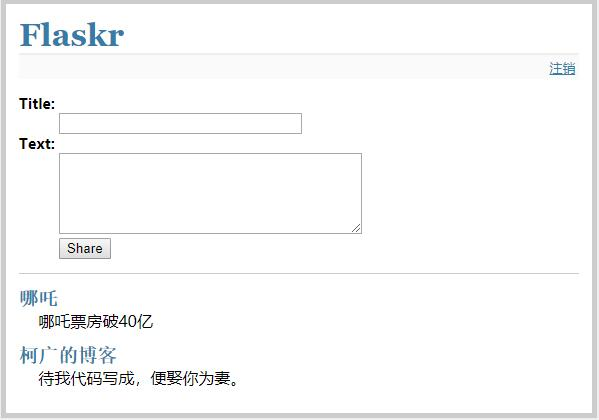

# flask入门经典项目
我们把我们的这个博客应用称为 `flaskr` ，也可以选一个不那么 `web 2.0` 的名字 。基本上，我们希望它能做这些事情：

1. 允许用户用配置文件里指定的凭证登入登出。只支持一个用户。
2. 当用户登入后，可以向页面添加条目。条目标题是纯文本，正文可以是一些 `HTML` 。因信任这里的用户，这部分 `HTML` 不做审查。
3. 页面倒序显示所有条目（后来居上），并且用户登入后可以在此添加新条目。
我们将会在应用中直接采用 `SQLite3` ，因为它足以应付这种规模的应用。

这里是一个应用最终效果的截图:

代码，可直接运行：[查看代码](https://github.com/ddxygq/PyCode/blob/master/web/flask/flaskr/flaskr.py)

