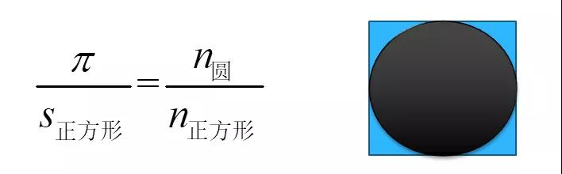
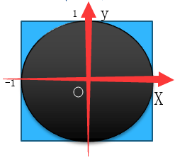

蒙特卡罗方法是一种计算方法。原理是通过大量随机样本，去了解一个系统，进而得到所要计算的值。最经典的莫过于圆周率π的计算了。

# 圆周率π的计算
单位圆面积为π，并且内切于边长为2的正方形，用随机数，10000个点往下面投，落到圆里面的概率乘以4就是π的值



**说明**：等式左边，是圆与正方形面积之比；等式右边，是落在单位圆内的点与落在正方形内的点的比值。二者相等。

**分析**
1. 以圆心为原点，建立二维坐标系；



2. 随便投一个点，这个记为(x, y)，落在圆内，则到圆心的距离 `x*2 + y*2 <= 1`；
3. 投点10000次，落入圆内次数`n`，`π`值为`n / 10000 * 4`；

# Python代码
分析好了，代码就很容易实现了，`coding`。
```python
import random


def run():
    n = 10**4
    n_pai = 0
    for i in range(1, n + 1):
        x = random.random()
        y = random.random()

        # 落在单位圆内部
        if x**2 + y**2 <= 1:
            n_pai = n_pai + 1

    pai = n_pai / float(n) * 4

    print(pai)


if __name__ == '__main__':
    run()
```
4次模拟结果
```
3.142
3.1424
3.1368
3.156
```