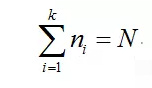
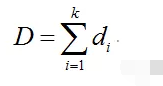
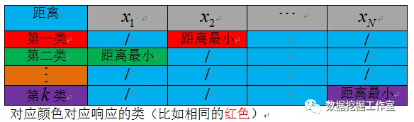

>K均值聚类方法是一种划分聚类方法，它是将数据分成互不相交的K类。K均值法先指定聚类数，目标是使每个数据到数据点所属聚类中心的总距离变异平方和最小，规定聚类中心时则是以该类数据点的平均值作为聚类中心。

# K均值法原理与步骤
对于有N个数据的数据集，我们想把它们聚成K类，开始需要指定K个聚类中心，假设第i类有ni个样本数据，计算每个数据点分别到聚类中心的距离平方和，距离这里直接用的欧式距离，还有什么海明距离、街道距离、余弦相似度什么的其实都可以，这里聚类的话，欧式距离就好。
（1）、所有类别样本数等于总样本数，即每个类类是互不相同的

（2）、每一类(假设是第i类)中数据点到聚类中心距离平方总和di为：
xi表示第i类各点平均值（聚类中心）

（3）、K类数据点距离之和为：

这样就会有一个K*N的距离平方和矩阵，每一列（比如第j列）的最小值对应的行数（比如第i行）就表明：第j个数据样本属于第i类别。这样，每个数据就会分别属于不同的类别了。

比如，表格中红色部分数据点x2到第一类的聚类中心距离最小，则x2就属于第一类。

---

### K均值步骤
1. 随机选取K个数据点作为（起始）聚类中心；
2. 按照距离最近原则分配数据点到对应类；
3. 计算每类的数据点平均值（新的聚类中心）；
4. 计算数据点到聚类中心总距离；
5. 如果与上一次相比总距离下降，聚类中心替换；
6. 直到总距离不再下降或者达到指定计算次数。

其实，这个过程相对比较简单，给我一组聚类中心，总能根据到聚类中心距离最小原则生成一组聚类方案，然后计算各个类别到聚类中心距离总和是否下降，如果距离总和下降，就继续计算每类数据点平均值（新的聚类中心），对应的聚类方案要好（还是那句话：给我一组聚类中心，总能根据到聚类中心距离最小原则生成一组聚类方案），然后不断计算，直到距离总和下降幅度很小（几乎收敛），或者达到指定计算次数。

### K-means算法缺点主要是
- 对异常值敏感；
- 需要提前确定k值；
- 结果不稳定；

[原文链接](https://mp.weixin.qq.com/s/EqmByRPvpzaI77K3aQLmWQ)

## 微信公众号
